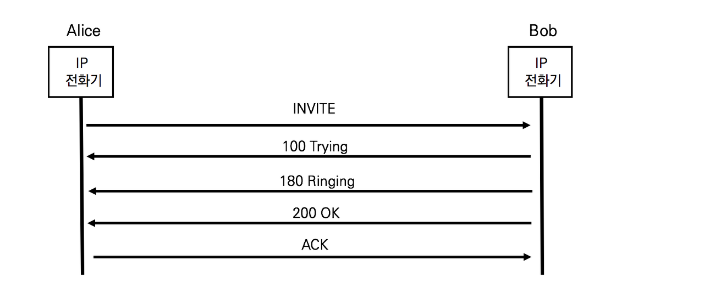
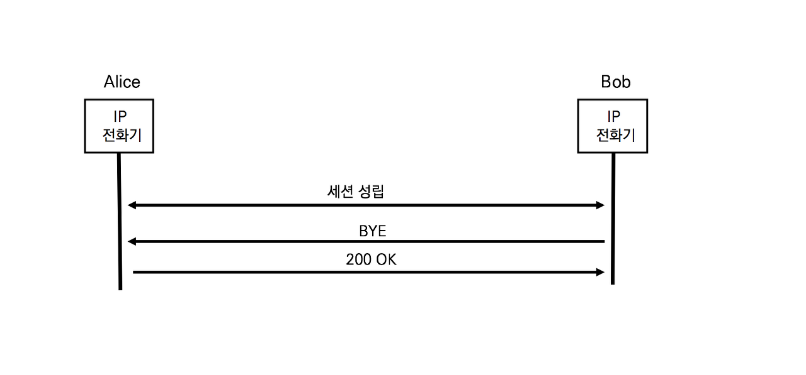

## SIP의 요청 Method

SIP의 요청 메시지를 method라고 하고, RFC 3261에는 6개의 기본 메서드가 정의되어 있다.

- INVITE : 머리티미디어 세션에 참가시키기기 위한 서비스 또는 사용자를 초대하기 위한 메서드
- ACK : ACKnowledgement의 준말. INVITE메서드에 대한 최종 응답인 200OK를 수신했음을 통지하기 위한 메서드 ACK는 별도의 응답을 받지 않음
- BYE : 기존의 세션을 종료하기 위한 메서드
- CANCEL : 최종 응답 200 OK를 받기 전에 기존의 요청을 취소하기 위한 메서드
- OPTIONS : 서버의 Capability를 요청하기 위한 메서드
- REGISTER : User Agent가 Registrar Server에 등록하기 위한 메서드

멀티미디어 세션 관리 및 부가 서비스를 위해 8개의 메서드가 별도의 IETF의 RFC 문서로 정의되었다

- INFO (RFC 2976) : 기존의 설립된 세션 또는 다이럴로그 내에서 추가적인 정보를 전송하기 위한 메서드
- PRACK (RFC 3262) : UAC가 임시적으로 Response를 승인하기 위한 메서드
- SUBSCRIBE (RFC 3265) : 특정 이벤트를 원격 노드에 요청하기 위한 메서드
- NOTIFY (RFC 3265) : 특정 이벤트 발생 시 응답하기 위한 메서드
- UPDATE (RFC 3311) : 세션 설정 파라미터를 업데이트하기 위한 메서드
- MESSAGE (RFC 3428) : 채팅과 같은 단문 메시지를 전달하기 위한 메서드
- PREFER (RFC 3515) : Presense Server에 UA의 상태를 전송하기 위한 메서드

SIP는 RFC3261에 정의된 기본 6개의 메서드와 추가 8개의 메서드를 합쳐ㅗ 총 14개의 메서드를 사용한다. SIP메서드만 잘 이해하면 SIP호를 쉽게 분석할 수 있다.

### 응답의 유형

요청에 대한 응답은 세 가지 유형으로 구분된다

- Accept (승인) : 요청의 처리를 승인하고 결과로 200OK를 송신
- Reject (거절) : 요청의 처리를 거절하고 거절의 원인을 송신
- Redirect (재송신 요청) : 요청의 처리를 보류하고 요청을 재송신할 다른 주소를 송신. Reject는 거절 사유에 따라 SIP Response가 별도로 규정되어있다.

## 실제 사용되는 SIP 호 설립 및 종료 절차

- 호 설립

- 호 종료

