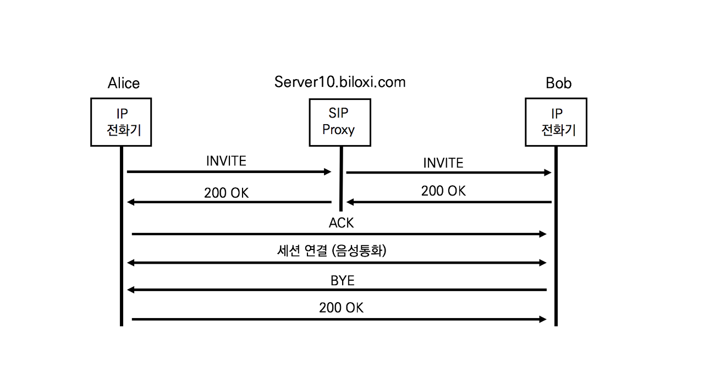

## SIP 헤더 분석 - SIP Proxy가 없는 경우


1. INVITE

   ```sip
   INVITE sip:bob@192.168.10.20 SIP/2.0
   Via: SIP/2.0/TCP pc33.atlanta.com;branch=z9hG4bK776asdhds
   Max-Forwards: 70
   To: Bob <sip:bob@biloxi.com>
   From: Alice <sip:alice@atlanta.com>;tag=1928301774
   Call-ID: a84b4c76e66710@pc33.atlanta.com
   CSeq: 314159 INVITE
   Contact: <sip:alice@pc33.atlanta.com>
   Content-Type: application/sdp
   Content-Length: 142
   ```

   앨리스가 밥에게 보내는 다이얼로그.

   Via : INVITE요청에 대한 응답은 pc33.atlant.com으로 전송하라

   Content-Type : SIP메시지 바디에 SDP메시지를 포함하고 있따

2. 200OK

   ```sip
   SIP/2.0 200 OK
   Via: SIP/2.0/TCP pc33.atlanta.com;branch=z9hG4bKnashds8 ;received=10.1.3.33
   To: Bob <sip:bob@biloxi.com>;tag=a6c85cf
   From: Alice <sip:alice@atlanta.com>;tag=1928301774
   Call-ID: a84b4c76e66710@pc33.atlanta.com
   CSeq: 314159 INVITE
   Contact: <sip:bob@192.168.10.20>
   Content-Type: application/sdp
   Content-Length: 131
   ```

   Via : received=10.1.3.33 : INVITE메시지는 10.1.3.33앨리스로부터 직접 받았다

   CSeq : INVITE와 동일한 값

3. ACK

   ```sip
   ACK sip:bob@192.168.10.20 SIP/2.0 
   Via: SIP/2.0/TCP pc33.atlanta.com;branch=z9hG4bKnashds8
   Max-Forwards: 70
   To: Bob <sip:bob@biloxi.com>;tag=a6c85cf
   From: Alice <sip:alice@atlanta.com>;tag=1928301774
   Call-ID:a84b4c76e66710@pc33.atlanta.com
   CSeq: 314159 ACK
   Content-Length: 0
   ```

   CSeq : 31459이므로 앞의 200 OK에 대한 ACK이다

4. BYE

   ```sip
   SIP/2.0 200 OK 
   Via: SIP/2.0/TCP 192.168.10.20 
   To: Alice <sip:alice@atlanta.com>;tag=1928301774
   From: Bob <sip:bob@biloxi.com>;tag=a6c85cf 
   Call-ID: a84b4c76e66710@pc33.atlanta.com
   CSeq: 231 BYE
   Content-Length: 0
   ```

   BYE는 발신자 수신자 누구나 생성 가능하다.

   From, To헤더로 확인해본 결과 통화를 종료한 사람은 Bob이다.

5. ```sip
   SIP/2.0 200 OK 
   Via: SIP/2.0/TCP 192.168.10.20 
   To: Alice <sip:alice@atlanta.com>;tag=1928301774
   From: Bob <sip:bob@biloxi.com>;tag=a6c85cf 
   Call-ID: a84b4c76e66710@pc33.atlanta.com
   CSeq: 231 BYE
   Content-Length: 0
   ```

   CSeq 헤더의 값에 의해 BYE에 대한 응답이다.


## SIP 헤더 분석 - SIP Proxy가 있는 경우



1. ```sip
   INVITE sip:bob@biloxi.com/TCP SIP/2.0 
   Via: SIP/2.0/TCP pc33.atlanta.com;branch=z9hG4bK776asdhds
   Max-Forwards: 70
   To: Bob <sip:bob@biloxi.com>
   From: Alice <sip:alice@atlanta.com>;tag=1928301774
   Call-ID:a84b4c76e66710@pc33.atlanta.com
   CSeq: 314159 INVITE
   Contact: <sip:alice@pc33.atlanta.com>
   Content-Type: application/sdp
   Content-Length: 142
   ```

   앨리스가 밥 전화의 IP주소를 모르므로 INVITE메시지를 SIP Proxy서버로 보낸다

   앨리스가 밥에게 보내는 SIP메시지는 SIP Proxy서버가 없을때와 마찬가지로 동일하다

2. ```sip
   INVITE sip:bob@192.168.10.20/TCP       SIP/2.0
   Via: SIP/2.0/TCP server10.biloxi.com;branch=z9hG4bK4b43c2ff8.1
   Via: SIP/2.0/TCP pc33.atlanta.com;branch=z9hG4bK776asdhds;received=10.1.3.33
   Max-Forwards: 69
   To: Bob <sip:bob@biloxi.com>
   From: Alice <sip:alice@atlanta.com>;tag=1928301774
   Call-ID:a84b4c76e66710@pc33.atlanta.com
   CSeq: 314159 INVITE
   Contact: <sip:alice@pc33.atlanta.com>
   Content-Type: application/sdp
   Content-Length: 142
   ```

   SIP Proxy 서버가 밥에게 보내는 INVITE

   SIP프록시 서버가 Via헤더를 추가하고 Max-Forwards 헤더를 수정했다.

   추가된 Via 헤더의 값은 SIP Proxy서버의 주소를 나타낸다.

   INVITE 요청의 응답인 200OK가 SIP 프록시 서버를 경유할 것을 요청한다

   만일 200OK응답이 SIP Proxy서버를 거치지 않고 전달될 경우. SIP Proxy서버는 호의 진행상태를 알 수 없다.

   앨리스가 보낸 Via 헤더는 'received=10.1.3.33'라는 값을 추가해 어디서 받았는지 명시한다

   Max-Forwards 헤더의 값이 70에서 에서 69로 줄었다

   CSeq :  SIP Proxy 서버는 제한적으로 메시지를 추가 또는 삭제할 수는 있어도 새로운 세션을 생성하지 않는다. B2BUA로 구현된 PBX라면 새로운 다이얼로그를 생성하기 위해 값을 변경하였을 것이다.  

3. ```sip
   SIP/2.0 200 OK
   Via: SIP/2.0/TCP server10.biloxi.com;branch=z9hG4bK4b43c2ff8.1;received=192.168.10.1        Via: SIP/2.0/TCP pc33.atlanta.com;branch=z9hG4bKnashds8;received=10.1.3.33
   To: Bob <sip:bob@biloxi.com>;tag=a6c85cf
   From: Alice <sip:alice@atlanta.com>;tag=1928301774
   Call-ID:a84b4c76e66710@pc33.atlanta.com
   CSeq: 314159 INVITE
   Contact: <sip:bob@192.168.10.20>
   Content-Type: application/sdp
   Content-Length: 131
   ```

   밥이 SIP Proxy서버로 보내는 200OK

   두 개의 Via 헤더는 INVITE 메시지에 있던 두 개의 Via 헤더를 그대로 복사하여 추가하였고, SIP Proxy 서버가 추가한 헤더에 SIP Proxy Server의 주소를 'received=192.168.10.1' 필드로 추가했다.

4. ```sip
   SIP/2.0 200 OK
   Via: SIP/2.0/TCP pc33.atlanta.com;branch=z9hG4bKnashds8;received=10.1.3.33
   To: Bob <sip:bob@biloxi.com>;tag=a6c85cf
   From: Alice <sip:alice@atlanta.com>;tag=1928301774
   Call-ID: a84b4c76e66710@pc33.atlanta.com
   CSeq: 314159 INVITE
   Contact: <sip:bob@192.168.10.20>
   Content-Type: application/sdp
   Content-Length: 131
   ```

   밥으로부터 받은 200OK메시지에 자신이 추가했던 Via헤더를 삭제한 후 앨리스에게 전송한다

5. 앨리스가 밥에게 보내는 ACK.

   앨리스는 밥의 200OK를 정확히 수신했음을 확인하는 ACK를 밥의 전화기로 직접 보낸다.

