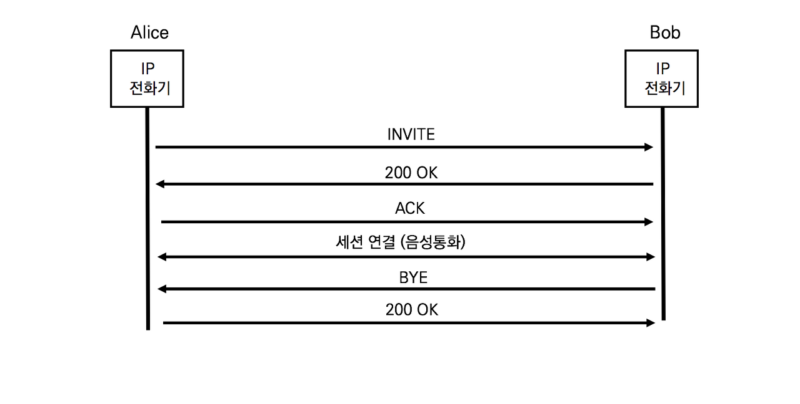

## SIP 헤더 분석 - SIP Proxy가 없는 경우



1. INVITE

   ```sip
   INVITE sip:bob@192.168.10.20 SIP/2.0
   Via: SIP/2.0/TCP pc33.atlanta.com;branch=z9hG4bK776asdhds
   Max-Forwards: 70
   To: Bob <sip:bob@biloxi.com>
   From: Alice <sip:alice@atlanta.com>;tag=1928301774
   Call-ID: a84b4c76e66710@pc33.atlanta.com
   CSeq: 314159 INVITE
   Contact: <sip:alice@pc33.atlanta.com>
   Content-Type: application/sdp
   Content-Length: 142
   ```

   앨리스가 밥에게 보내는 다이얼로그.

   Via : INVITE요청에 대한 응답은 pc33.atlant.com으로 전송하라

   Content-Type : SIP메시지 바디에 SDP메시지를 포함하고 있따

2. 200OK

   ```sip
   SIP/2.0 200 OK
   Via: SIP/2.0/TCP pc33.atlanta.com;branch=z9hG4bKnashds8 ;received=10.1.3.33
   To: Bob <sip:bob@biloxi.com>;tag=a6c85cf
   From: Alice <sip:alice@atlanta.com>;tag=1928301774
   Call-ID: a84b4c76e66710@pc33.atlanta.com
   CSeq: 314159 INVITE
   Contact: <sip:bob@192.168.10.20>
   Content-Type: application/sdp
   Content-Length: 131
   ```

   Via : received=10.1.3.33 : INVITE메시지는 10.1.3.33앨리스로부터 직접 받았다

   CSeq : INVITE와 동일한 값

3. ACK

   ```sip
   ACK sip:bob@192.168.10.20 SIP/2.0 
   Via: SIP/2.0/TCP pc33.atlanta.com;branch=z9hG4bKnashds8
   Max-Forwards: 70
   To: Bob <sip:bob@biloxi.com>;tag=a6c85cf
   From: Alice <sip:alice@atlanta.com>;tag=1928301774
   Call-ID:a84b4c76e66710@pc33.atlanta.com
   CSeq: 314159 ACK
   Content-Length: 0
   ```

   CSeq : 31459이므로 앞의 200 OK에 대한 ACK이다

4. BYE

   ```sip
   SIP/2.0 200 OK 
   Via: SIP/2.0/TCP 192.168.10.20 
   To: Alice <sip:alice@atlanta.com>;tag=1928301774
   From: Bob <sip:bob@biloxi.com>;tag=a6c85cf 
   Call-ID: a84b4c76e66710@pc33.atlanta.com
   CSeq: 231 BYE
   Content-Length: 0
   ```

   BYE는 발신자 수신자 누구나 생성 가능하다.

   From, To헤더로 확인해본 결과 통화를 종료한 사람은 Bob이다.

5. ```sip
   SIP/2.0 200 OK 
   Via: SIP/2.0/TCP 192.168.10.20 
   To: Alice <sip:alice@atlanta.com>;tag=1928301774
   From: Bob <sip:bob@biloxi.com>;tag=a6c85cf 
   Call-ID: a84b4c76e66710@pc33.atlanta.com
   CSeq: 231 BYE
   Content-Length: 0
   ```

   CSeq 헤더의 값에 의해 BYE에 대한 응답이다.

