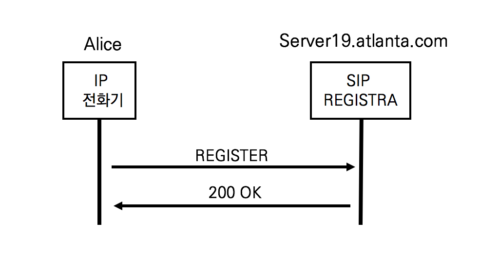
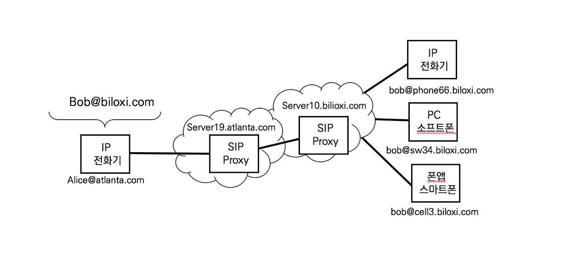

## REGISTER

SIP Proxy가 등록된 단말을 추적하게끔 하기 위해 사용

전화기는 SIP Registrar서버에 REGISTER 메서드를 이용하면 SIP Registrar서버는 200OK를 응답함으로써 등록이 이루어짐



1. REGISTER

   ```sip
   REGISTER sip:server19.atlanta.com SIP/2.0
   Via: SIP/2.0/TCP pc33.atlanta.com;branch=z9hG4bk2l55n1
   To: Alice <sip:alice@atlanta.com>
   From: Alice <sip:alice@atlanta.com>;tag=283074
   Call-ID:a84b4g96te10@pc33.atlanta.com
   CSeq: 31862 REGISTER
   Contact: <sip:alice@10.1.3.33>
   Expires: 21600
   Content-Length: 0
   ```

   Expires는 등록 유효기간을 의미한다. (SIP Proxy 서버에게 21600초 동안 등록을 유지)

   

2. 200OK

   ```
   SIP/2.0 200 OK
   Via: SIP/2.0/TCP pc33.atlanta.com;branch=z9hG4bk2l55n1; received=10.1.3.33
   To: Alice <sip:alice@atlanta.com>; tag=a 6c85e3
   From: Alice <sip:alice@atlanta.com>;tag=283074
   Call-ID:a84b4g96te10@pc33.atlanta.com
   CSeq: 31862 REGISTER
   Contact: <sip:alice@pc33.atlanta.com>
   Contact: <sip:alice@cm9013.atlanta.com>
   Service-Route: <sip:bigbox3.atlanta.com;lr>
   Expires: 3600
   Contact-Length: 0
   ```


## 사용자가 여러 대의 단말을 사용할 시

URI를 사용해서 여러 대의 단말을 구분한다.




## SIP Proxy서버  주소 획득의 문제

SIP의 서버를 확인하는 정의되지 않았다. 보통 아래의 방법을 사용한다.

1. 관리가자 전화기 (UA)에 SIP Proxy 서버의 주소를 직접 입력한다
2. HTTP나 TFTP와 같은 프로토콜을 사용한다

SIP Proxy 서버의 주소를 획득하는 가장 쉬운 방법은  DHCP를 이용해 전화기가 부팅되어 IP주소를 획득할 때 SIP Proxy서버의 주소를 같이 획득한다. DHCP서버는 IP주소 할당 외에 DNS나 TFTP서버의 주소를 함께 할당할 수 있다.