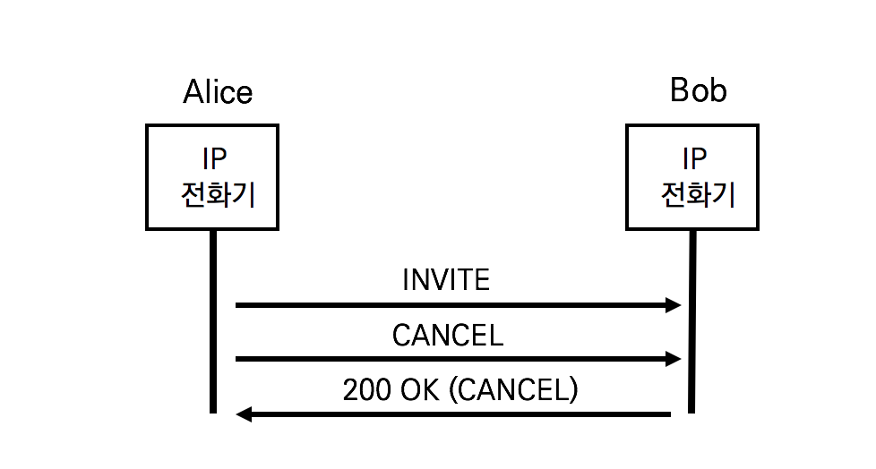
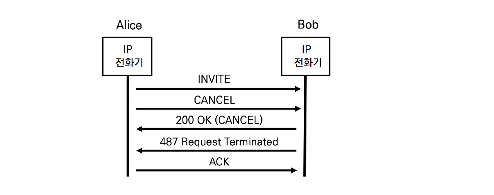
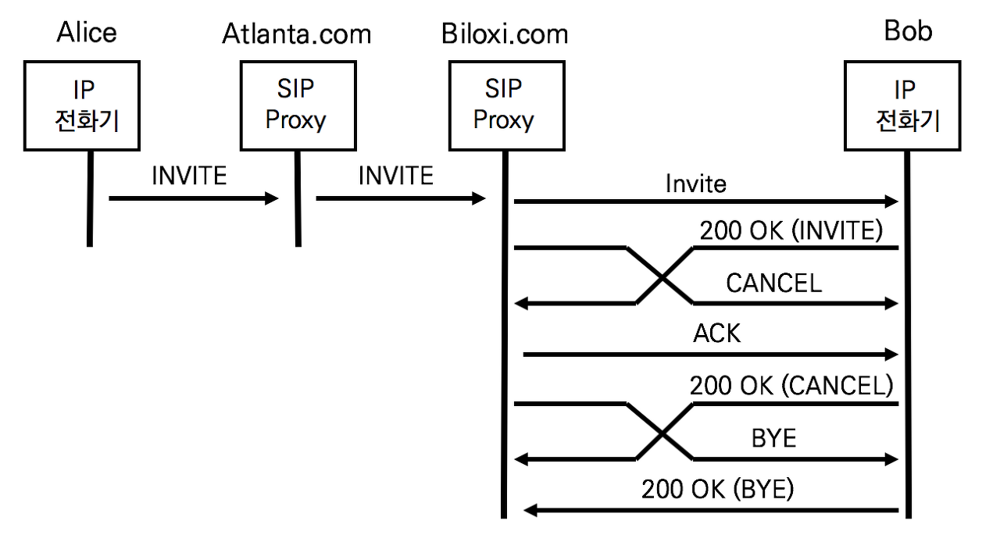
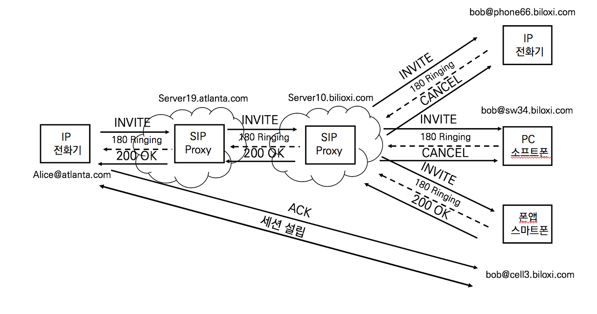

## CANCEL

INVITE 요청에 대한 200OK를 수신하기 전에 전화가 종료되어버릴 때 SIP 프로토콜은 CANCEL메서드를 이용한다. CANCEL명령어는 기존의 요청을 취소하기 위해 사용한다.

CANCEL메서드에서 핵심 헤더는 두개다.

1. 취소 사유를 명시하는 Reason헤더
2. 어떤 요청을 취소했는지 알 수 있는 Cseq



1. CANCEL

   ```sip
   CANCEL sip:bob@192.168.10.20 SIP/2.0
   Via: SIP/2.0/TCP 10.1.3.33;branch=z9hG4bK776asdhds
   Max-Forwards: 70
   To: Bob <sip:bob@biloxi.com>
   From: Alice <sip:alice@atlanta.com>;tag=1928301774
   Call-ID:a84b4c76e66710@pc33.atlanta.com
   CSeq: 10197 CANCEL
   Contact: <sip:alice@atlanta.com>
   Reason: SIP ;cause=486 ;text=“Busy Here”
   Content-Length: 0
   ```

   CANCEL 메쏘드는 반드시 Reason 헤더를 포함

2. 200OK

   ```sip
   SIP/2.0 200 OK
   Via: SIP/2.0/TCP 10.1.3.33
   From: Alice <sip:alice@atlanta.com>;tag=1928301774
   To: Bob <sip:bob@biloxi.com>;tag=a6c85cf
   Call-ID:a84b4c76e66710@pc33.atlanta.com
   CSeq: 10197 CANCEL
   Content-Length: 0
   ```

   CSeq를 통해 200OK응답이 INVITE에 대한 것인지 CANCEL에 대한 것인지 확인가능


## 응답을 받지 못한 요청에 대한 처리



1. 487 Request Terminated

   ```sip
   SIP/2.0 487 Request Terminated
   Via: SIP/2.0/TCP 10.1.3.33
   From: Alice <sip:alice@atlanta.com>;tag=1928301774
   To: Bob <sip:bob@biloxi.com>;tag=a6c85cf
   Call-ID:a84b4c76e66710@pc33.atlanta.com
   CSeq: 314159 INVITE
   Content-Length: 0
   ```

   CSeq 헤더는 INVITE에 대한 응답이라고 알려준다


## 200OK이후 CANCEL을 수신하는 문제




## Call Forking의 경우에 효율적인 CANCEL요청

Call Forking : 하나의 전화번호로 통화 시도를 하면 여러 개의 전화기로 전파하여 벨을 울리게 해준다



1. Alice -> Bob 통화요청
2. 밥은 3개의 전화기중 한 대로 200 OK응답
3. SIP Proxy 서버는 두 대의 전화기에 INVITE요청을 CANCEL을 보내 전화를 취소한다.

세 개의 INVITE는 Via 헤더의 서로 다른 branch 값을 가진다. Call Forking은 시간 간격을 두고 벨을 울리게 하는 순차적인 방법과 동시에 벨을 울리게 하는 방법이 있다.

**CANCEL**

```sip
CANCEL sip:bob@192.168.10.20 /TCP SIP/2.0
Via: SIP/2.0/TCP server10.biloxi.com;branch=z9hG4bK4b43c2ff8.1
Max-Forwards: 70
To: Bob <sip:bob@biloxi.com>
From: Server10 <sip:server10.biloxi.com>;tag=1928301774
Call-ID:a84b4c76e66710@pc33.atlanta.com
CSeq: 6187 CANCEL
Contact: <sip:server10.biloxi.com>
Reason: SIP ;cause=200 ;text=”call completed elsewhere”
Content-Length: 0
```


