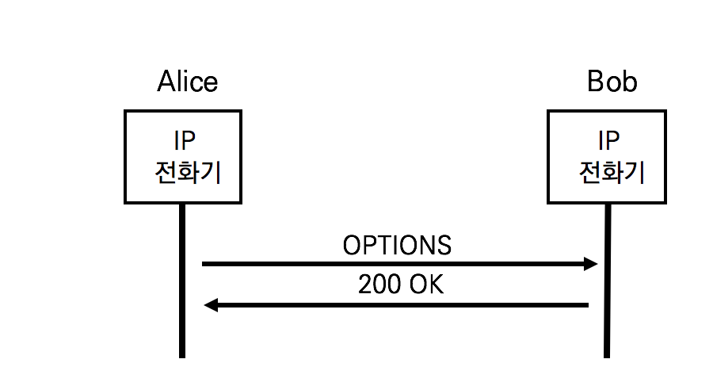

OPTIONS

OPTIONS메서드는 UA가 다른 UA나 SIP Proxy서버의 Capability를 확인하기 위해 사용한다. INVITE요청과 200OK 응답 중에 확인할 수 있지만, OPTIONS 요청은 원하는 때에 확인할 수 있다.

SIP 컴포넌트의 Capability

- 지원 가능한 메서드의 종류
- 지원 가능한 콘텐츠 타입
- 지원 가능한 확장 헤더의 종류
- 지원 가능한 코덱 등



1. OPTIONS

   ```sip
   OPTIONS sip:bob@192.168.10.20 SIP/2.0
   Via: SIP/2.0/TCP pc33.atlanta.com;branch=z9hG4bK77i832k9
   Max-Forwards: 70
   To: Bob <sip:bob@biloxi.com>
   From: Alice <sip:alice@atlanta.com>;tag=1928301774
   Call-ID:a84b4c76e6Kr456@pc33.atlanta.com
   CSeq: 22756 OPTIONS
   Contact: <sip:alice@pc33.atlanta.com> 
   Allow: INVITE, ACK, OPTIONS, BYE, CANCEL, REFER, SUBSCRIBE, NOTIFY, MESSAGE, UPDATE 
   Accept: application/sdp, application/pidf-xml
   Content-Length: 0
   ```

   

2. 200OK

   ```sip
   SIP/2.0 200 OK
   Via: SIP/2.0/TCP sip:alice@atlanta.com;branch=z9hG4bK77i832k9
   To: Bob <sip:bob@biloxi.com>; tag=a6c85e3
   From: Alice <sip:alice@atlanta.com>;tag=1928301774
   Call-ID:a84b4c76e6Kr456@pc33.atlanta.com
   CSeq: 22756 OPTIONS
   Contact: <sip:bob@biloxi.com>
   Contact: <sip:bob_home@biloxi.com>
   Allow: INVITE, ACK, OPTIONS, BYE, CANCEL, REFER, NOTIFY, MESSAGE
   Accept: application/sdp, text/plain, image/jpeg
   Accept-language: en, fr
   Content-Type: application/sdp
   Content-Length: 274
   ```

   - Contact 헤더 : 연결 가능한 단말들의 Contact address 리스트
   - Allow 헤더 : 지원 가능한 메서드 리스트
   - Accept-language 헤더 : 지원 가능한 언어 리스트
   - Accept : 지원 가능한 메시지 바디의 타입 리스트. Accept 헤더가 없을 경우 "application/sdp"로 가정. 실제로 SIP메시지 바디 타입은 Content-Type 헤더로 표시

## OPTIONS PING

상대방이 정상 작동하기  위해 OPTIONS메서드를 이용하여 SIP Trunk 구간에서 상대방의 상태를 확인할 수 있는 keepalive메커니즘을 제공하는 것을 OPTIONS PING 이라 부른다

OPTIONS PING은 주기적으로 SIP Trunk 사이에서 OPTIONS메시지를 주고받다가 상대방이 응답이 없거나 200OK응답이 아닌 경우에는 INVITE 요청을 전달하지 않는다.

즉, OPTIONS PING을 이용하면 사전에 장애를 감지할 수 있으므로 호를 빠르게 진행할 수 있다.

따라서 OPTIONS PING은 상대 SIP컴포넌트를 URI주소가 아닌 IP주소를 사용할 것을 권장한다. 만일 도메인 이름인 FQDN을 이용할 경우 DNS에 의한 이중화 기능으로 인해 정확한 확인이 어려울 수 있다.