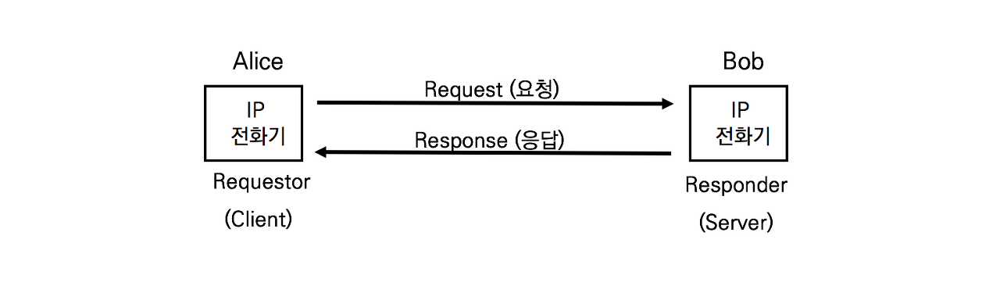

## SIP Response

엔지니어들은 SIP통화에 문제가 발생하면 제일 먼저 확인하는 것이 응답 메시지이다. 응답은 에러가 발생한 이유를 추측할 수 있게 한다.

SIP Response의 개요

SIP 응답의 일련번호

- 1xx Provisional : 정보
- 2xx Success : 정상
- 3xx Redirection : 요청을 다른 주소로 재송신 요청
- 4xx Client Error : 클라이언트 장애
- 5xx Server Error : 서버 장애
- 6xx Global Failure : 사용자와 연결은 가능하나 통화는 불가

### 1xx Provisional Response / 1xx Information Response

최종응답 전에 요청을 처리하는 시간이 200ms이상일 때 서버가 처리중임을 통지. 1xx응답은 SIP메시지 바디에 SDP를 함께 전달할 수 있다

1. 100 Trying

   수신된 요청을 다음 서버로 전송하거나 처리 중. 이반적으로 100Trying은 INVITE요청을 받자마자 발행된다

2. 180 Ringing

   수신 전화기의 벨이 울리고 있다. 180 Rining을 수신하면 링백톤을 재생하거나 링백톤 수신을 준비한다.

3. 181 Call is being forwarded

   수신 전화기가 착신전환 기능을 설정. 그러므로 착신전환 번호로 호 시도 중임을 발신 전화기로 통지

4. 182 Queued

   수신 전화기가 일시적으로 통화를 할 수 없는 상태일 때 호를 대기 큐로 전달. 수신 전화기가 통화 가능해지면 대기 중인 호를 재연결한다. 예를 들어 고객센터에서 모든 상담원이 통화 중일 경우 상담원 통화가 가능해질때까지 호는 큐잉되어 음악이나 큐잉 메시지를 듣게 된다.

5. 183 Session in progress

   현재 처리중인 호에 대해 추가적인 정보를 발신자에게 전달한다

6. 199 Early Dailog Terminated

   RFC 6288에 새롭게 명시된 응답. SIP Proxy간에 최종 응답인 200OK 전에 다이얼로그가 종료되었음을 통지

### 2xx Successful

요청이 정상적으로 처리됨

1. 200 OK

   요청을 정상적으로 처리

2. 202 Accepted

   요청 처리가 승인됐지만 아직 처리 중

3. 204 No NOtifiaction

   RFC 5839에 명시된 응답. 기존 다이얼로그 내에서 SUBSCRIBE메시지와 관련된 응답이 전달되지 않음

### 3xx Redirect

사용자가 새로운 위치로 이동하거나 UA정보가 변경된 서비스로 통합

1. 300 Multiple Choices

   사용자가 여러 단말을 소유하고 있으므로 선호되는 UA로 호를 진행

2. 301 Moved Permanently

   요청된 Request-URI의 주소로 단말을 찾을 수 없음. 발신자는 응답에 포함된 Contact 헤더 주소로 re-INVITE를 요청하고, 로컬 디렉토리와 주소록 등에 정보를 업데이트한다

3. 302 Moved Temporarily

   사용자가 일시적으로 다른 곳으로 이동. 발신자는 응답에 포함된 Contact Header주소로 re-INVITE를 진행한다. 일시적인 이동이므로 로컬 디렉토리와 주소록 등에 정보를 업데이트 하지 않는다

4. 305 Use Proxy

   착신 전화기에 도착한 요청이 SIP Proxy를 경유하지 않음. 요청을 응답에 포함된 SIP Proxy서버 주소로 재전송한다

5. 380 Alternative Service

   현재의 서비스 요청은 실패했지만 다른 서비스는 이용이 가능

### 4xx Request Failure

요청 실패 통지. 응답은 실패의 이유를 명시해야하고, 발신 전화기는 메시지 변경 없이 같은 요청을 반복하지 않는다.

1. 400 Bad Request

   잘못된 문구나 메시지 포맷을 포함하고 있으므로 처리할 수 없다. 보통 SIP헤더가 빠져있을 때 발핸된다

2. 401 Unauthorized & 407 Proxy Authentication Required

   요청은 사용자 인증이 필요하다. 등록 서버나 UAS는 401 응답을, SIP Proxy 서버는 407응답을 발핸한다

3. 403 Forbbiden

   서버는 요청애 대한 처리를 거절한다

4. 404 Not Found

   Request-URI에 있는 도메인 주소가 존재하지 않는다

5. 406 Not Acceptable

   Accept 헤더에 열거되지 않은 콘텐츠 타입을 요구한다

6. 408 Request Timeout

   일정 시간 안에 요청에 대한 응답이 불가능하다

7. 410 Gone

   요청한 자원이 서버에서 고정적으로 이용할 수 없다

8. 413 Request Entity Too Large

   요청이 서버가 처리할 수 있는 용량을 초과한다. 일시적이라면 Retry-After 헤더로 발신 전화기에 재시도가 가능함을 표시한다

9. 414 Request-URI Too Long

   Reuqest-URI가 SIP Proxy 서버가 해석할 수 있는 길이보다 길다

10. 415 Unsupported Media Type

    요청이 포함한 메시지 바디는 서버가 지원하지 않는 타입니다. 응답은 반드시 Accept, Accept-Encoding, 또는 Accept-Language헤더 등을 포함해야 한다

11. 406 Unsupported URI Scheme

    요청이 포함한 Request-URI 스킴을 해석할 수 없다

12. 420 Bad Extension

    요청한 Proxy-Require 헤더 또는 Require 헤더에 정의된 Extension(확장)을 이해하지 못한다. 응답은 반드시 Unsupporte 헤더에 지원하지 않는 Extension을 명시해야 한다

13. 421 Extension Required

    UAS는 요청을 처리하기 위해 특정 Extension이 필요하지만, Supported Header에 명시되지 않았다. 응답은 Require헤더에 필요한 Extension을 명시해야 한다

14. 423 Interval Too Brief

    요청아는 자원을 확보하기 위한 시간이 너무 부족하다

15. 480 Temporarily Unavailable

    요청을 정상적으로 처리하고 연결할 수 있지만 상대방이 응답 가능하지 않다. 예를 들면 로그인은 했지만 통화가 안되거나 Do not Disturb 기능을 이용중이다

16. 481 Call/Transaction Does not Exsist

    요청은 기존 다이얼로그나 트랜잭션과 매치되지 않는다

17. 482 Loop detected

    루프 상황이 검출되었다.Via헤더의 값으로 서버가 전송한 요청이 되돌아온 것을 알 수 있다

18. 483 Too Many Hops

    Max-Forwads헤더 값이 0인 요청을 받았다

19. 484 Address Incomplete

    요청은 불완전한 Request-URI를 포함한다

20. 485 Ambiguous

    요청은 애매모호한 Request-URI를 포함한다. 응답은 Contact헤더에 명확한 주소를 리스팅한다

21. 486 Busy Here

    요청을 정상적으로 처리하고 연결할 수 있지만 상대방이 응답 가능하지 않는다. 예를 들면 통화중일 경우

22. 487 Request Terminated

    요청은 BYE나 CANCEL요청에 의해 종료되었습니다. CANCEL 요청에 대한 정상 응답은 200 OK이며, CANCEL에 의해 최소된 INVITE에 대한 응답으로 사용한다

23. 488 Not Acceptable Here

    Request-URI에 명시된 특정 자원이나 코덱을 사용할 수 없다

24. 491 Request Pending

    UAS는 같은 다이얼로그에 미결된 요청이 있다

25. 493 Undecipherable

    요청에 포함된 메시지 바디에 암호화된 MIME이 있어 처리할 수 없다

### 5xx Server Error

서버의 에러로 인해 요청을 처리할 수 없음

1. 500 Server Internal Error

   요청을 처리던 중에 서버 내부 문제로 인해 처리할 수 없다

2. 501 Not Implemented

   요청을 처리하기 위한 서비스나 기능이 서버에서 지원되지 않는다

3. 502 Bad Gateway

   게이트웨이너 Proxy서버는 요청에 대한 잘못된 응답을 다른 서버로부터 받았다

4. 503 Service Unavailable

   서버는 일시적인 과부하나 유지보수로 인해 요청을 처리할 수 없다. 응답은 Retry-After 헤더를 포함하며 UAC가 요청을 재전송 할 수 있게 한다

5. 504 Server Time-out

   서버는 외부 서버로부터 정해진 시간 내에 응답을 받지 못했다

6. 505 Version Not Supported

   서버는 SIP 프로토콜 버전을 지원하지 않는다

7. 513 Message Too Long

   서버는 요청의 메시지가 너무 길어서 처리할 수 없다

### 6xx Global Failure

특정 사용자에 대한 최종 정보를 가지고 있음을 통지

1. 600 Busy Every where

   착신 전화기와 연결되었지만 전화를 받지 않는다. 예를 들면, 수신자가 바빠서 받지 않았다

2. 600 Decline

   착신 전화기와 연결되었지만 전화를 받지 않는다. 예를 들면 상대방이 통화를 원하지 않는다

3. 604 Does Not Exsist Anywhere

   요청에 포함된 Request-URI의 사용자가 존재하지 않는다

4. 606 Not Acceptable

   착신 전화기와 연결되었지만 전화를 받지 않는다. 예를 들어, 요청된 미디어나 대역폭의 부족으로 연결할 수 없다