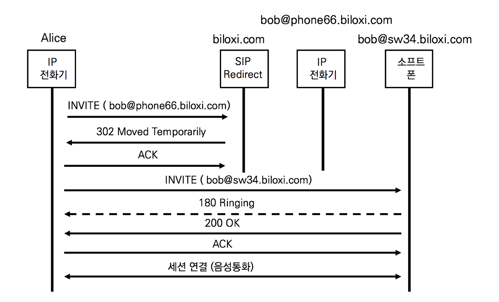
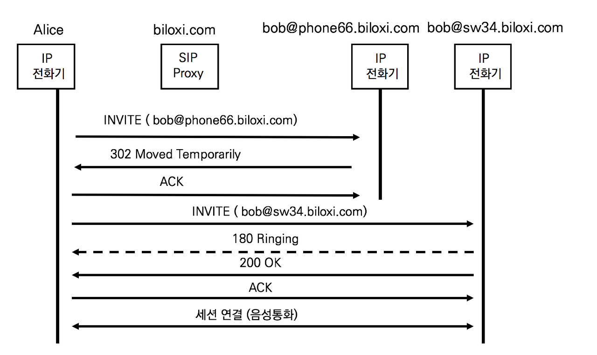
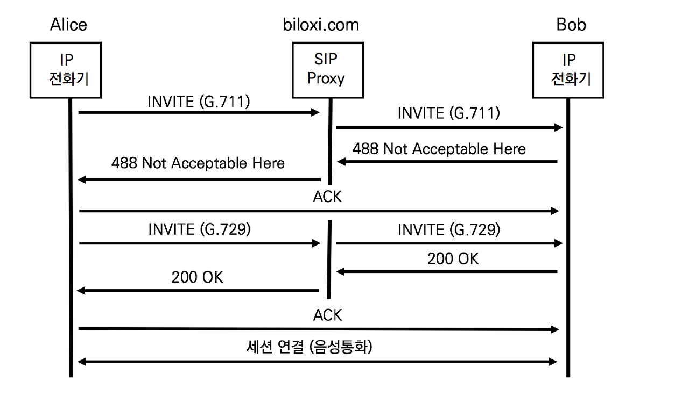

## SIP 응답에 따른 호 절차

1. Redirect : 302 Moved Temporarily

   INVITE 요청에 대한 응답으로 SIP Proxy서버가 302 응답을 보내는 경우

SIP Redirect 서버도 IP  PBX에 포함되어있는 기능적인 구분이다. 앨리스로부터 온 INIVTE요청에 대해 SIP Redirect 서버는 302 Moved Temporarily응답을 전한다. 302응답의 헤더는 re-INVITE를 보낼 주소가 명시되어있고 re-INVITE는 contact헤더의 주소로 발행된다. ( Contact : bob@sw34.biloxi.com )

2. Call Forward : 302 Moved Temporarily

SIP Proxy서버는 전화기의 상태를 감시하고 전화기로부터 설정 정보를 업데이트 받는다. 사용자가 전화기에서 착신 전환 (Call Forward All) 기능을 설정하였으나 SIP Proxy서버에 있는 밥의 프로파일이 업데이트 되지 못했다

앨리스로부터 온 INVITE요청에 대해 밥의 IP 전화기는 302 Moved Temporarily응답을 전달한다. 302응답의 Contact헤더는 re-INVITE를 보낼 주소가 명시되고 re-INVITE는 contact헤더의 주소로 발행된다

직원들이 많이 사용하는 전화 부가 기능은 착신전환과 호전환이다. SIP Proxy와 IP전화기의 제조사가 다를 경우에 부가 기능을 구현하는 방식이 다를 수 있다. IP PBX와 전화를 같이 제조하는 회사는 IP PBX의 사용자 프로파일을 변경하지만, IP 전화기만을 제조하는 기업은 전화기에서 처리한다. IP PBX 제조 기업과 공동작업을 할 경우에는 설정 변경 업데이트가 가능하다. 그러나 전화기에서 설정을 보유하는 방법은 보안에 매우 취약하므로 잘 사용하지 않는다. 전화기의 착신전환 기능을 활용하여 착신 전환된 국제 전화로 회사의 전화비용이 크게 나올 수도 있다.

3. Unsupported Codec : 488 Not Acceptable Here

Alice -> Bob : G.711 코덱으로 INVITE 요청

Bob -> Alice : 488 Not Acceptable Here