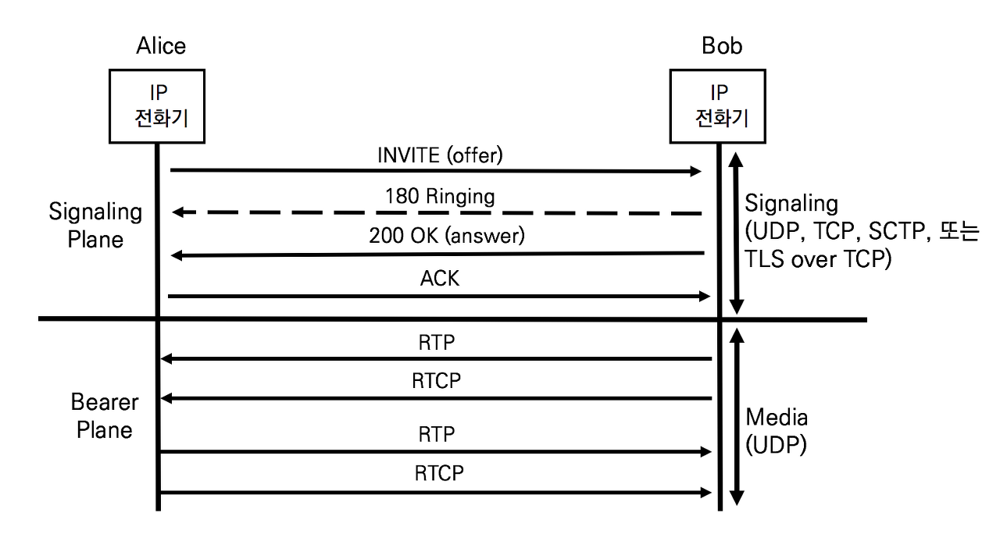
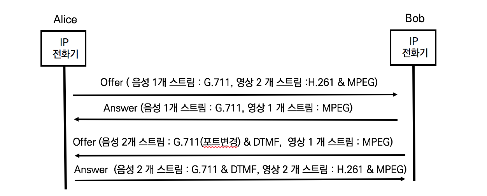

## SDP

Session Description Protocol의 약어로 멀티미디어 세션 파라미터를 협상하는 포로토콜이다. SDP는 RFC 2327을 개정한 RFC45665으로 권도되었다.

H.323프로토콜 슈트에서 볼 때 H.225가 시그널링에 대해 정의하고, H.245가 Capability Exchange를 정의한다. 마찬가지로 SIP프로토콜이 시그널링에 대해 정의하고  SDP가 Capability Exchange를 정의한다. SDP는 SIP뿐만 아니라 MGCP와 Megaco에서도 사용한다

SIP는 요청과 응답 모델(Request & Response Model)로 정의하였고 SDP는 제안과 수락모델(Offer & Answer Model)로 정의한다.

SDP의 Offer/Answer Model로의 동작에 대해서는 RFC 3264 An Offer/Answer with th SDP에서 설명한다




## SDP 메시지 분석 개요

SDP는 멀티미디어를 전달하는 RTP 프로토콜에 대한 세부적인 내용을 협상한다. SDP는 SIP와 다른 메시지 포맷을 사용하지만 텍스트 기반이므로 이해하기 쉽다.

```sdp
v=0
o=alice 2890844526 2890844526 IN IP4 atlanta.com
s=
c=IN IP4 10.1.3.33
t=0 0
m=audio 49172 RTP/AVP 0
a=rtpmap:0 PCMU/8000   
```

- v=0
  - 필수
  - SDP 프로토콜의 버전 표시. SDP 버전은 0이다
- o=alice 2890844526 2890844526 IN IP4 atlanta.com
  - 필수
  - SDP메시지를 생성한 Owner/Creator를 표시.
  - 순서대로 Username, Session-ID, Session Version, Network Type, Address Type, Unicate Address이다
- s=
  - 필수
  - 세션 이름을 표시한다
- c=IN IP4 10.1.3.33
  - 옵션
  - 순서대로 Network Type, Address Type, Connection-Address이며, RTP프로토콜이 사용할 주소를 정의한다
- t=0 0
  - 필수
  - Timing으로 start-time과, stop-time을 표시한다. `0 0`은 고정 세션을 의미한다.

## SDP 메시지 분석

SDP의 Capability Exchange를 위한 핵심은 `m=`과 `a=`이다. RTP가 시용할 코덱, IP주소, 포트번호를 명시한다. 보통 SDP메시지를 생성하는 UA는 가능한 모든 코덱을 명시하여 제안한다.

```sdp
m=audio 16444 RTP/AVP 0 8 18 101
a=rtpmap:0 PCMU/8000
a=ptime:20
a=rtpmap:8 PCMA/8000
a=ptime:20
a=rtpmap:18 G729/8000
a=ptime:20
a=sendrecv
a=rtpmap:101 telephone-event/8000
a=fmtp:101 0-15 
```

- m=audio 16444 RTP/AVP 0 8 18 101

  - Media Description으로 Media, Port, Protocol, Format을 정의한다
  - Media (m=audio 16444 RTP/AVP 0 8 18 101)
    - RTP프로토콜의 페이로드 선언
    - audio, video, text, application, message중에서 표시
  - Port
    - 미디어가 전송될 포트 표시
    - UDP 16384에서 32767 사이의 번호를 무작위로 선택
  - Protocol
    - UDP, RTP/AVP, RTP/SAVP중에서 표시
    - AVP 는 Audio Video Profile의 약자
  - Format
    - 미디어의 포맷을 서브필드 `a=`로 표시함을 의미
    - Payload Type 0 8 18의 순서는 코덱 협상의 우선순위를 표시
    - Payload Type 101은 DTMF 이벤트를 정의

- a=rtpmap:0 PCMU/8000

  - 미디어 속성(attribute) 정의
  - a=rtpmap : payload type, encoding name/clock rate를 표시
  - a=ptime : packet time으로 미디어 패킷 한 개가 포함한 시간 정보로 ms로 표시. 보통 20ms로 표시
  - a=fmtp : 미디어 포맷에 대한 파라미터를 정의

- a=(미디어의 방향)

  - RTP 프로토콜이 전달하는 미디어 속성 뿐만 아니라 미디어 방향도 표시한다

  - `a=sendrecv`

    단말은 송신 및 수신 가능. 예) 전화기로 통화가 가능한 채널

    별도의 언급이 없으면 `a=sendrecv`로 가정

  - `a=recvonly`

    단말은 미디어 수신만 가능. 예) 단말은 링백톤 수신만 가능한 채널

  - `a=sendonly`

    단말은 미디어 송신만 가능. 예) 마이크 기능만 있는 단말로 송신만 가능한 채널

  - ` a=inactive`

    단말은 송신 및 수신이 불가능. 예) 전화기에서 Hold버튼을 누른 상태

- a=(DTMF 협상)

  - DTMF는 통화중에 Digit(숫자)를 전달할 수 있도록 하고, 어떤 방식으로 할지를 결정한다.
  - a=rtpmap:101 telephone-event.8000
    RFC 2833에 의한 In-band DTMF
  - a=fmtp 101 0-15
    DTMF Tone은 0,1,2,3,4,5,6,7,8,9,0,*,#, A, B, C, D 총 15가지를 송수신

- a=rtpmap:101 telephone-event/8000

- a=fmtp:101 0-15 


## SDP협상의 이해



1. 앨리스의 Offer

```sdp
v=0
o=alice 2890844526 2890844526 IN IP4 host.anywhere.com
s=
c=IN IP4 host.anywhere.com
t=0 0
m=audio 49170 RTP/AVP 0
a=rtpmap:0 PCMU/8000
m=video 51372 RTP/AVP 31
a=rtpmap:31 H261/90000
m=video 53000 RTP/AVP 32
a=rtpmap:32 MPV/90000
```

Alice의 제안

- 음성 스트림 채널 1
  G.711 ulaw 코덱(PCMU) , 49170 UDP 포트, 별도로 언급이 없으므로 양방향 채널
- 영상 스트림 채널 1
  H.261 코덱 (페이로드 타입 31),  51372 UDP 포트, 별도로 언급이 없으므로 양방향 채널
- 영상 스트림 채널 2
  MPEG 코덱 (페이로드 타입 32), 53000 UDP 포트, 별도로 언급이 없으므로 양방향 채널

2. 밥의 Answer

```sdp
v=0
o=bob 2890844730 2890844730 IN IP4 host.example.com
s=
c=IN IP4 host.example.com
t=0 0
m=audio 49920 RTP/AVP 0
a=rtpmap:0 PCMU/8000
m=video 0 RTP/AVP 31
m=video 53000 RTP/AVP 32
a=rtpmap:32 MPV/90000
```

밥의 Answer

- 음성 스트림 채널 1
  G.711 ulaw (PCMU) 코덱, 49920 UDP 포트, 별도로 언급이 없으므로 양방향 채
- 영상 스트림 채널 1
  H.261 코덱을 사용하는 영상 스트림 채널의 개방을 원하지 않으므로 미디어 속성(a=)을 정의하지 않음
- 영상 스트림 채널 2
  MPEG 코덱 (페이로드 타입 32), 53000 UDP 포트, 별도로 언급이 없으므로 양방향 채널

여기서 미디어 속성 `a=`을 포함하지 않으면 미디어 스트림이 개방되지 않는다

3. 밥의 협상 변경 요청 Offer

```sdp
v=0
o=bob 2890844730 2890844731 IN IP4 host.example.com
s=
c=IN IP4 host.example.com
t=0 0
m=audio 65422 RTP/AVP 0
a=rtpmap:0 PCMU/8000
m=video 0 RTP/AVP 31
m=video 53000 RTP/AVP 32
a=rtpmap:32 MPV/90000
m=audio 51434 RTP/AVP 110
a=rtpmap:110 telephone-events/8000
a=recvonly
```

밥의 재협상 제안 : 음성 스트림 채널 1의 UDP포트번호 변경과 DTMF이벤트 처리를 위한 음성 채널 개방 요구

- 음성 스트림 채널 1
  G.711 ulaw (PCMU) 코덱, 별도로 언급이 없으므로 양방향 채널
  49920 UDP 포트를 65422로 변경할 것을 요청
- 영상 스트림 채널 1
  H.261 코덱을 사용하는 영상 스트림 채널의 개방을 원하지 않으므로 미디어 속성(a=)을 정의하지 않음 
- 영상 스트림 채널 2
  MPEG 코덱 (페이로드 타입 32), 53000 UDP 포트, 별도로 언급이 없으므로 양방향 채널
- 음성 스트림 채널 2
  DTMF 이벤트 처리를 위한 수신전용 (receive-only) 채널 
  일반적으로 DTMF 이벤트 처리는 RTP Payload Type 110을 사용

4. 앨리스의 Answer

```sdp
v=0
o=alice 2890844526 2890844527 IN IP4 host.anywhere.com
s=
c=IN IP4 host.anywhere.com
t=0 0
m=audio 49170 RTP/AVP 0
a=rtpmap:0 PCMU/8000
m=video 0 RTP/AVP 31
a=rtpmap:31 H261/90000
m=video 53000 RTP/AVP 32
a=rtpmap:32 MPV/90000
m=audio 53122 RTP/AVP 110
a=rtpmap:110 telephone-events/8000
a=sendonly
```

앨리스는 자신이 사용하려고 한 음성 스트림 채널 1개와 영상 스트림 채널 2개에 밥이 추가적으로 제한한 DTMT 이벤트용 음성 채널을 송신 전용으로 오픈한다.

