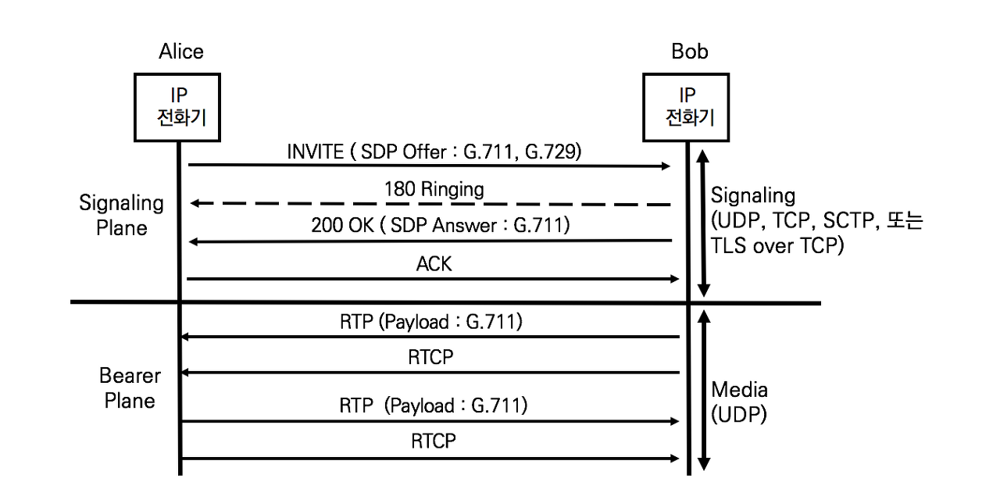

## SDP의 협상방식

SDP는 단말 간의 멀티미디어 세션과 관련된 미디어 타입 및 포맷을 협상하는 프로토콜이며 제안 및 수락 모델로 작동한다.

SDP는 단독으로 전달될 수 없으며 SIP메시지 바디에 포함되어 협상한다.

SDP Offer가 어떤 SdIP메시지에서 전달되느냐에 따라 협상 방식을 두가지로 정의한다.

1. Early Offer

SDP Early Offer는 SIP INVITE메시지와 SDP Offer를 함께 전달하는 방식이다. SDP Answer는 200 OK나 180Ringing과 함께 전달된다. Early Offer는 발신자가 SDP협상의 주도권을 가진다. 대부분의 장비들이 Early Offer를 사용한다.

2. Delayed Offer

SDP Delayed offer는 INVITE메시지에 SDP Offer를 전달하지 않고 180 Ringing이나 200 OK에 SDP Offer를 전달하는 방식이다. SDP Answer는 ACK와 함께 전달한다. Delayed Offer는 수신자가 SDP 협상의 주도권을 갖는다. 시스코 제품들은 Delayed Offer를 사용한다.

### 비교

**Early Offer**

- 미디어 채널의 협상이 빠르다.
- 200 OK 응답 이전에 미디어 채널 협상을 완료하여 사용하고자 할 때 유용하다.

**Delayed Offer**

- 코덱 협상이 확실하다.
- 수신자의 Capability를 확인 후에 협상을 완료할 수 있으므로 Capability 재협상이 수행되지 않는다. 

## 미디어 클리핑과 링백톤 문제

위의 경우 두 가지의 문제가 발생할 수 있다.

1. **원격 링백톤 문제**

180 Ringing메시지를 전달받은 앨리스는 전화기의 링백톤을 재생해야 한다. 앨리스의 전화기는 미디어 채널 협상이 완료되지 않은 시점이므로 자체적으로 Local Ringback Tone을 재생한다. 즉, 미디어 채널이 개방되지 않아도 전화기가 "드르륵 드르륵"소리를 만들어 주면 발신자는 통화가 정상적으로 이루어진다고 생각한다.

그러나 우리는 컬러링이나 착신 측이 보내주는 Remote Ringback Tone(링백톤)을 사용한다. **발신자인 앨리스가 최신 음악의 컬러링을 듣게하기 위해서는 미디어 채널 협상이 180Ringing이전에 끝나야 한다.**

2. **미디어 클리핑 문제**

수화기를 들자마자 "여보세요" 라고 말하지만, ACK를 수신하기 전까지 미디어 채널은 개방되지 않는다. 또한 SIP 시그널링은 다수의 SIP Proxy를 거치지만 음성을 전달하는 RTP는 전화기와 전화기 간에 최단경로를 이용하므로 RTP가 SIP 시그널링보다 더 빨리 전달 될 가능성이 높기 때문에 Media Clipping이 발생할 가능성이 높다. 이럴 경우 앞의 말이 잘리는 현상이 발생한다.

