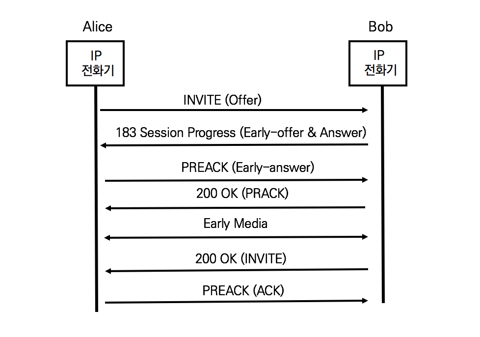

## Early Media Session 설립을 위한 새로운 SIP 헤더

Early Media Session을 기존 다이얼로그에서 생성하기 위해 Content-Disposition헤더를 이용한다.

Content-Disposition 헤더는 'early-session'이라는 새로운 disposition type을 정의하고, Require과 Support헤더에 'early-session'이라는 옵션 태그를 정의하여 early session disposition type을 표시한다

## Content-Disposition 헤더

RFC 3959 The Early Session Disposition Type for the SIP권고안은 Early Media Session과 Regular Media Session이 같은 코덱을 사용할 것을 권고한다.

### 예제



PRACK은 Provisional Response ACKnowledgement의 준말로 아직 설립되지 않은 세션에 신뢰할 수 있는 최종 응답을 제공한다.

1. 앨리스의 INVITE (SDP Offer)

```sip
...
Content-Type: application/sdp
Content-Disposition: session


v=0
o=alice 2890844730 2890844731 IN IP4 host.example.com
s=
c=IN IP4 192.0.2.1
t=0 0
m=audio 20000 RTP/AVP 0
```

앨리스는 SIP INVITE메시지와 Regular Media Session에 대한 SDP Offer를 전달한다

SIP INVITE메세지에 'Content-Disposition:session'헤더를 추가함으로써 현재의 SDP Offer가 Regular Media Session에 대한 협상임을 표시한다.

2. 밥의 183 Session Progress (Early Offer & Answer)

```sip
...
Content-Type: multipart/mixed; boundary="boundary1"
Content-Length: 401

--boundary1
Content-Type: application/sdp
Content-Disposition: session


v=0
o=Bob 2890844725 2890844725 IN IP4 host.example.org
s=
c=IN IP4 192.0.2.2
t=0 0 
m=audio 30000 RTP/AVP 0 

--boundary1
Content-Type: application/sdp
Content-Disposition: early-session

v=0
o=Bob 2890844714 2890844714 IN IP4 host.example.org
s=
c=IN IP4 192.0.2.2
t=0 0
m=audio 30002 RTP/AVP 0
--boundary1--
```

밥은 183 Session Progress메시지와 함께 SDP 협상을 발행한다. SDP 협상은 Early Media Session에 대한 Offer와 REgular Media Session에 대한 Answer이다

Content-Type:multipary/mixed를 통해 여러 SDP 세션에 대한 정보가 포함되어 있음을 표시한다. Content-Disposition 헤더는 Regular Media Session을 위한 'session'과 Early Media SEssion을 위한 'early-session'을 정의하고 각각의 미디어 속성 파라미터를 협상한다

3. 앨리스의 PRACK (Early Answer)

```sip
...
Content-Type: application/sdp
Content-Disposition: early-session

v=0
o=alice 2890844717 2890844717 IN IP4 host.example.com
s=
c=IN IP4 192.0.2.1
t=0 0
m=audio 20002 RTP/AVP 0
```

앨리스는 PRACK 메서드를 이용하여 Early Offer에 대한 Answer를 200OK 이전에 수행하여 Early Media Session협상을 완료한다

