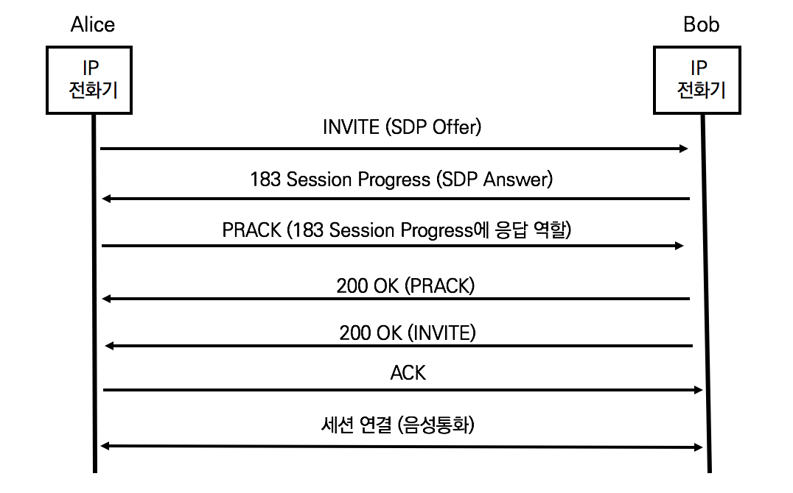

## 응답의 두 가지 유형

- 기본 SIP Call Flow는 INVITE / 200OK / ACK의 3way Handshake이다. 실제 통화에서는 옵션 메시지인 100 Trying과 180 Ringing이 추가된다.


- Final Response (최종 응답)
  요청(Request)에 대한 처리의 결과로써 생성
  요청에 대한 응답으로 동작하므로 신뢰할 수 있는 응답 제공
  예) INVITE에 대한 200 OK와 200 OK에 대한 ACK 

- Provisional Response (임의 응답)
  요청(Request)에 대한 처리 중인 정보를 제공
  전달 후에 응답을 기다리지 않으므로 신뢰할 수 없는 응답
  예) 100 Trying과 183 Session Progress 


## 아직 설립되지 않은 세션에 신뢰할 수 있는 응답이 필요한 이유

UAS전화기는 100 Trying 또는 183 Session Progress와 같은 메시지를 200 OK Response 이전에 전송하면서 필요한 정보를 전달합니다. UAC전화기는 INVITE 요청을 송신한 후 ACK 메서드 전까지는 정보를 전달할 방법이 없다. 즉 UAC는 200 OK이전에 신뢰할 수 있는 응답을 제공하기 위해서 기본적으로 SIP 호 프로시저와 다른 방법이 필요하다.

PRACK은 INVITE에 대한 100 Trying이외에 101qnxj 199 Response에 대해서 신뢰할 수 있는 응답을 제공하는 Provisional ACK이다. PRACK은 일반적인 요청과 마찬가지로 200OK 응답을 받는다.




PRACK은 INVITE에 대한 200 OK 최종 응답 (Final Response)전에 UAC에 의해 생성되며 183 Session Progress라는 Provisional Response에 대한 응답이 PRACK에 포함된다. SIP 호 절차에 따른 메시지를 분석해보자.

1. 앨리스의 INVITE (SDP Offer)

```sip
INVITE sip:bob@192.168.10.20 SIP/2.0
Via: SIP/2.0/TCP pc33.atlanta.com;branch=z9hG4bK776asdhds
Max-Forwards: 70
To: Bob <sip:bob@biloxi.com>
From: Alice <sip:alice@atlanta.com>;tag=1928301774
Call-ID:a84b4c76e66710@pc33.atlanta.com
CSeq: 314159 INVITE
Contact: <sip:alice@pc33.atlanta.com>
Requires: 100rel
Content-Type: application/sdp
Content-Length: 142

(SDP 정보는 생략) 
```

Requires 헤더는 100rel 메시지를 포함한다. 100rel은 Provisional Response에 대한 신뢰성을 제공하기 위한 Option Tag이다. UA들은 신뢰할 수 있는 Provisional Response 주고받을 수 있다.

2. 밥의 183 Session Progress (SDP Answer)

```sip
SIP/2.0 183 Session Progress
Via: SIP/2.0/TCP pc33.atlanta.com;branch=z9hG4bK776asdhds
To: Bob <sip:bob@biloxi.com>
From: Alice <sip:alice@atlanta.com>;tag=1928301774
Call-ID:a84b4c76e66710@pc33.atlanta.com
CSeq: 314159 INVITE
RSeq: 813520
Contact: <sip:alice@pc33.atlanta.com>
Content-Type:application/sdp
Content-Length: 235

(SDP 정보 생략) 
```

Provisional Response는 Rseq 헤더로 squence number를 제공한다. 만일, UAS가 100rel을 지원하지 않는다면, 420 Bad Extension 응답으로 거절하고 Unsupported 헤더에 사유를 명기한다.

3. 앨리스의 PRACK (183 Session Progress)

```sip
PRACK sip:bob@192.168.10.20 SIP/2.0
Via: SIP/2.0/TCP pc33.atlanta.com;branch=z9hG4bK776asi98JK
Max-Forwards: 70
To: Bob <sip:bob@biloxi.com>
From: Alice <sip:alice@atlanta.com>;tag=1928301774
Call-ID:a84b4c76e66710@pc33.atlanta.com
CSeq: 314159
RAck: 813520 314159 INVITE
Contact: <sip:alice@pc33.atlanta.com>
Content-Length: 0
```

183 Session Progress의 Rseq 헤더의 값은 813520으로 PRACK의 RAck 헤더 값과 동일하다. 즉, PRACK 요청은 183 Session Progress 헤더에 신뢰할 수 있는 응답을 제시하는 ACK를 의미한다.

4. 200 OK (PRACK)

```sip
200 OK sip:bob@192.168.10.20  SIP/2.0 
Via: SIP/2.0/TCP pc33.atlanta.com;branch=z9hG4bK776asi98JK ;received=10.1.3.33
To: Bob <sip:bob@biloxi.com>; tag=a6c85e3
From: Alice <sip:alice@atlanta.com>;tag=1928301774
Call-ID:a84b4c76e66710@pc33.atlanta.com
CSeq: 314159 PRACK
Contact: <sip:alice@pc33.atlanta.com>
Content-Length: 0
```

