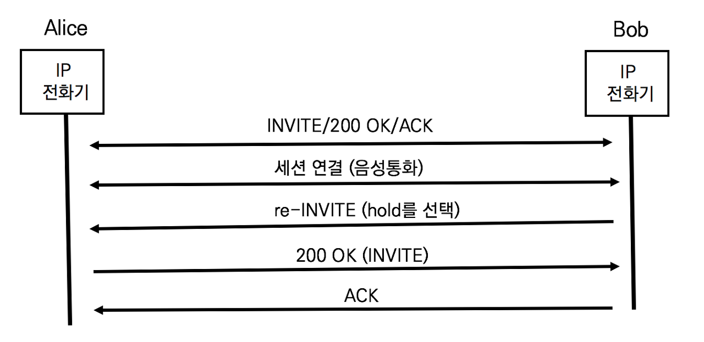

## 세션 설립 후 세션 파라미터 재협상

통화 중 호 보류와 같은 부가 서비스를 구현하기 위해서는 미디어 스트림의 주소, 미디어의 방향 또는 코덱을 변경해야 한다. 통화 중에ㅗ SDP협상을 진행하기 위한 SIP메서드가 필요하지만 SIP세션 서립 후 사용가능한 SIP메서드는 BYE뿐이다. BYE메서드는 세션을 종료할 때 사용 가능하므로 새로운 SIP메서드를 활용하거나 사용 가능한 기존 메서드를 활용한다.

### 기존 메서드 활용

기존 SIP INVITE메서드를 이용해 세션 파라미터를 재협핫ㅇ한다. 세션 헐립 후 세션 파라미터를 협상하기 위해 생성되는 INVITE를 re-INVITE라고 한다. 단순히 기존 세션의 INVITE와 구분하기 위해 달리 부르는 것으로 re-INVITE/200 OK/ACK로 동일하게 동작한다. re-INVITE메서드는 호 보류(Call Hold)와 같은 서비스를 구동하려는 목적으로 많이 활용된다.

앨리스와 밥은 통화중이다. 밥은 부가서비스를 호출하기 위해 보류 (Hold)버튼을 선택하면 re-INVITE메시지가 발행된다. 새로운 INVITE가 발행되므로 새로운 다이얼로그가 생성된다.

### re-INVITE의 대표적 사례 - 호 보류 (Call Hold)

호 보류는 전화기에 보류 버튼이 있을 만큼 IP Telephony 네트워크에서 자주 사용되는 부가 기능이다. 삼자통화를 하거나 회의로 전환하거나 할 때 사용한다.

**re-INVITE를 이용하는 호 보류 서비스의 구현**

- 미디어 스트림의 방향 변경에 의한 호 보류

  일반적으로 사용자가 Hold버튼을 누르는 순간 미디어 방향을 'a-sendonly'로 변경한다. 사용자의 전화기는 묵음이 되어 상대방에게 미디어를 전달하지 않는다. 통화 중인 상대방은 'a=recvonly'상태에 놓이거나 'a=inavtive'로 세션 파라미터를 변경한다.

- 0.0.0.0으로 미디어의 접속 주소 변경에 의한 호 보류

  RFC 3261및 RFC 2543에 명시된 방법으로 'c=0.0.0.0'으로 연결될 IP주소를 바꾸는 압업이다. 보안상 위험함으로 RFC 3264에서 추천하지 않는다. 원래의 세션을 단절할 뿐만 아니라 IPv6에서는 동작하지 않는다.