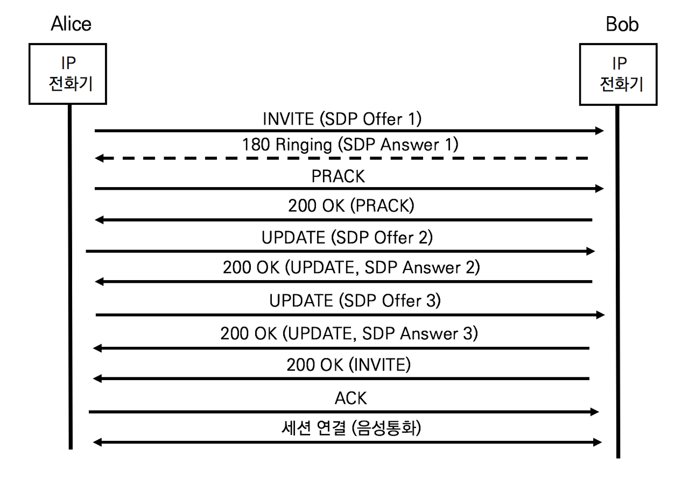

## re-INIVTE메서드로 세션 파라미터 재협상이 불가한 상황

설립된 세션에 대한 세션 파라미터를 재협상하기 위해서는 INVITE메서드를 이용하여 새로운 다이얼로그를 만든다. 하지만 호 보류 상황에서 re-INVITE를 사용할 수 없는 상황이 있다.

- 앨리스의 전화기는 INVITE를 전송 후 180 Ringing을 받아 링백톤을 재생한다. 밥은 벨소리를 듣고 수화기를 들기 전에 호전화를 위해 호보류를 누른다. 즉 200 OK가 전송되기 전에 호보류 서비스를 호출한다
- re-INVITE는 INVITE /200 OK/ACK 이후 세션 설립이 완료된 후에 사용하는 메서드이다. 200OK이전에 새로운 다이얼로그를 생성할 수 없으므로 기존 다이얼로그를 유지하면서 세션파라미터를 재협상해야 한다. re-INVITE메서드를 사용할 수 없는 상황을 위한 메서드가 필요하다.

## UPDATE

UPDATE 메서드는 RFC 3311 The SIP UPDATE Method에서 정의한다. re-INVITE와 달리 UPDATE메서드는 다이얼로그를 유지하면서 세션 파라미터를 재협상한다.


UPDATE는 INVITE / 200 OK / ACK 이전에 세션 협상이 완료된 상황에서 세션 파라미터를 변경하기 위해 사용하고, re-INVITE는 INVITE / 200 OK / ACK이후에 세션 파라미터를 변경하기 위해 사용한다. 세션 협상 완료된 후 통화 중에 기존 다이얼로그를 유지하기 위해 UPDATE를 사용할 수 있지만, re-INVITE를 이용하여 새로운 다이얼로그를 생성하는 것이 일반적이다.


**UPDATE메서드를 이용하여 세션 설립 이전에 G.711코덱에서 G.729코덱으로 변환하는 과정**

1. 앨리스의 INVITE (SDP1 : G.711 OFFER)'

   앨리스는 INVITE와 함께 G.711 코덱을 사용하는 미디어 세션에 대해 SDP Offer를 제안한다.

   ```sip
   INVITE sip:bob@biloxi.com/TCP SIP/2.0
   Via: SIP/2.0/TCP pc33.atlanta.com;branch=z9hG4bK776asdhds
   Max-Forwards: 70
   To: Bob <sip:bob@biloxi.com>
   From: Alice <sip:alice@atlanta.com>;tag=1928
   Call-ID:a84b4c76e66710@pc33.atlanta.com
   Allow: UPDATE
   CSeq: 22756 INVITE
   Contact: <sip:alice@pc33.atlanta.com>
   Requires: 100rel
   Content-Type: application/sdpContent-Length: 142
   
   (SDP 정보는 생략, G711 코덱을 Offer) 
   ```

   Allow 헤더는 사용가능한 메서드를 명기한다. UAC인 앨리스는 'Allow:UPDATE'를 선언하여  UPDATE메서드 사용이 가능하다. 또한 'Requires:100rel'이므로 임의 응답 (Provisional Response)에 대한 신뢰할 수 있는 응답을 제공할 수 있다.

2. 밥의 '180 Ringing (SDP1 : G.711 Answer)'

   밥은 180 Ringing과 함께 G.711코덱을 사용하는 미디어 세션에 대해 SDP Answer를 전달한다.

   ```sip
   SIP/2.0 180 Ringing 
   Via: SIP/2.0/TCP pc33.atlanta.com;branch=z9hG4bK776asdhds
   To: Bob <sip:bob@biloxi.com>
   From: Alice <sip:alice@atlanta.com>;tag=1928
   Call-ID:a84b4c76e66710@pc33.atlanta.com
   Allow: UPDATE
   CSeq: 22756 INVITE
   RSeq: 813520
   Contact: <sip:alice@pc33.atlanta.com>
   Content-Type: application/sdp
   Content-Length: 142
   
   (SDP 정보는 생략, G.711 코덱을 Answer) 
   ```

   UAS인 밥은 'Allow:UPDATE'를 선언하여 UPDATE 메서드 사용이 가능하다. RSeq가 주어져 신뢰할 수 있는 응답이 필요할 경우 사용할 수 있다.

3. 앨리스의 UPDATE (SDP2 : G.729 Offer)

   앨리스는 200 OK 이전에 UPDATE메서드로 코덱을 G.711에서 G.729로 변경한다

   ```sip
   UPDATE sip:bob@biloxi.com/TCP SIP/2.0
   Via: SIP/2.0/TCP pc33.atlanta.com;branch=z9hG4bK776asdhds
   Max-Forwards: 70
   To: Bob <sip:bob@biloxi.com>
   From: Alice <sip:alice@atlanta.com>;tag=1928
   Call-ID:a84b4c76e66710@pc33.atlanta.com
   CSeq: 10197 UPDATE
   Contact: <sip:alice@pc33.atlanta.com>
   Content-Type: application/sdp
   Content-Length: 142
   
   (SDP 정보는 생략, G.729 코덱을 Offer) 
   ```

   

## PRACK과 UPDATE



1. 1차 세션 파라미터 협상 (SDP 1)

   1차 SDP제언과 수락 (Offer & Answer) 협상은 앨리스의 INVITE 요청과 밥의 180 Ringing응답으로 이루어졌다. 앨리스는 180Ringing응답을 정확히 수신했음을 통지하기 위해 PRACK을 발행한다. 여기서 PRACK은 INVITE에 대한 200 OK 이전에 신뢰할만한 응답을 제공한다

2. 2차 세션 파라미터 협상 (SDP 2)

   앨리스가 180 Ringing 이후에 링백톤을 듣다가 호 보류 버튼을 누르고 2차 SDP 제안과 수락 (Offer & Answer) 협상은 