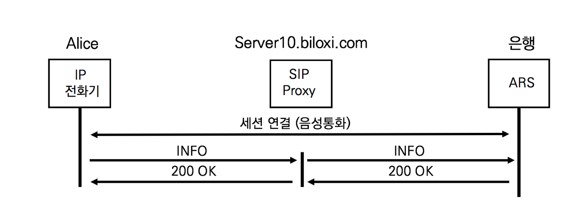
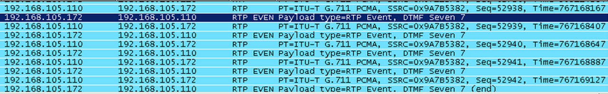

## SIP INFO의 이해

SIP 세션과 관련된 SIP메서드는 다음과 같이 나눈다.

- SIP 세션 설립을 위한 메서드 : INVITE / 200 OK / ACK
- SIP 세션 종료를 위한 메서드 : BYE
- SIP 세션 변경을 위한 메서드 : UPDATE / re-INVITE


UA가 설립된 SIP 세션에 대한 정보를 요청할 필요가 있다. SIP OPTIONS메서드는 SIP세션이 아니라 UA에 대한 Capability 정보를 요청하는 것이므로 적절하지 않다. 새로운 SIP메서드가 필요하다. SIP INFO는 RFC 2976 The SIP INFO Method에서 정의하고, 설립된 SIP 세션 정보에 대한 요청과 어플리케이션 레벨의 단순 정보 선송에 사용한다. SIP INFO가 전송하는 정보는 다음과 같다

- PSTN 게이트웨이 간에 PSTN Signaling 메시지 전송
- DTMF Digits(숫자) 전송
- 무선 모빌리티 어플리케이션 지원을 위한 무선 신호의 세기 전송
- 은행 계좌 잔액을 조회하는 정보
- 통화자 간에 이미지나 텍스트와 같은 비스트리밍 정보를 전송


## SIP INFO 메시지 분석

SIP INFO는 전송할 정보를 SIP INFO의 헤더가 아닌 SIP 메시지 바디를 사용한다.SIP INFO는 은행의 자동응답 시스템 (ARS)과 연결하여 계좌번호나 비밀번호 등을 전달한다.



앨리스는 은행 ARS 시스템에 접속하여 요청받은 비밀번호를 전화기 키패드에서 숫자를 눌러 전달한다. 실제는 다수의 SIP INFO와 200 OK로 구성된다.


1. 앨리스의 INFO

   앨리스는 은행 ARS 자동응답 시스템에 접속한 후에 요청받은 정보를 전달한다.

   ```sip
   INFO sip:ARS@192.168.10.20 SIP/2.0
   Via: SIP/2.0/TCP pc33.atlanta.com;branch=z9hG4bK776asegma
   Max-Forwards: 70
   To: Bank <sip:Bank@Bank_URI.com>
   From: Alice <sip:alice@atlanta.com>;tag=1928301774
   Call-ID:a84b4c76e66710@pc33.atlanta.com
   CSeq: 22756 INFO
   Contact: <sip:alice@pc33.atlanta.com>
   Content-Type: text/plain
   Content-Length: 16
   
   3 1 8 1 9 6 2
   ```

   은행은 기존 Call-ID와 동일한 SIP INFO를 수신한다. Content-Type을 text/plain으로 하여 3181962번호를 전달한다.

2. 응답

   SIP INFO 메시지를 수신한 후 200 OK외에 다음과 같은 응답을 사용할 수 있다.

   - 481 Call leg / Transaction Dose not Exist
     수신된 INFO가 기존의 Call Leg와 매치가 되지 않음 

   - 415 Unsupported Media Type
     UAS가 이해할 수 없는 메시지 바디를 포함하므로 처리 없음

   - 487 Request Terminated
     SIP INFO 요청을 처리 중에 CANCEL 메쏘드를 받음


## SIP INFO에서 Content-Type의 문제

RFC 2976에서 SIP INFO의 메시지 바디에 Digit을 실어 보내도록 되어있지만, Content-Type에 대한 정확한 형식을 규정하지 않아 제조사별로 구현 방식이 다르다. 서로 다을 제조사의 장비 간의 DTMF테스트 중일 때는 Contents-type을 동일하게 명기하는지를 확인할 필요가 있다. DTMF를 위한 SIP INFO의 Content-Type 헤더 값이 다를 수 있다.

- Contents-type; audio/telephone-event
- Contents-type; application/vnd.networks.digits
- Content-Type: text/plain


## DTMF의 이해

DTMF(Dual Tone Multi Frequency)는 2개의 주파수 성분을 갖는 신호를 의미한다. DTMF는 전송할 숫자를 2개의 주파수로 변환하므로 1개의 주파수를 사용하는 Pulse보다 안정적이다. 전화기의 키패드 숫자를 누를 때마다 들리는 삐 소리가 주파수의 소리다. ARS 자동응답 시스템은 주파수를 듣고 숫자로 변홚낟. 즉 DTMF는 전화기가 전송하는 숫자를 상대측 장비가 정확히 수신하도록 한다. DTMF전달 방식은 크게 두가지로 구분된다.

1. Out of band 방식

   Out of band 방식은 시그널링 경로로 DTMF신호를 전달한다. 전화기나 게이트웨이가 음성을 전달하는 미디어 (RTP) 채널로 DTMF 신호음을 전달하지 ㅇ낳고 숫자로 변환하여 시그널링 채널로 전달한다. H.323네트워크에서는 H.245채널을 이용하고 SIP 네트워크에서는 SIP INFO를 이용한다.

   Out of band 방식은 DTMF Duration에 대한 정보를 표현할 수 없으므로 숫자를 길게 또는 짧게 누르는 것을 표현할 수 없다. DTMF를 전달하려는 발신자 숫자를 누른 시간만큼 삐 소리를 듣지만, 수신자는 발신자가 DIGIT버튼에서 손가락을 떼는 순간 시그널링 경로로 메시지만 전달되어 삐 소리만 듣는다.

   SIP INFO는 out of band 방식으로 SIP 시그널링으로 전달되므로 안전덕이고 잡음에 영향을 받지 않는다.

2. In band 방식

   In band 방식은 음성이 전달되는 Media 경로로 DTMF신호를 전달한다. 전화기나 게이트웨이가 음성을 전달하는 미디어(RTP) 채널에 DTMF 주파수를 그대로 전달하므로 DTMF Duration까지도 전달한다.

   In band 방식은 시그널링과 상관없이 RTP를 사용하는 모든 프로토콜에서 사용되고, Bypass와 RFC 2833방식으로 나뉜다.

   - Bypass 방식

     Bypass 방식은 숫자를 RTP가 사용하는 압축코덱으로 음성과 같이 보낸다. 별도의 형식이나 협상이 필요 없이 IP 전화기나 게이트웨이가 숫자에 맞는 주파수를 생성하여 음성 채널로 그대로 전달한다. G.711이 아닌 G.729나 G.723과 같이 압축률이 높은 코덱을 사용할 경우 DTMF톤이 변형되거나 정보가 손실될 가능성이 있다.

   - RFC 2833방식

     RFC 2833방식은 음성과 같은 미디어 세션의 RTP 패킷에 DTMF번호와 볼륨, 시간을 명시하여 전송한다. Out of band의 단점인 주파수의 세기와 시간까지 같이 전달되는 장벙이 있다 RFC 2833 Rtp Payload for DTMF Digits, Telephony Tonse and Telephony Signals 권고안으로 정의한다.

## In band 방식의 SDP 협상

Bypass와 RFC 2833방식은 RTP 채널로 DTMF를 전달한다. SDP Offer /Anaswer모델에서 진행되는 DTMF협상을 살펴본다.

1. Bypass방식의 SDP 협상

   별도의 DTMF협상없이 음성 코덱만을 제안한다. 전화기나 게트웨이는 DTMF를 기존 설립된 RTP채널로 음성과 함께 전달한다.

   ```sip
   v=0
   o=alice 2890844526 2890844526 IN IP4 atlanta.com
   c=IN IP4 10.1.3.33 
   t=0 0
   m=audio 49172 RTP/AVP 18 
   a=rtpmap:18 G729/8000
   ```

2. RFC 2833 방식의 SDP 협상

   RFC 2833 DTMF협상을 위해 페이로드 타입 101을 협상한다.

   ```sip
   v=0
   o=alice 2890844526 2890844526 IN IP4 atlanta.com 
   c=IN IP4 10.1.3.33
   t=0 0
   m=audio 49172 RTP/AVP 18 101
   a=rtpmap:18 G729/8000 
   a=rtpmap:101 telephone-event/8000
   ```

## RFC 2833 DTMF의 정보 손실 방지 방안

RFC 2833방식이 사용하는 RTP 채널은 UDP로 전달되므로 수신 측에서부터 수신 확인에 대한 응답을 받지 못한다. RFC 2833은 DTMF패킷 분실에 대한 위험을 분산하기 위해 하나의 숫자를 여러번 전송한다. SIP 단말은 RFC 2833방식의  DTMF 방식 선택 시 몇 개의 패킷을 보낼지 설정한다. 같은 In Band방식의 Bypass방식은 패킷 분실에 대한 대응 방안이 없다.



DTMF 전송 방식은 항상 장애나 분실에 대비해 어플리케이션 레벨의 전송 확인하는 절차를 둔다. IVR(Interactive Voice Response)나 ARS자동 응답 시스템은 수신된 숫자들이 정확한지를 어플리케이션 레벨에서 확인하기 위한 재확인 멘트를 재생한다. 예를 들어 , "지금 전송한 회원번호가 XXX이면 1번 아니면 2번을 눌러 주세요"가 대표적이다.

