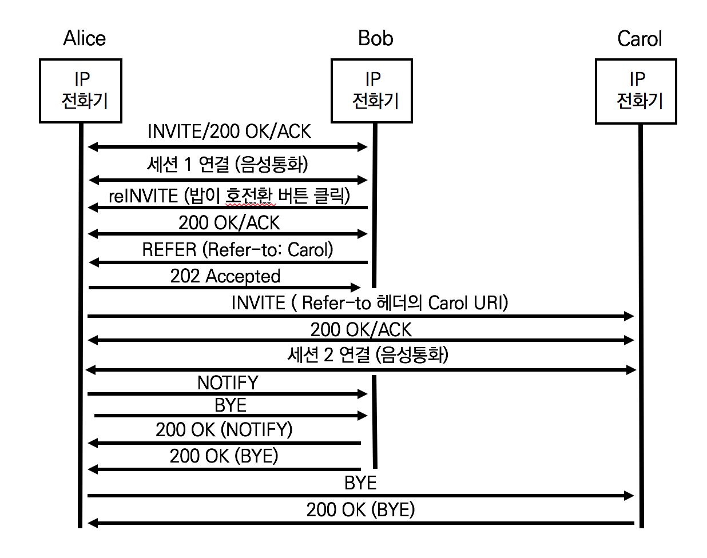
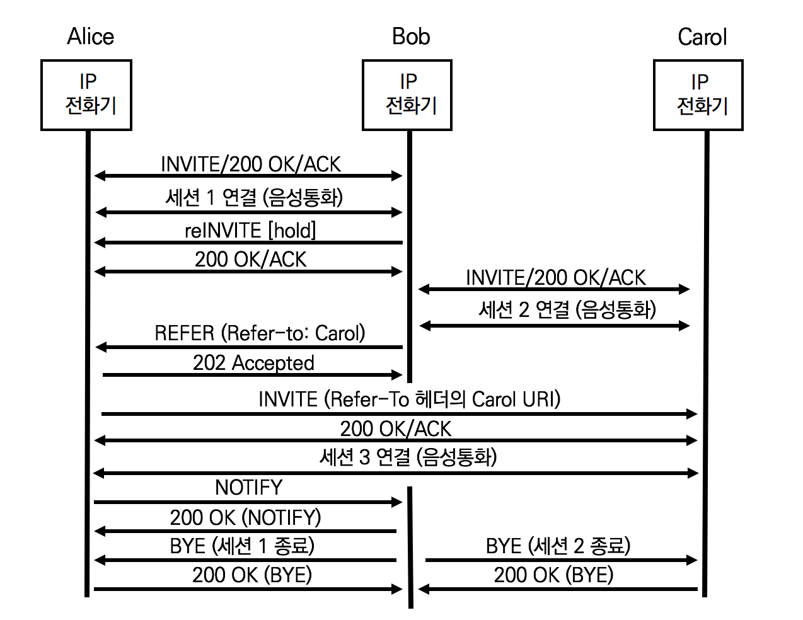

## REFER Method의 이해

SIP REFER메서드는 제공하는 자원을 UA가 참조하게 하고 RFC 3261 SIP 및 RFC 3515 The Refer Method에서 정의한다. SIP REFER메서드의 Refer-To 헤더가 지정하는 자원을 활용하기 위해 UA는 제 3의 UA로 INVITE를 발행한다. SIP REFER메서드를 사용하는 부가 서비스로는 호 전환 (Call Transfer)이 있다.


SIP REFER요청의 Refer-To헤더는 UA가 INVITE요청을 제대로 발행하도록 정확한 목적지 주소를 사용해야 한다. Refer-To 헤더의 주소는 다양한 형식의 URI를 지원한다.

- Refer-To: sip:alice@atlanta.example.com
- Refer-To: <sip:bob@biloxi.example.net?Accept-Contact=sip:bobsdesk.biloxi.example.net&Call-ID%3D55432%40alicepc.atlanta.example.com>
- Refer-To: <sip:dave@denver.example.org?Replaces=12345%40192.168.118.3%3Bto-tag%3D12345%3Bfrom-tag%3D5FFE-3994>
- Refer-To: <sip:carol@cleveland.example.org;method=SUBSCRIBE>
- Refer-To: http://www.ietf.org

SIP REFER요청을 받은 UA는 반드시 2020 Accepted로 응해야 한다.

## 이벤트 처리의 결과를 SIP NOTIFY로 통보

SIP REFER 요청을 수신한 UA는 요청의 처리 결과를 통보하기 위해 SIP NOTIFY메서드를 사용한다. SIP NOTIFY요청의 메시지 바디에는 다음과 같은 정보가 표신된다.

- SIP/2.0 100 Trying
  현재 REFER에 의해 요청된 이벤트 처리 중
- SIP/2.0 200 OK
  현재 REFER에 의해 요청된 이벤트 정상 처리 완료
- SIP/2.0 503 Service Unavailable
  현재 REFER에 의해 요청된 이벤트 실패 
- SIP/2.0 603 Declined
  현재 REFER에 의해 요청된 이벤트 거절 

## SIP REFER 메시지 분석

RFC 3515 The Refer Method에서 설명된 REFER Call Flow


1) 앨리스의 REFER

통화중에 앨리스는 밥에게 회원번호를 요청하고 수집용 서버로 호 전환을 시도한다. 앨리스 전화기는 밥에게 REFER 요청을 발행ㅎ나다

```sip
REFER sip:b@atlanta.example.com SIP/2.0 
Via: SIP/2.0/UDP agenta.atlanta.example.com;branch=z9hG4bK2293940223
To: <sip:b@atlanta.example.com>
From: <sip:a@atlanta.example.com>;tag=193402342
Call-ID:898234234@agenta.atlanta.example.com
CSeq: 93809823 REFER
Max-Forwards: 70
Refer-To: (whatever URI, 서버의 주소)
Contact: sip:a@atlanta.example.com
Content-Length: 0
```

Refer-To 헤더는 서버의 URI 주소를 명기한다. 밥은 새로운 INVITE요청을 발행한다.

2) 밥의 202 Accepted

밥은 REFER요청을 수신하고 처리했다는 의미로 2020 Accepted로 응답한다.

```sip
SIP/2.0 202 Accepted
Via: SIP/2.0/UDP agenta.atlanta.example.com;branch=z9hG4bK2293940223
To: <sip:b@atlanta.example.com>;tag=4992881234
From: <sip:a@atlanta.example.com>;tag=193402342
Call-ID:898234234@agenta.atlanta.example.com
CSeq: 93809823 REFER
Contact: sip:b@atlanta.example.com
Content-Length: 0
```

3) 밥의 NOTIFY

밥은 SIP REFER에 의한 이벤트 진행 상황을 SIP NOTIFY로 앨리스에게 통보한다. SIP 메시지 바디의 'SIP/2.0 100 Trying'는 요청된 이벤트를  처리 중임을 의미한다

```sip
NOTIFY sip:a@atlanta.example.com SIP/2.0
Via: SIP/2.0/UDP agentb.atlanta.example.com;branch=z9hG4bK9922ef992-25
To: <sip:a@atlanta.example.com>;tag=193402342
From: <sip:b@atlanta.example.com>;tag=4992881234
Call-ID:898234234@agenta.atlanta.example.com
CSeq: 1993402 NOTIFY
Max-Forwards: 70
Event: refer
Subscription-State: active;expires=(depends on Refer-To URI)
Contact: sip:b@atlanta.example.com
Content-Type: message/sipfrag;version=2.0
Content-Length: 20

SIP/2.0 100 Trying
```

Event헤더는 `Event:refer`값으로 호 전환 서비스를 타나탠다. Subscription-State헤더는 요청의 상태 정보를 나타내므로  SIP REFER 요청에 대한 상태 정보다.

- Subscription-State:active 
  Refer-To의 대상이 이벤트를 승인하고 처리 중
- Subscription-State:pending
  Refer-To의 대상이 요청을 수령하고 불충분한 정책 정보로 승인 또는 거절을 결정하지 못함
  호전환 서비스에서 pending 상태 정보는 발생하지 않음
- Subscription-State:terminatd;reason=noresource
  Refer-To의 대상이 이벤트 처리 완료
  반드시 사유를 명기

4) 앨리스의 200 OK (NOTIFY)

SIP NOTIFY 메시지 수신을 통보한다.

```sip
SIP/2.0 200 OK
Via: SIP/2.0/UDP agentb.atlanta.example.com;branch=z9hG4bK9922ef992-25
To: <sip:a@atlanta.example.com>;tag=193402342
From: <sip:b@atlanta.example.com>;tag=4992881234
Call-ID:898234234@agenta.atlanta.example.com
CSeq: 1993402 NOTIFY
Contact: sip:a@atlanta.example.com
Content-Length: 0
```

## 

## SIP REFER 요청의 활용 - 호전환 (Call Transfer)

SIP RFER메서드를 사용하는 부가 서비스는 호전환 (Call Transfer)이며 구현하는 방식에 따라 Blind Transfer와 Consultative Transfer로 나뉜다.

1) Blind Transfer

앨리스와 통화 중에 밥은 호전환(Transfer)버튼을 누른다. 밥의 전화기는 re-INVITE메시지에 호 보류 (Call Hold)를 위한 SDP 메시지를 전달함과 동시에 호 전환 대상의 전화번호를 수집하기 위한 프롬프트를 표시한다. 밥이 캐럴의 전화번호를 다이얼링한다.

밥의 전화기는 앨리스의 전화기로 캐럴의 전화번호를 REFER요청의 Refer-to 헤더로 전달한다. 앨리스의 전화기는 캐럴의 전화기로 자동으로 호를 시도한다. 앨리스는 링백톤을 듣고 캐럴은 전화 벨소리를 듣는다. 캐럴이 수화기를 들면 대화를 시작한다.

앨리스의 전화기는 요청된 이벤트가 정상 처리되었음을 통지하기 위해 SIP NOTIFY 메서드를 밥에게 송신한다. 그리고 앨리스의 전화기와 밥의 전화기간의 통화를 자동으로 종료한다.



호를 전달받은 제삼자인 캐럴은 앨리스가 직접 전화한 것인지 밥이 호전환시켜준 것인지 알지 못한다. Blind Transfer 서비스는 제삼자와 통화 없이 제삼자에게 호전환 서비스를 호출한다. 단지 캐럴의 IP 전화기 디스플레이에서 밥이 호전환했다는 표시만 한다.

2) Consultative Transfer

앨리스와 통화 중에 밥은 호전환(Transfer)버튼을 누른다. 밥의 전화기는 re-INVITE 메시지에 호보류 (Call Hold)를 위한 SDP메시지를 전달함과 동시에 호 전환 대상의 전화번호를 수집하기 위한 프롬프트를 표시한다. 밥이 캐럴의 전화번호를 다이얼링 한다.

밥은 링백톤을 듣고 캐럴은 전화 벨소리를 든는다. 캐럴이 수화기를 들면 대화를 시작한다. 밥은 앨리스와 통화 중이고 앨리스와 통화를 원하는지 캐럴에게 물어본다. 캐럴이 앨리스와의 통화를 승낙한다.

밥이 호전환 버튼을 다시 누른다. 밥의 전화기는 앨리스의 전화기로 캐럴의 전화번호를 REFER요청의 Refer-to헤더로 전달한다. 앨리스의 전화기는 캐럴의 전화기로 자동으로 호를 시도한다. 앨리스는 링백톤을 듣고 캐럴은 전화 벨소리를 든는다. 캐럴이 수화기를 들고 대화를 시작한다.



호를 전달받은 제삼자인 캐럴은 밥이 호전환 시켜주면서 앨리스와 통화하고 있다는 것을 알고 있다. Consultative Transfer서비스는 제삼자와 통화 후 승낙을 받은 후에 제삼자에게 호전환 서비스를 호출한다.