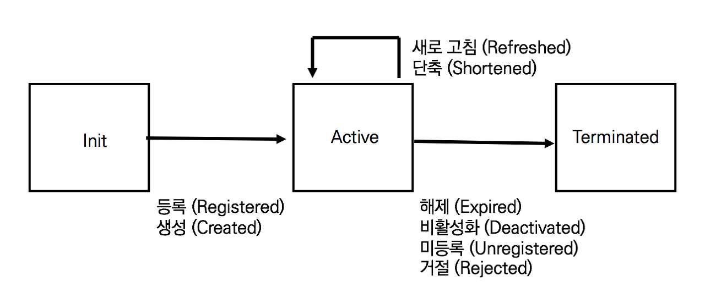
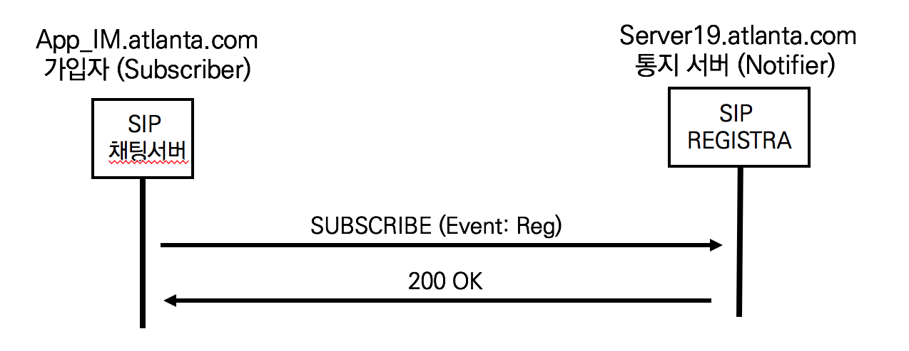

## 등록 상태 정보를 활용하는 SIP 응용 서비스

등록 상태 정보를 이용하는 SIP 응용 서비스들은 상태 정보 변화에 대한 이벤트 통지(Notifiaction)를 요청하고 이벤트 변화에 대한 업데이트를 수시로 통지받는다. RFC 3265 SIP-Specific Event Notifiaction는 상태 정보를 이용하는 응용 서비스들을 설명한다.

- 자동 콜백 서비스 (Automatic Callback Service)

  앨리스가 밥에게 몇 번이나 전화했지만 통화중이거나 부재중이다. 이런 경우에 앨리스는 밥과 확실히 통화하기 위해 자동 콜백 서비스를 사용한다. 자동 콜백 서비스는 밥의 전화기가 통화가 가능한 상태로 상태 정보가 변경되면 앨리스의 전화기에 밥의 전화기의 상태 정보를 업데이트한다. 앨리스는 밥의 상태 정보ㄹ 변화를 감지하고 통화를 시도한다.

- Buddy List (친구 목록)

  PC 메신저 앱이나 전화기의 주소록에 등록된 친구 목록은 친구들의 상태 정보를 표시한다. 메신저는 친구들이 채팅을 위해 온라인 또는 오프라인인지를 표시하고 전화기는 친구들이 통화중인지 통화대기 중인지를 표시한다

- 메시지 대기 표시 MWI (Message Waiting Inidcation)

  음성사서함은 읽지 않은 메시지의 유무를 전화기나 소프트폰에 통지한다. 전화기는 붉은색의 LED로 표시하고 메신저는 붉은 숫자르ㅗ 표시한다. 메시지 대기 표시를 확인한 사람들은 음성 사서함에 접속하여 저장된 음성 메시지를 재생한다.

## 등록 상태 머신 (Registration State Machine)

RFC 3680 SIP Event Package for Registration은 SIP REGISTRA서버가 단말의 상태 정보를 어떻게 관리하는지를 설명하기 위해 등록 상태 머신을 설명한다.

SIP 네트워크에서 등록(Registration)은 사용자의 AoR(Address-of-record)과 탄말의 Contact Address와를 바인딩하는 과정이다. 하나의 AoR은 여러개의 Contact Address를 가질 수 있다. UA가 SIP REGISTRA서버에 등록하는 과정에서 등록 상태 정보는 3 단계로 표시되며, 이를 등록 상태 머신이라고 한다

- Init

  사용자의 AoR에 단말의 Contact Address가 없는 상태

  SIP REGISTRA에 등록된 사용자이나 통화 가능한 단말이 없음

- Active

  사용자의 AoR에 하나 이상 단말 Contact address가 바인딩된 상태

  SIP REGISTRA에 등록된 사용자이며 통화 가능한 단말이 있음

- Terminated

  사용자의 AoR에 단말의 Contact Address가 바인딩 된 후에 해제된 상태

  Termiatated된 후 등록 상태는 Init 상태로 전환

엄밀하게 등록 상태 정보와 사용자 상태 정보는 다르다. 사용자 상태 정보는 사용자가 SIP 네트워크에서 통화가 가능한지를 나타내고 하나 이상의 단말 Contact address의 모음으로 나타낸다. 등록 상태 정보는 단순히 단말의 Contact address가 존재하는지를 나타낸다.

## SIP SUBSCRIBE 메서드의 이해

신청자(Subscriber)가 SIP REGISTRA 서버에 특정 사용자의 상태 정보 업데이트를 요청하기 위해 SIP SUBSCRIBE 메서드를 사용한다. SIP REGISTRA 서버는 사용자의 상태 정보에 대한 이벤트가 발생할 경우 신청자에게 SIP NOTIFY 메서드로 결과를 통지한다. SIP SUBSCRIBE 메서드를 발행하는 UA를 신청자 (Subscriber)라 하고, NOTIFY로 응답하는 SIP REGISTR 서버를 Notifier라고 한다.

