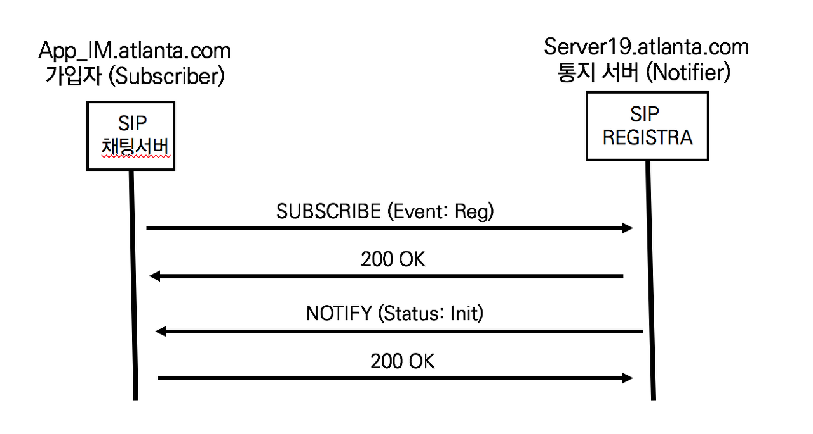

## SIP NOTIFY의 이해

SIP NOTIFTY는 요청된 이벤트가 발생할 경우 그 결과를 통지한다. SIP SUBSCIRB 메서드는 등록 상태 정보 이벤트를 요청하고 SIP REFER는 호 전환 이벤트를 요청한다. 두 요쳥에 포함한 이벤트의 승인은 200 OK로 응답하지만, 요청이벤트가 발생하여 상세한 업데이트는 SIP NOTIFY 메서드를 이용한다

SIP 채팅 서버가 앨리스의 등록 상태 정보를 SIP REGISTRA 서버에게 요청하는 과정은 SIP SUBSCRIBE 요청과 200 OK 응답이다. SIP SUBSCRIBE 메서드는 이미 설명했으므로 SIP NOTIFIY의 동작에 대해 정리한다.