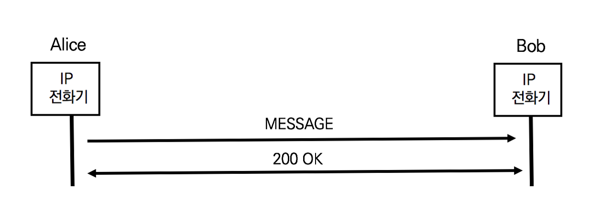
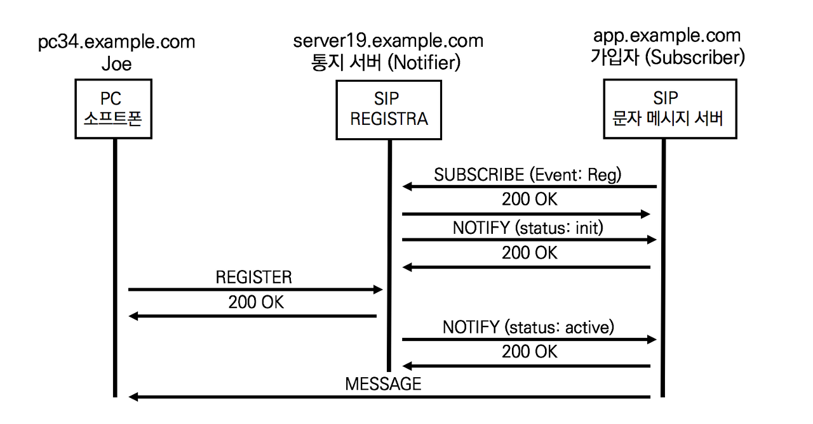

## MESSAGE 메서드

SIP MESSAGE메서드는 근 실시간으로 사용자 간에 메시지를 주고받기 위해 사용하며, RFC 3428 SIP for Instant Messaging에서 정의한다.

MESSAGE 요청은 다음과 같은 응답이 발생할 수 있다

- 200 OK

  사용자가 메시지를 읽었다는 것을 의미하는 것이 아니라 MESSAGE요청을 수신

- 4xx or 5xx

  MESSAGE 요청이 성공적으로 전달되지 않음

- 6xx

  MESSAGE 요청이 전달되었으나 사용자가 수신을 거절


## SIP MESSAGE 메시지 분석

SIP MESSAGE 요청과 응답을 정리



1. 앨리스의 MESSAGE

   앨리스와 밥은 별도의 다이얼로그를 생성하지 않고 앨리스는 SIP MESSAGE 요청을 전송한다

   ```sip
   MESSAGE sip:bob@biloxi.com  SIP/2.0 
   Via: SIP/2.0/TCP pc33.atlanta.com;branch=z9hG4bK776asegma
   Max-Forwards: 70
   To: Bob <sip:bob@biloxi.com>
   From: Alice <sip:alice@atlanta.com>;tag=1928301774
   Call-ID:a84b4c76e66710@pc33.atlanta.com
   CSeq: 22756 MESSAGE
   Content-Type: text/plain
   Content-Disposition: render
   Content-Length: 37
   
   
   Hello! Bob
   ```

   SIP 메시지 바디에 던송되는 메시지의 크기는 1300 Bytes를 초과할 수 없다.

2. 밥의 200 OK

   ```sip
   SIP/2.0 200 OK
   Via: SIP/2.0/TCP pc33.atlanta.com;branch=z9hG4bKnashds7 ;received=10.1.3.33
   To: Bob <sip:bob@biloxi.com>
   From: Alice <sip:alice@atlanta.com>;tag=1928301774
   Call-ID:a84b4c76e66710@pc33.atlanta.com
   CSeq: 22756 MESSAGE
   Content-Length: 0
   ```


## 환영인사 (Welcome Notice) 예제 시나리오

RFC 3680 SIP Event Package for Registration 권고안에 등록 상태 정보를 이용한 예제 시나리오가 있다. Welcome Notice는 사용자의 상태 및 위치정보를 확인하여 스마트폼의 전원이 해외 로밍 지역에서 전원이 켜지면 자동으로 문자 메시지를 전송하는 시스템이다. SUBSCIRBE, NOTIFY, 그리고 MESSAGE 메서드가 함께 동작하는 서비스 시나리오다.



SIP REGISTRA 서버는 NOtifier이며 SIP 문자 메시지 서버는 신청자(Subscriber)이다.

1. 문자 메시지 서버 SUBSCRIBE

   문자메시지 서버는 조(Joe)의 등록 이벤트 정보 업데이트를 SIP REGISTRA 서버에게 요청한다.

   ```sip
   SUBSCRIBE sip:joe@example.com SIP/2.0
   Via: SIP/2.0/UDP app.example.com;branch=z9hG4bKnashds7
   From: sip:app.example.com;tag=123aa9
   To: sip:joe@example.com
   Call-ID:9987@app.example.com
   CSeq: 9887 SUBSCRIBE
   Contact: sip:app.example.com
   Event: reg
   Max-Forwards: 70
   Accept: application/reginfo+xml
   ```

   Event 헤더로 등록 상태 정보 업데이트를 요청하지만, 요청의 유효기간을 설정하기 위한 Expires 헤더는 없다.

2. SIP REGISTRA 서버의 200 OK

   SIP REGISTRA 서버는 SUBSCRIBE 요청을 수신하고 200 OK로 응답한다.

   ```sip
   SIP/2.0 200 OK
   Via: SIP/2.0/UDP app.example.com;branch=z9hG4bKnashds7;received=192.0.2.1
   From: sip:app.example.com;tag=123aa9
   To: sip:joe@example.com;tag=xyzygg
   Call-ID:9987@app.example.com
   CSeq: 9987 SUBSCRIBE
   Contact: sip:server19.example.com
   Expires: 3600
   ```

   SIP REGISTRA 서버는 등록상태 정보 통시 요청의 유효기간을 3600초로 설정한다.

3. SIP REGISTRA 서버의 NOTIFY

   SIP REGISTRA 서버는 SIP 문자 서비스로부터 SIP SUBSCRIBE 요청에서 조의 등록 상태 정보 업데이트를 요청받았다. 현재의 등록 상태 정보를 업데이트한다.

   ```sip
   NOTIFY sip:app.example.com SIP/2.0
   Via: SIP/2.0/UDP server19.example.com;branch=z9hG4bKnasaii
   From: sip:joe@example.com;tag=xyzygg
   To: sip:app.example.com;tag=123aa9
   Call-ID:9987@app.example.com
   CSeq: 1288 NOTIFY
   Contact: sip:server19.example.com
   Event: reg
   Max-Forwards: 70
   Content-Type: application/reginfo+xml
   Content-Length:...
   
   <?xml version="1.0"?>
       <reginfo xmlns="urn:ietf:params:xml:ns:reginfo"
                       version="0" state="full">
        <registration aor="sip:joe@example.com" id="a7" state="init" /> 
   </reginfo>
   ```

   SIP 메시지 바디의 XML 정보는 조가 아직 등록하지 않은 state='init"상태이다. 그리고 SIP NOTIFY 요청의 응답은 200 OK이다.

4. 조의 REGISTRER

   조는 비행기 착륙 후에 스마트폼의 전원을 켜면서  SIP REGISTER 메시지를 발행한다. 조는 자신의 AoR주소에 단말 Contact address를 바인딩한다.

   ```sip
   REGISTER sip:example.com SIP/2.0
   Via: SIP/2.0/UDP pc34.example.com;branch=z9hG4bKnaaff
   From: sip:joe@example.com;tag=99a8s
   To: sip:joe@example.com
   Call-ID:88askjda9@pc34.example.com
   CSeq: 9976 REGISTER
   Contact: sip:joe@pc34.example.com
   ```

5. SIP REGISTRA 서버의 NOTIFY

   SIP REGISTRA 서버는 조의 상태 정보가 업데이트되자마자 SIP 문자 메시지 서버에 조의 상태 정보를 SIP NOTIFY 요청으로 업데이트한다.

   ```sip
   NOTIFY sip:app.example.com SIP/2.0 
   Via: SIP/2.0/UDP server19.example.com;branch=z9hG4bKnasaij 
   From: sip:joe@example.com;tag=xyzygg 
   To: sip:app.example.com;tag=123aa9
   Call-ID:9987@app.example.com
   CSeq: 1289 NOTIFY
   Contact: sip:server19.example.com
   Event: reg
   Max-Forwards: 70
   Content-Type: application/reginfo+xml
   Content-Length:...
   
   
   <?xml version="1.0"?>
   <reginfo xmlns="urn:ietf:params:xml:ns:reginfo" 
              version="1" state="partial">
        <registration aor="sip:joe@example.com" id="a7" state="active">
                <contact id="76" state="active" event="registered"
                duration-registered="0">
                <uri>sip:joe@pc34.example.com </uri>
                </contact>
          </registration>
   </reginfo>
   ```

   SIP 메시지 바디의 XML 정보는 조가 state="active"상태로 단말이 등록되었고, 단말 Contact address는 pc34.example.com이다. 그리고 SIP NOTIFY요청의 응답은 200 OK이다.

6. SIP 문자 메시지 서버의 MESSAGE

   SIP 문자 메시지 서버는 SIP NOTIFY 요청으로 확인된 조의 단말 주소로 "Welcome to the example.com service"메시지를 발송한다.

   ```sip
   MESSAGE sip:joe@pc34.example.com SIP/2.0
   Via: SIP/2.0/UDP app.example.com;branch=z9hG4bKnashds8
   From: sip:app.example.com;tag=123aa10 
   To: sip:Joe@example.com
   Call-ID:9988@app.example.com
   CSeq: 82779 MESSAGE
   Max-Forwards: 70
   Content-Type: text/plain
   Content-Length: ...
   
   
   Welcome to the example.com service!
   ```

   

