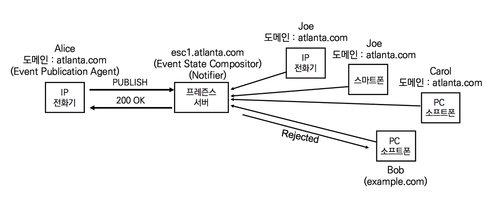

## 사용자 상태 정보(Presence)의 이해

PC에서 사용하는 앱은 전원을 끄면 사용할 수 없지만, 스마트폰은 항상 켜져있고 사용자가 가지고 다닌다. 사용자 상태 정보는 네트워크로 전파되는 연결 (willingness and ability)이므로 스마트폰의 협업 서비스는 Always-on으로 항상 연결된다. 그래서 카카오톡과 같은 모바일 메신저는 상태 정보보다 메시지는 읽었는지 안읽었는지를 표시한다.

스카이프와 같은 PC용 메신저가 스카트폰 앱을 만들기도 하고, 카카오톡과 같은 모바일 메신저가 PC용 앱을 만들기도 한다. 두 제품군은 상태 정보의 표시 여부로 구분될 수 있다. 과거에 즐겨 사용하던 구글 행아웃, 네이트온, MSN등과 같은 PC메신저는 버디 리스트에 사용자 상태 정보를 표시한다. 상태 정보는 온라인(On-line) 또는 오프라인(Off-line) 정보와 같은 단순 정보에서부터 회의 중 (Meeting), 통화 중(Busy), 자리비움(Away) 등과 같은 복잡한 정보까지 확장한다. 이렇게 복잡한 상태 정보를 제공하던 PC용 메신저는 일반인들 사이에서는 사라졌지만, 기업용 PC메신저들은 아직도 활발하게 사용된다.

또한, SIP 전화기들도 통화 중(Busy)과 통화 대기 중(idle)에 대한 상태 정보를 적극적으로 사용한다. 사용하는 서비스들은 다음과 같다

- BLF 스피드 다이얼 버튼

  BLF (Busy Lamp Filed)  스피드 다이얼 버튼은 상태 정보를 표시하는 스피드 다이얼 버튼이다. 자주 통화하는 번호를 BLF 스피드 다이얼 버튼으로 지정하여 통화여부를 확인한다. 주로 비서들이 매니저들에게 걸려온 전화를 호전환 하기 전에 메니저의 전화기 상태 정보를 확인한다.

- 통화 내역 확인 (Call History)

  최근 발신 내역이나 최근 수신 내역을 확인할 때 전화번호의 상태 정보를 표시한다.

- 전화번호 확인 (DIrectory Search)

  전화번호 검색을 할 때 검색된 전화번호의 상태 정보가 표시된다.

- 웹에서 회사 주소록 찾기

  회사 주소록에서 특정 직원을 검색할 때 직원 전화번호의 상태 정보가 표시된다. 일반적으로 웹페이지의 전화번호는 클릭 투 콜 서비스와 연결되어 있어 클릭만으로 전화를 걸 수 있다.

사용자의 상태 정보는 SIP 전화기, SIP 소프트폰과 메신저 등에서 사용한다.

## SIP PUBLISH의 이해

등록상태정보를 교환하기 위해서 REGISTER, SUBSCRIBE 및 NOTIFY메서드가 유기적으로 동작한다. 등록 상태 정보는 사용자의 AoR과 Contact address의 바인딩에 의해 생성된다. 사용자 상태 정보는 다수의 Contact address의 조합으로 만들어진다. 사용자 상태 정보는 자동 생성되기도 하지만, Do not Disturb처럼 사용자에 의해 강제 설정될 수도 있다. 그러므로 사용자의 AoR과 연관된 여러 이벤트를 처리할 수 있는 별도의 메서드가 필요하다.

SIP PUBLISH 메서드는 AoR (Address-of-Record)과 연관된 Event State를 생성, 변경 및 제거한다. RFC 2779 A Model for Presence and Instant Messaging과 RFC 3903 SIP Extension for Event State Publication의 용어 정의를 통해 상태 정보를 생성하고 교환하는 과정에 대한 구성 요소를 살펴본다.

- Event State

  자원의 상태 정보

- EPA (Event Publication Agent

  PUBLISH 요청을 발행하는 UAC

  RFC 2856의 PUA (Presence User Agent)

- ESC (Event State Compositor)

  PUBLISH 요청을 받아 처리하는 UAS

  RFC 3856의 PA (Presence Agent)

  Proxy 및 Register와 공존

- Event Hard State

  자원의 default Event State로 AoR에 대한 고정된 상태 정보

  ESC는 Soft State Publicsation이 없을 때 사용

- Event Soft State

  PUBLISH 메커니즘을 통해 EPA가 발행하는 Event State

  유효기간 내에서만 의미를 나타냄

RFC 권고안들이 같은 장비를 다르게 부르는 이유는 복잡한 기능을 쉽게 정의하기 위해서다. Event State Compositor는 SIP Proxy 서버일 수도 있고, 사용자 상태 정보를 관리하는 프레즌스 서버일 수도 있다. 사용자 규모와 제조사에 따라 SIP Proxy서버와 프레즌스 서버가 한 방비로 구현하거나 별도로 구현한다. 엔지니어는 장비명이 무엇인지가 아니라 기능이 무엇인지 알아야 한다.

프레즌스 서버는 도메인에 있는 사용자들의 상태 정보를 관리하고 신청자들에게 업데이트를 하는 역할을 한다. 앨리스의 상태 정보를 통지받기 원하는 사용자들은 프레즌스 서버(Notifier)에 상태 정보 업데이트 통지 신청을 하기 위해 SUBSCRIBE 메서드를 사용한다. 프레즌스 서버는 같은 프레즌스 도메인에 있는 신청자들의 SUBSCRIBE 요청을 수락하지만, 서로 다른 프레즌스 도메인에 있는 밥의 요청은 거절한다.

앨리스의 전화기는 SIP REGISTER요청과 함께 자신에게 설정된 프로파일에 따라 상태 정보 업데이트를 SIP PUBLISH 요청으로 프레즌스 서버로 보낸다. 앨리스는 프레즌스 서버어ㅔ 단순한 상태 정보, 위치 및 시간 등의 정보가 전달되지만 프레즌스 서버는 상태 정보 정책에 따라 지정돤 정보가 신청자들에게 전달한다. 상태 정보 전파는 SIP NOTIFY 메서드를 활용한다. 또한 상ㅐ 정보 전파는 프레즌스 정책에 따라 전파하거나 하지 않을 수 있다.

w정리하면, 특정 사용자에 대한 상태 정보를 프레즌스 서버에 신청하기 위해서는 SIP SUBSCRIBE 메서드를 사용한다. 프레즌스 서버가 특정 사용자의 상태 정보 변화를 신청자에게 업데이트하기 위해서는 SIP NOTIFY메서드를 사용한다. 사용자가 자신의 상태 정보를 프레즌스 서버에 업데이트하기 위해서는 SIP PUBLISH메서드를 사용한다.