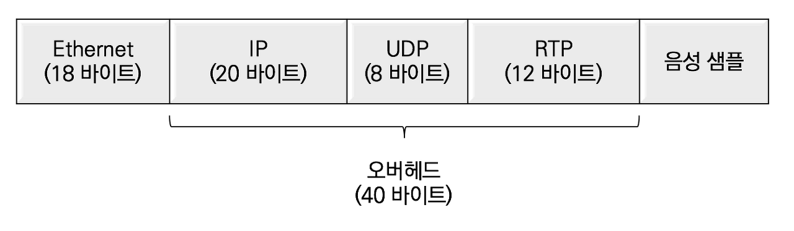
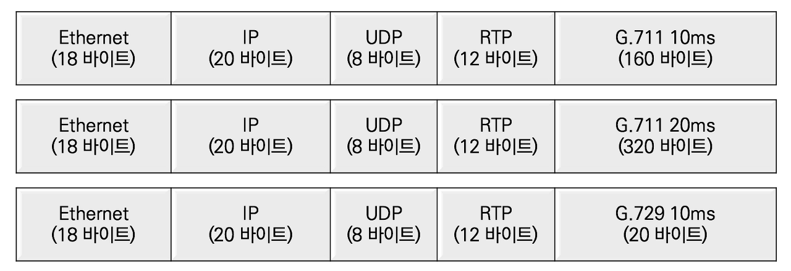
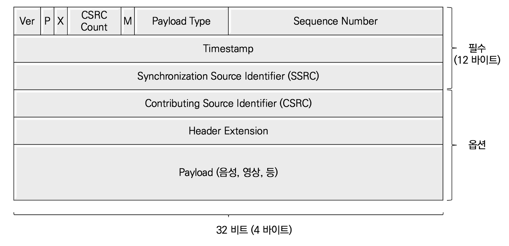
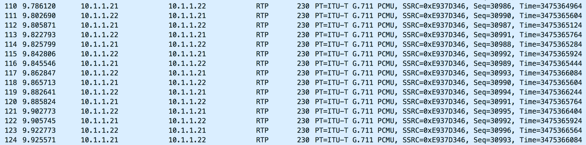
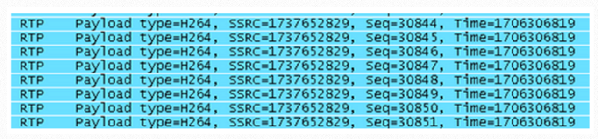

## RTP의 개요

RTP는 Real-time Transport Protocol의 약어로 실시간 음성, 영상 및 데이터를 IP 네트워크로 전송하는 표준 프로토콜이다. RTP는 IETF RFC 3350 A Transport Protocol for Real-Time Applications 권고안에서 정의한다. RTP는 RTCP (Real-time Control Protocol)를 이용하여 데이터의 전달 상황을 감시 및 최소한의 제어 기능과 미디어 식별 등을 제공한다. RTCP의 사용은 옵션이므로 설정에 따라 사용할 수 있다.

## RTP의 전송 프로토콜

RTP는 전송 프로토콜로 UDP (User Datagram Protocol)과 네트워크 프로토콜로 IP를 이용한다. RTP가 신뢰할 수 있는 TCP를 이용하지 않고 UDP를 이용하는 이유는 실시간 음성 및 영상으 패킷 에러나 패킷 손실이 발생하더라도 TCP 재전송 메커니즘을 활용할 수 없기 때문이다. 재전송된 패킷은 수신 단말이 재생해야 할 시간을 이미 지나가 버린 이후가 될 확률이 높아 패킷을 폐기한다.

실시간으로 음성 샘플 하나를 전달하는 패킷의 크기를 계산해보면, 패킷 당 IP헤더 (20바이트), UDP 헤더(8 바이트), RTP 헤더 (12 바이트)r가 필요하므로 총 40바이트의 오버헤드가 발생한다.

샤논과 나이키스트 정리에 의해 G.711코덱은 1초당 8000개의 샘플링하고 샘플당 8비트로 양자화한다. DSP칩으로 G.711코덱을 적용하면 10ms단위 당 음성 샘플은 160바이트이고, G.729는 20바이트이다. 만일 패킷당 10ms 단위로 페이로드를 만들면 초당 100개가 전송되고, 패킷당 20ms 단위로 페이로드를 만들면 50개가 전송된다. 일반적으로 20ms단위로 하나의 패킷을 만들어 초당 50개의 패킷을 생성한다.

## RTP 헤더 분석

RFC 3550에 정의된 RTP 헤더 포맷을 정리한다.

- V (version) : 2 bit
  RTP의 Version 표시 (현재 버전은 2)
- P (padding) : 1 bit
  패킷의 마지막 부분에 하나 이상의 패딩 바이트 무 표시
  패딩 비트는 의미가 없는 비트로 헤더나 패킷의 크기를 일정하게 유지하기 위해 사용하는 비트 
- X (Extension) : 1 bit
  고정 헤더 이후의 하나 이상의 확장 헤더 유무 표시
- CC (CSRC Count) : 4 bit
  RTP 12 바이트 고정 헤더 뒤에 CSRC identifier의 수 표시
- M (Marker) : 1 bit
  패킷 내에서 프레임 경계와 같은 중요한 이벤트들을 표시
  Payload Type 필드의 확장을 위해 무시되기도 함 
- PT (Payload Type) : 7bit
  페이로드의 타입은 RTP가 전송하고 있는 실시간 데이터의 압축 코덱을 명시 
  페이로드 타입은 Capability Exchange 협상에서 상호 인지 필수
- Sequence number : 16 bit
  보안을 이유로 랜덤 번호에서 시작하고 패킷이 늘어날 때마다 1씩 증가
  수신 측이 패킷 손실 여부 확인 가능
- Timestamp : 32 bit
  RTP 패킷의 첫 번째 바이트의 샘플링 순간을 표시
  초기값은 랜덤 넘버로 결정되지만 샘플링 레이트에 따라 증가량은 상이
- SSRC (Synchronization Source) Identifier : 32 bit
  동기화 소스로 랜덤 넘버로 결정
- CSRC (Contributing Source) Identifiers : 32 bit
  다수의 음원이 Audio Mixer를 통해 하나로 통합될 경우 원래 음원의 목록을 표시 

## RTP 패킷 분석

와이어 샤크로 음성 RTP 패킷을 캡처하여 RTP헤더의 내용을 간단하게 분석한다.

페이로드 타입(Payload Type)은 G.711 PCMU로 인코딩 된 페이로드로 보내는 RTP 패킷이다. 동일한 SSRC번호를 가지는 패킷이므로 같은 통화이며, IP 주소가 10,1.1.21과 10.1.1.22인 전화기간의 양방향 통화로 두 개의 RTP 스트림이 교차하고 있다. 각 스트림별로 시퀀스 넘버 (Sequence Number)는 1씩 증가하고 있고, 사이에 빠진 번호가 없으므로 네트워크상에서 패킷 손실은 없다. 타임스탬프(Timestamp)의 증가량은 160바이트 단위이므로 10ms씩 음성 페이로드를 보내고 있으므로 초당 100개의 패킷이 생성된다. 또한, 시퀀스 넘버와 타임스탬프는 RFC 3550이 권고안에 따라 0에서 시작하지 않고 랜덤하게 생성했다.

## 영상 RTP 패킷 분석

와이어샤크로 영상 RTP 패킷을 캡처하여 RTP 헤더의 내용을 간단하게 분석한다

페이로드 타입은 H.264로 인코딩 된 영상을 페이로드로 보내는 RTP 패킷이다. 동일한 SSRC번호를 가지는 패킷이므로 같은 통화이다. 시퀀스 넘버 (Sequence Number)는 1씩 증가하고 있고, 사이에 빠진 번호가 없으므로 네트워크상에서 패킷 손실은 없다. 타임스탬프가 동일한 이유는 하나의 영상 프레임에 대한 데이터가 많기 때문에 다수의 패킷으로 나눠서 전송하기 때문이다.

