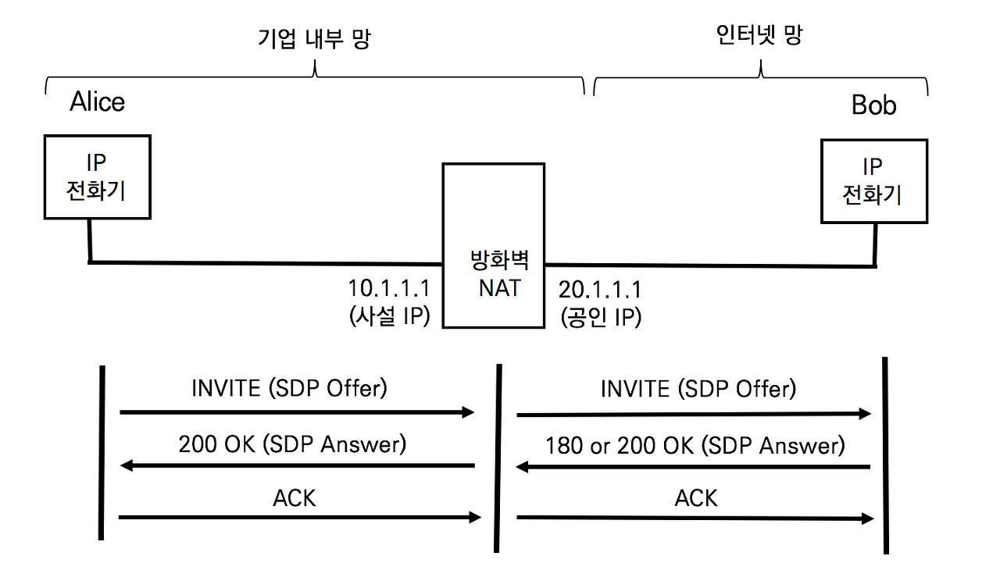

## NAT의 이해

IP 주소는 인터넷으로 라우팅이 불가능한 사설 IP 대역과 인터넷으로 라우팅이 가능한 공인 IP 대역으로 나뉜다. 대부분의 일반 기업 및 대부분의 통신 사업자들이 사설 IP를 사용하는 이유는 공인 IP주소의 부족과 보안 때문에 사용한다. 사설 IP대역의 보안은 인터넷에서 라우팅이 되지 않기 때문에 외부 접근이 차단된다. 사설 IP데역은 다음과 같다

- A Class (10.0.0.0/8) : 10.0.0.0 ~ 10.255.255.255.255
- B Class (172.168.0.0/12) : 172.16.0.0 ~ 172.31.255.255
- C Class (192.168.0.0 /16) : 172.168.0.0 ~ 192.168.255.255

PC나 스마트폰이 사설 IP 주소를 사용해도 문제없이 인터넷의 서비스나 웹서핑을 할 수 있는 이유는 NAT라는 기술때문이다. NAT는 Network Address Translation의 약어로 네트워크 주소 변역 기술이다. NAT기능은 사설 IP 주소와 공인 IP주소 간의 매핑 테이블을 생성하여 상호 변환해주는 기술이다.

NAT기능이 활성화된 라우터나 장비는 기업의 내부망(사설 망)과 인터넷 망을 사이에 위치하여 IP주소를 변환한다.


앨리스가 웹 브라우저로 웹 서버에 접속할 때는 패킷은 출발지 IP주소는 10.1.1.2로 목적지 IP주소는 20.1.1.5를 사용한다. NAT기능을 수행하는 방화벽은 사설 IP 10.1.1.2.와 공인 IP 20.1.1.1을 상호 변환하는 NAT테이블을 생성하고 출발지 IP주소 10.1.1.2인 패킷의 주소를 공인 IP 주소 20.1.1.2로 변환한다. 반대로 앨리스의 웹브라우저가 보낸 패킷에 대한 응답은 목적지 IP 주소 20.1.1.2로 전달한다. NAT 기능이 활성화된 방화벽은 NAT매핑을 보고 20.1.1.2주소를 사설 IP 주소 10.1.1.2로 변환한다. 그래서 서로 통신이 가능하다.

NAT가 활성화된 라우터나 방화벽이 NAT 매핑 테이블을 생성하는 시점은 내부의 트래픽이 외부의 인터넷망으로 패킷을 보낼 때 만들어진다. 반대로 외부 인터넷 망에서 기업 내부 사설망으로 접속하는 패킷은  NAT 매핑 테이블이 없으므로 패킷을 자동으로 폐기한다. 인터넷 서비스가 문제가 없는 이유는 내부에서 외부로 트래픽이 나갈 때 생성된 NAT 매핑 테이블을 그대로 활용해서 외부 트래픽이 내부로 들어오는 것이다. 최조의 트래픽이 내부에서 외부로 나가는 것이 중요하다.

## 인터넷을 통한 음성 및 영상 통화가 NAT Traversal이 필요한 이유

인터넷 통화는 NAT로 인해 문제가 발생한다. 사설망의 전화기가 인터넷망의 전화기로 통화를 시도하면 시그널링은 정상적으로 이루어지지만, 인터넷 망의 전화기가 사설망의 전화기로 통화를 시도하면 NAT 매핑 테이블이 없으므로 방화벽을 투과할 수 없다. 또한, VoIP시그널링이 정상적으로 이루어지더라도 음성 트래픽은 양방향으로 서로 다른 세션을 이용한다. 사설망에서 인터넷망으로 나가는 미디어 트래픽은 문제가 없지만 인터넷망에서 사설망으로 들어오는 미디어 트래픽은 NAT 매핑 테이블이 없으므로 토과할 수 없다.

인터넷 전화가 NAT 환경에서도 잘 되도록 하는 기술을 NAT Traversal (NAT 투과기술)이라 하고 방화벽장비들이 NAT를 많이 사용하므로 Firewall Traversal(방화벽 투과 기술)이라고도 한다. NAT투과기술이 복잡한 이유는 수동으로 NAT매핑 테이블을 생성하여 외부에서 내부로 들어오도록 하더라도 문제가 발생한다.

NAT Traversal은 OSI 7Layer의 Layer 3네트워크 계층에서 IP 주소 변환이 이루어진다. 하지만, VoIP 프로토콜은 Layer 7인 응용 계층에서 동작한다. NAT 기능이 활성화된 장비들은 응용계층의 어플리케이션을 인식하지 못한다. VoIP프로토콜은 응용계층의 SDP Offer와 SDP Answer로 RTP 미디어 스트림이 사용할 주소를 알려준다. RTP가 사용하는 주소도 공인 IP 주소 변경해 주지 않으므로 NAT Traversal 기술이 필요하다



1. 앨리스의 INVITE와 SDP Offer

   앨리스는 밥과 통화하기 위해 SIP INVITE요청과 SDP Offer를 전달한다.

   ```sip
   INVITE sip:bob@biloxi.com SIP/2.0
   Via: SIP/2.0/TCP pc33.atlanta.com;branch=z9hG4bK74bf9
   Max-Forwards: 70
   From: Alice <sip:alice@atlanta.com>;tag=9fxced76sl 
   To: Bob <sip:bob@biloxi.com>
   Call-ID: 3848276298220188511@pc33.atlanta.com
   CSeq: 31862 INVITE 
   Contact: <sip:alice@atlanta.com> 
   Content-Type: application/sdp
   Content-Length: 142
   
   
   v=0
   o=alice 2890844526 2890844526 IN IP4 atlanta.com
   c=IN IP4 10.1.3.33
   t=0 0
   m=audio 49172 RTP/AVP 0 
   a=rtpmap:0 PCMU/8000
   ```

   SIP 메시지와 SDP메시지는 발신자와 수신자를 가리키는 주소 체계를 URI또는 IP주소체계를 사용한다. 사용된 IP 주소가 사설 IP 주소 대역일 경우 인터넷을 통해 라우팅 될 수 없으므로 문제가 된다. SDP 메시지의 내용에 'c='에 사설 IP가 사용되었으므로 밥이 전송하는 RTP 미디어 스트림은 인터넷을 통해 라우팅되지 못한다.

2. NAT Traversal 문제가 발생할 경우

   SIP메시지와 SDP 메시지에서 사설 IP 주소가 사용되면 통화에 문제를 일으킨다.

   - 사설 IP가 적용된 Via헤더

     SIP INVITE요청에 대한 200 OK응답은 Via 헤더의 주소로 전달된다. SIP Proxy서버가 INVITE 요청에 삽입한 Via 헤더의 사설 IP 주소는 인터넷망을 통해 라우팅될 수 없다.

   - 사설 IP가 적용된 Contact 헤더

     SIP INVITE / 200 OK / ACK 이후의 새로운 요청은  Contact헤더를 이용한다. 수신자가 통화를 종료할 경우 BYE요청은 Contact헤더의 사설 IP 주소로 전송되므로 인터넷망을 통해 라우팅될 수 없다. 따라서 발신자는 통화가 중단되었는지를 알지 못한다.

   - SDP 메시지의 'c='

     'c='는 실제 음성을 실어 나르는 RTP프로토콜이 사용하는 주소다. 사설 IP가 사용되면 RTP 패킷은 인터넷을 통해 라우팅 될 수 없다.

