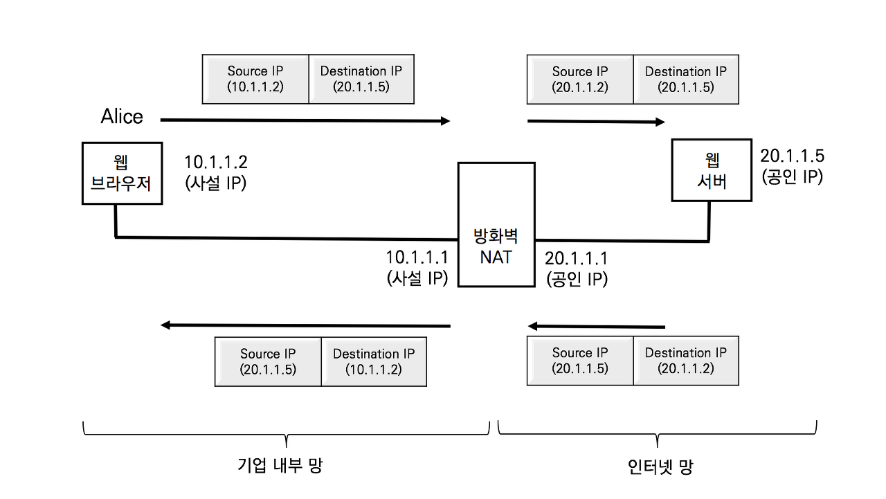

## NAT의 이해

IP 주소는 인터넷으로 라우팅이 불가능한 사설 IP 대역과 인터넷으로 라우팅이 가능한 공인 IP 대역으로 나뉜다. 대부분의 일반 기업 및 대부분의 통신 사업자들이 사설 IP를 사용하는 이유는 공인 IP주소의 부족과 보안 때문에 사용한다. 사설 IP대역의 보안은 인터넷에서 라우팅이 되지 않기 때문에 외부 접근이 차단된다. 사설 IP데역은 다음과 같다

- A Class (10.0.0.0/8) : 10.0.0.0 ~ 10.255.255.255.255
- B Class (172.168.0.0/12) : 172.16.0.0 ~ 172.31.255.255
- C Class (192.168.0.0 /16) : 172.168.0.0 ~ 192.168.255.255

PC나 스마트폰이 사설 IP 주소를 사용해도 문제없이 인터넷의 서비스나 웹서핑을 할 수 있는 이유는 NAT라는 기술때문이다. NAT는 Network Address Translation의 약어로 네트워크 주소 변역 기술이다. NAT기능은 사설 IP 주소와 공인 IP주소 간의 매핑 테이블을 생성하여 상호 변환해주는 기술이다.

NAT기능이 활성화된 라우터나 장비는 기업의 내부망(사설 망)과 인터넷 망을 사이에 위치하여 IP주소를 변환한다.

앨리스가 웹 브라우저로 웹 서버에 접속할 때는 패킷은 출발지 IP주소는 10.1.1.2로 목적지 IP주소는 20.1.1.5를 사용한다. NAT기능을 수행하는 방화벽은 사설 IP 10.1.1.2.와 공인 IP 20.1.1.1을 상호 변환하는 NAT테이블을 생성하고 출발지 IP주소 10.1.1.2인 패킷의 주소를 공인 IP 주소 20.1.1.2로 변환한다. 반대로 앨리스의 웹브라우저가 보낸 패킷에 대한 응답은 목적지 IP 주소 20.1.1.2로 전달한다. NAT 기능이 활성화된 방화벽은 NAT매핑을 보고 20.1.1.2주소를 사설 IP 주소 10.1.1.2로 변환한다. 그래서 서로 통신이 가능하다.

NAT가 활성화된 라우터나 방화벽이 NAT 매핑 테이블을 생성하는 시점은 내부의 트래픽이 외부의 인터넷망으로 패킷을 보낼 때 만들어진다. 반대로 외부 인터넷 망에서 기업 내부 사설망으로 접속하는 패킷은  NAT 매핑 테이블이 없으므로 패킷을 자동으로 폐기한다. 인터넷 서비스가 문제가 없는 이유는 내부에서 외부로 트래픽이 나갈 때 생성된 NAT 매핑 테이블을 그대로 활용해서 외부 트래픽이 내부로 들어오는 것이다. 최조의 트래픽이 내부에서 외부로 나가는 것이 중요하다.