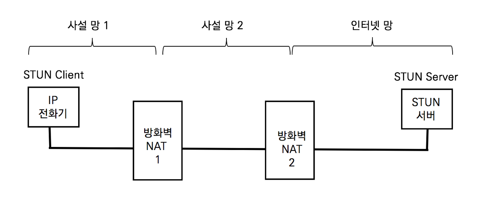

## ICE의 개요

 ICE Interactive Connectivity Establishment의 약어로 RFC 5345 A Protocol for Network Address Translator (NAT) Traversal for Off/Answer Protocols에 정의되었다. ICE는 두 단말이 서로 통신할 수 있는 최적의 경로를 찾도록 도와주는 프레임워크다. ICE는 STUN (Session Traversal Utilities for NAT, RFC 5389)와 TURN (Traversal Using Relay Nat, RFC 5766)을 활용하는 프레임워크로 SDP 제안 및 수락 모델 (Offer / Answer Model)에 적용할 수 있다.

ICE는 두 단말 간의 제안 및 수락 모델로 생성되는 실시간 UDP 미디어 스트림을 송수신하기 위한 NAT Traversal 기술이지만 TCP 전송 프로토콜에도 적용 가능하다. ICE는 STUN과 TURN 프레임워크로 확보된 통신 가능한 여러 IP 주소와 포트 넘버를 SDP Offer와 SDP Answer를 통해 상대방에게 전달한다. 두 단말은 확보된  모든 주소에 대해 단대단 (Peer-to-peer) 연결성 테스트를 진행하고 통신 가능한 주소로 RTP 미디어 스트림을 송수신한다.

## STUN (Session Traversal Utility for NAT)의 이해

STUN은 클라이언트-서버 프로토콜이다. STUN클라이언트는 사설망에 위치하고 STUN 서버는 인터넷망에 위치한다. STUN 클라이언트는 자신의 공인 IP 주소를 사전에 확인하기 위해 STUN 서버에게 요청하고 STUN 서버는 STUN 클라이언트가 사용하는 공인 IP 주소를 응답한다.

STUN 클라이언트는 자신이 사용할 공인 IP 주소를 알 수 없으므로 STUN 서버에게 자신의 공인 IP 주소를 요청한다. STUN 메시지가 방화벽을 지날 때 네트워크 계층의 IP와 전송 계층의 포트넘버가 바뀐다. STUN 서버는 패킷의 IP 헤더와 UDP 헤더의 값(클라이언트의 공인 주소)과 STUN 메시지 안에 있는 STUN 클라이언트의 IP 주소와 UDP 포트 넘버 (클라이언트의 사설 주소)를 비교한다. STUN 서버는 두 개의 서로 다른 주소에 대한 바인딩 테이블을 생성하고 요청에 대한 응답 메시지에 공인 IP 주소를 보낸다. STUN 클라이언트는 VoIP 시그널링을 생성할 때 사설 IP가 아닌 공인 IP 주소를 사용한다.

