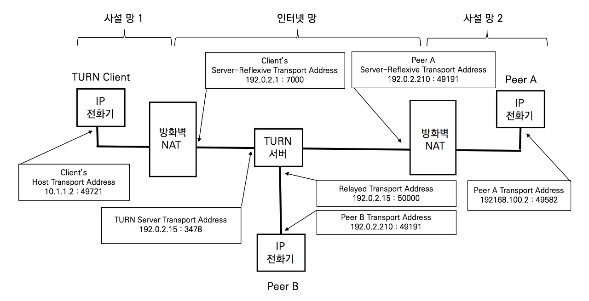

## ICE의 개요

 ICE Interactive Connectivity Establishment의 약어로 RFC 5345 A Protocol for Network Address Translator (NAT) Traversal for Off/Answer Protocols에 정의되었다. ICE는 두 단말이 서로 통신할 수 있는 최적의 경로를 찾도록 도와주는 프레임워크다. ICE는 STUN (Session Traversal Utilities for NAT, RFC 5389)와 TURN (Traversal Using Relay Nat, RFC 5766)을 활용하는 프레임워크로 SDP 제안 및 수락 모델 (Offer / Answer Model)에 적용할 수 있다.

ICE는 두 단말 간의 제안 및 수락 모델로 생성되는 실시간 UDP 미디어 스트림을 송수신하기 위한 NAT Traversal 기술이지만 TCP 전송 프로토콜에도 적용 가능하다. ICE는 STUN과 TURN 프레임워크로 확보된 통신 가능한 여러 IP 주소와 포트 넘버를 SDP Offer와 SDP Answer를 통해 상대방에게 전달한다. 두 단말은 확보된  모든 주소에 대해 단대단 (Peer-to-peer) 연결성 테스트를 진행하고 통신 가능한 주소로 RTP 미디어 스트림을 송수신한다.

## STUN (Session Traversal Utility for NAT)의 이해

STUN은 클라이언트-서버 프로토콜이다. STUN클라이언트는 사설망에 위치하고 STUN 서버는 인터넷망에 위치한다. STUN 클라이언트는 자신의 공인 IP 주소를 사전에 확인하기 위해 STUN 서버에게 요청하고 STUN 서버는 STUN 클라이언트가 사용하는 공인 IP 주소를 응답한다.

STUN 클라이언트는 자신이 사용할 공인 IP 주소를 알 수 없으므로 STUN 서버에게 자신의 공인 IP 주소를 요청한다. STUN 메시지가 방화벽을 지날 때 네트워크 계층의 IP와 전송 계층의 포트넘버가 바뀐다. STUN 서버는 패킷의 IP 헤더와 UDP 헤더의 값(클라이언트의 공인 주소)과 STUN 메시지 안에 있는 STUN 클라이언트의 IP 주소와 UDP 포트 넘버 (클라이언트의 사설 주소)를 비교한다. STUN 서버는 두 개의 서로 다른 주소에 대한 바인딩 테이블을 생성하고 요청에 대한 응답 메시지에 공인 IP 주소를 보낸다. STUN 클라이언트는 VoIP 시그널링을 생성할 때 사설 IP가 아닌 공인 IP 주소를 사용한다.

STUN 클라이언트의 주소는 호스트 주소 또는 단말 주소라고 하고, STUN서버가 알려주는 주소는 Reflexive Transport Address 또는 Mapping Address라고 한다. STUN 클라이언트는 SIP 메시지와 RTP 메시지에 Reflexive Trasport Address를 사용한다.

 STUN이 항상 효과적이지는 않다. 두 단말이 같은 NAT 환경에 있을 경우 STUN은 동작하지 않는다. 또한 Symmetric NAT로 동작하는 사설망 환경에서는 애플리케이션이 다르면 NAT 매핑 테이블이 바뀌기 때문에 사용할 수 없다. STUN 메시지로 확인한 STUN클라이언트의 Reflexive Transport Address가 다른 어플리케이션인 SIP 시그널링과 RTP 프로토콜을 사용할 때는 주소가 바뀐다.

## TURN (Traversal Using Relays around NAT, RFC 5766)의 이해

TRUN 프로토콜은 NAT환경에 단말이 릴레이 서버를 이용하여 통신하게 한다. TURN 클라이언트는 사설망 위에 위치하고 TURN 서버는 인터넷망에 위치한다. TURN 클라이언트는 통화를 할 피어들과 직접 통신하는 것이 아니라 릴레이 서버 역할을 하는 TRUN 서버를 경유한다.

TUNR 서버의 주소는 관리자가 직접 설정하거나 설정 파일을 다운로드한다고 가정한다. TURN 클라이언트는 사설 주소 (Host Transport address)가 포함된 TURN 메시지를 TURN서버로 전송한다. TURN 서버는 TURN메시지에 포마된 사설 주소 (Host Transport address)와 TURN 메시지 패킷의 공인 주소인 Layer3 IP 주소와 Layer4 UDP 포트 넘버 (Server-reflexive transport address)로 응답한다. NAT 장비는 NAT 매핑 테이블에 있는 정보에 따라 TURN응답 메시지를 클라이언트의 사설 주소 (Host Transport address)로 전송한다

TURN 서버는 릴레이 역할을 하는 공인 주소 (Relay Transport address)를 할당하는 역할을 한다 대규모 전개가 아니라면 TURN서버와 릴레이 서버는 동일한 서버다.

## STUN과 TURN 초간단 정리

STUN은 단말이 자신의 공이 IP주소와 포트를 확인하는 과정에 대한 프로토콜이고, TURN은 단말이 패킷을 릴레이 시켜 줄 서버를 확인하는 과정에 대한 프로토콜이다. STUN 서버는 사설 주소와 공인 주소를 바인딩하고, TURN 서버는 릴레이 주소를 할당한다. 특히 TURN은 ICE에서 직접 사용한다.

## ICE Candidate Gathering

ICE를 실행하는 단말들은 통신이 가능한 모든 주소를 식별한다. 처음에 클라이언트는 STUN 메시지를 TURN서버로 전송하고 수신하는 과정에서 릴레이 주소를 확인한다 . 릴레이 주소는 TURN 서버가 패킷 릴레이를 위해 할당하는 주소이다.

