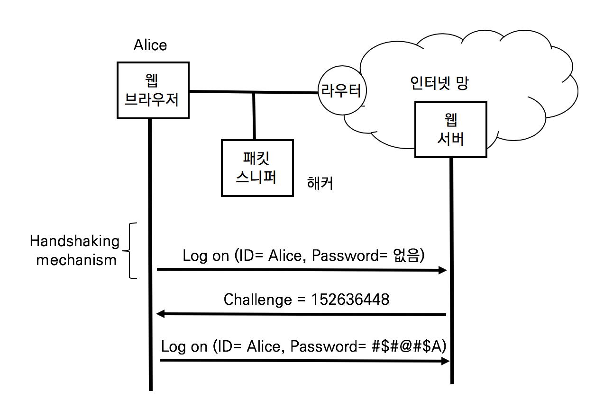
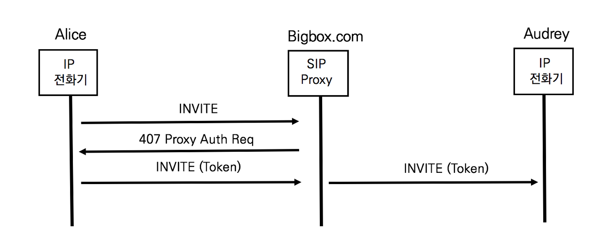
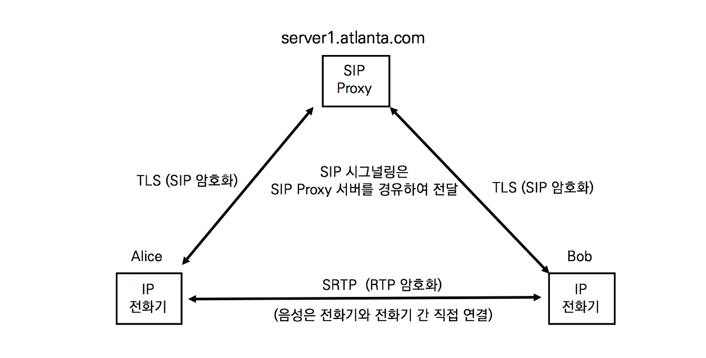
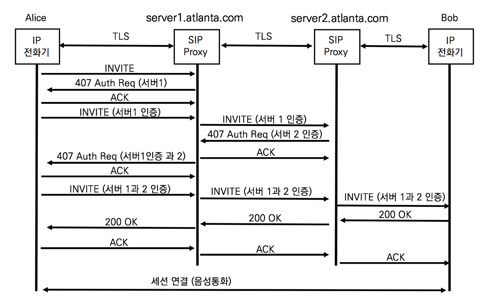

# 사용자 인증

## SIP 보안이 필요한 이유

앨리스가 밥과 통하를 할 때 필요한 장비는 두 대의 전화기와 한 대의 SIP Proxy 서버다. 엔지니어 입장에서 기업의 IP네트워크 또는 인터넷 네트워크는 더 많은 것들로 이루어져 있다. 전화 한 통화가 이루어지기 위해 거쳐야 하는 장비는 수많은 전화기, 스위치, 라우터 방화벽, SBC 그리고 IP Proxy 서버가 있다. 인터넷의 모든 장비들은 관리자가 있고 각 속한 기업이나 조직의 관리 정책에 의해 운용된다. 안전한 전화 통화를 위해 모든 장비가 안전하게 설계되고 구축되는지를 확인하지 않는다. 기본적으로 안전하게 관리된다고 가정한다.

SIP Security는 기업 내부에 있는 IP전화기와 SIP Proxy 서버 간의 안전한 통신에 관심을 가진다. 실제 통화하는 단말과 단말 간의 안전한 통신에 관심을 가진다. 그리고 전화ㅎ통화에 참여하는 앨리스와 밥이 안전하다고 느낄 수 있는 보안 정책이 필요하다. 앨리스와 법이 안전하다고 신뢰할 수 있는 방안들이 갖추어져야 편하게 대화가 가능하다.

## 기본적인 SIP Security

SIP 프로토콜은 기본적인 보안 방법들이 있다.

- Digest Authentication (사용자 인증)

  도메인 내의 SIP Proxy 서버는 발신자가 인증된 사용자인지를 확인한다. HTTP 프로토콜도 사용하는 인증방식으로 재사용 공격 방지와 인증을 제공한다

- TLS

  Hob by Hob 또는 End-to-End로 시그널리에 대한 기밀성과 무결성을 보장한다

- S/MIME (Secure / Multipurpose Internet Mail Extension)

  SIP 메시지 바디는 MIME으로 작성하여 암호화한다. 암호화는 메시지에 기밀성 및 무결성을 제공한다.

- Network Asserted Identity (NAI)

  같은 도메인 내의 발신자를 식별한다

- SIP Identitiy

  도메인과 도메인 간의 발신자를 식별한다

- SIP Privacy

  외부 도메인에 대해 메시지의 특정 부분을 보호한다.

SIP 프로토콜은 한 가지 방법을 사용하는 것이 아니라 서로 상호 보완적으로 사용한다.

## HTTP Digest Authentication (단순 인증)

SIP 단순인증은 RFC 2617 HTTP Digest Authentication에 기반을 둔 사용자 인증 방법이다.


웹서버에 로그인하기 위해 사람들은 브라우저에서 유저네임과 패스워드를 입력한다 . 패스워드를 평문 그대로 전송한다면 해커는 손쉽게 패킷을 캡처하여 순쉽게 패스워드를 얻을 수 있다. 그래서 패스워드를 해쉬하여 전송한다면 해커는 패킷을 캡처하여도 패스워드를 얻을 수 없다. 해쉬는 패스워드를 특정한 길이의 난수열로 바꾸는 기법이다. 암호는 다시 복호화하여 원문을 얻을 수 있지만 해쉬는 복호화가 불가능한 것이 특징이다. 문제는 MD5와 같은 오래된 해쉬 기법을 사용하거나 패스워드가 변경되지 않는 한 동일한 해쉬값이 전달되므로 언젠가는 해킹될 우려가 있다.

현재의 암호화 기법은 시스템이 동적으로 해쉬갑이 매번 변경되도록 하여 해커가 추측하지 못하게 한다. 매번 전송되는 패스워드의 해쉬값을 변경하기 위해 합의된 난수열을 사용한다.



앨리스가 처음 로그인 시도 시에는 유저네임만을 전송한다. 웹서버는 랜덤 난수열을 생성하여 Challenge로 응답한다. 앨리스가 패수어드를 해쉬할 대 패스워드와 Challenge값을 함께 해쉬한다. 이렇게 하면 해쉬값이 매번 변경되므로 해커가 유추할 수 없다.


## SIP Digest Authentication

SIP Digest Authentication은 HTTP Digest Authentication과 동작 방식은 동일하지만, HTTP 프로토콜이 아니라 SIP 프로토콜 위에서 동작하는 것이 다르다.



1. 앨리스의 INVITE

   앨리스는 SIP INVITE 요청을 SIP Proxy 서버로 전송한다.

   ```sip
   INVITE sip:audrey@atlanta.com SIP/2.0
   Via: SIP/2.0/TCP pc33.atlanta.com;branch=z9hG4bK74b43
   Max-Forwards: 70
   From: Alice <sip:alice@atlanta.com>;tag=9fxced76sl
   To: Audrey <sip:audrey@atlanta.com>
   Call-ID: 3848276298220188511@pc33.atlanta.com
   CSeq: 31862 INVITE
   Contact: <sip:alice@atlanta.com>
   Content-Type: application/sdp
   Content-Length: 151 
   ```

2. SIP Proxy 서버의 407 Proxy Authorization Required

   SIP Proxy 서버는 INVITE 메시지에 사용자 인증에 대한 정보가 없으므로 407 Proxy Authoriation Required 응답을 앨리스에게 전달한다.

   ```sip
   SIP/2.0 407 Proxy Authorization Required
   Via: SIP/2.0/TLS pc33.atlanta.com;branch=z9hG4bK74b43 ;received=10.1.3.33
   From: Alice <sips:alice@atlanta.com>;tag=9fxced76sl
   To: Audrey <sips:audrey@atlanta.com>;tag=3flal12sf
   Call-ID: 3848276298220188511@pc33.atlanta.com
   CSeq: 31862 INVITE
   Proxy-Authenticate: Digest realm="atlanta.com", qop="auth",         nonce="f84f1cec41e6cbe5aea9c8e88d359", opaque="", stale=FALSE, algorithm=MD5
   Content-Length: 0
   ```

   SIP Proxy 서버는 SIP INVITE 요청에 대해 사용자 인증을 요청하려고 응답한다. Proxy-Authenticate 헤더는 여러 가지 정보를 포함하고 있다.

   - realm="atlanta.com"
     도메인 네임
   - qop="auth"
     사용자 인증 정보 요청
   - nonce="f84f1cec41e6cbe5aea9c8e88d359"
     HTTP Digest Authentication의 Challenge 값과 동일한 시간을 기반으로 한 난수열

   INVITE를 받은 SIP Proxy 서버는 407 Proxy Authorization Required로, SIP REDIRECT 서버나 REGISTRA 서버는 401 Unauthrized로 응답한다

3. 앨리스의 INVITE (Token)

   앨리스는 INVITE메시지에 Authorization헤더를 이용하여 사용자 인증 정보를 전달한다

   ```sip
   INVITE sips:audrey@atlanta.com SIP/2.0
   Via: SIP/2.0/TLS pc33.atlanta.com;branch=z9hG4bK776asdhds ;received=10.1.3.33
   Max-Forwards: 70
   Route: <sips:bigbox10.atlanta.com;lr>
   To: Audrey <sips:audrey@atlanta.com>
   From: Alice <sips:alice@atlanta.com>;tag=1928301774
   Call-ID: a84b4c76e66710@pc33.atlanta.com 
   CSeq: 31863 INVITE
   Contact: <sips:alice@pc33.atlanta.com>
   Content-Type: application/sdp
   Content-Length: 151
   Authorization: Digest username=“audrey", realm="atlanta.com"  nonce="ea9c8e88df84f1cec4341ae6cbe5a359", opaque="",  uri="sips:audrey@atlanta.com",  response="dfe56131d1958046689d83306477ecc"
   ```

   407 Proxy Auth Required 응답의 Proxy-Authenticate 헤더의 nounce값을 이용하여 생성한 해쉬값과 사용자 인증 정보를 Authorization 헤더로 전달한다.

   - username=“audrey"
     사용자명
   - realm="atlanta.com" 
     도메인 네임
   - nonce="ea9c8e88df84f1cec4341ae6cbe5a359"
     HTTP Digest Authentication의 Challenge 값과 동일한 시간을 기반으로 한 난수열
   - uri="sips:audrey@atlanta.com"
     착신 측의 URI 주소
   -  response="dfe56131d1958046689d83306477ecc"
     패스워드 해쉬 정보

4. SIP Proxy 서버의 INVITE (Token)

   SIP Proxy 서버는 오드리에게 앨리스가 보낸 메시지를 그대로 전달한다. SIP Proxy 서버는 응답을 받기 위해 Via 헤더만을 추가한다

## TLS와 SRTP의 개요

공공기관과 보안을 중요시하는 기업들은 보안이 강화된 Secure IP Telephony를 구현한다. Secure IP Telephony는 매우 복잡한 체계로 구현되지만 주요 프로토콜은 TLS (Transport Layer Security)와 SRTP(Secure RTP)다. TLSsms 냐ㅖ시그널링 메시지를 암화화하고, SRTP는 음성과 영상 트래픽을 암호화한다. Secure IP  Telephony가 구현된 네트워크에서 중간에 패킷을 캡쳐하더라도 내용을 유추할 수 없다.



TLS는 넷스케이프 사에 전자 상거래 등의 보안을 위해 개발된 SSL (Secure Socket Layer Protocol) 프로토콜이  RTF 2246으로 1999년에 표준화 된 후 현재는 RFC 5346 TLS 1.2가 표준화되었다. RFC 8446 TLS 1.3도 표준화되었지만, 가장 널리 쓰이는 것능 TLS 1.2이다. TLS는 OSI 7계층 중 전송계층에서 수행되는 프로토콜이므로 응용계층의 프로토콜인 HTTP, XMPP, FTP등 사용할 수 있다. TLS는 기밀성, 무결성 및 사용자 인증까지 제공할 수 있는 프로토콜로써 확장성 및 효율성이 뛰어나 광범위하게 사용된다.

## SIP 프로토콜을 위한 TLS

TLS는 이름 그대로 전송 계층인 TCP에 신뢰성을 강화할 수 있는 프로토콜이다. TLS가 적용할 경우 SIP 픅로토콜이 전송 프로톸로로 TCP만 사용해야 한다.


앨르스와 밥 간에 직접 다대단 (End-to-End) TLS 세션이 만들어져 SIP프로토콜을 주고받는다고 가정해보자. SIP Proxy 서버는 Via헤더와 같은 SIP 메시지를 추가 변경 상제 할 수 없고, SIP 메시지를 확인할 수 없으므로 호의 상태를 전혀 추적할 수 없다. 따라서 TLS 는 Hop-by-Hop으로 세션을 생성한다.



홉 바이 홉으로 생성된 TLS 세션을 통해 SIP프로토콜의 운영 방식을 변경하지 않고도 안전하게 전달할 수 있다. 두 개의 SIP Proxy 서버가 모두 사용자 인증을 요구할 경우에는 사용자 인증을 모두 수행한다.

## TLS 협상 절차

TLS세션을 생성하기 위한 파라미터 교환은 TLS Handshake 프로토콜이 진행한다. TLS클라이언트와 서버가 통신하기 위해서는 TLS 버전, 암호화 알고리즘 및 상호 인증을 수행해야한다. 그리고 공개키 암호화 기법을 이용하여 암호화 키를 생성하고 교환한다.


처음에는 Full Handshake 절차로 진행되고, 세션이 다시 시작할 때는 간소한 Abbreviated Handshake를 진행한다. 앨리스 전화기와 SIP Proxy 서버간의 TLS Full Handshake절차이다.

1. TLS Hello 교환

   TLS 버전과 속성 그리고 암호화 알고리즘을 협상한다.Client Hello와 Server Hello가 교환된다

2. Certificate Excheange(인증서 교환)

   SIP Proxy 서버 인증을 전달하면서 클라이언트 인증서를 ㅛㅇ청한다. 클라이언트는 서버 인증서를 검증하기 위해 자신의 인증서 목록에 인증서 발행 기관 (CA, Certicifate Authority)의 인증서가 있는지를 확인한다 인증서 목록에 있다면 검증을 수행하고 서버의 인증서를 신뢰한다. 없다면 TLS 세션은 종료된다. SIP Proxy서버도 동이한 과정을 거쳐 인증서를 신리한다.

3. 상호 인증 (Server to Phone, Phone to server)

   클라이언트는 랜덤 문자열을 생성하여 서버로 전송한다. 서버는 개인키 (Private Key)로 같이 전달된 문자열을 서명한 후 전달한다. 클라이언트는 서버가 ㅅ명을 서버의 공개키로 검증한다. 이오 ㅏ마찬가지로 수행되지만 옵션이다.

4. TLS Session Key 교환

   SIP Proxy 서버와 클라이언트가 상호 인증을 완료했다. SIP 시그널링을 암호화할 때 사용할 대칭 암호키를 교환한다. 공개키와 개인키를 이용한 비대칭 암호화는 엄청난 리소스 소모가 발생하므로 많은 내용을 실시간으로 암호화할 수 없다. 그래서 대칭 암호화 기법을 사용하여 암호화하고, 비대칭 암호화 방식은 대칭 암호화를 위한 하뫃화 키를 교환하기 위해 사용한다. 키 교환 (Key Exchange)은 대칭 암호화 키를 교환하는 과정이다.

   클라이언트는 암화화 키를 생성한 후에 서버의 공개키로 암호화하여 전달한다. 오직 서버의 개인키로만 복호화가 가능하므로 해커에 의해 패킷이 중간에 탗뤼되더라도 서버만이 확인할 수 있다. 클라이언트 전화기와 CUCM 서버는 동일한 세션 키를 안전하게 확보한다.

5. FInished

   세션 암호화 키를 교환 후에 암호화 방식을 변경하거나 세션을 종료한다.


## S/MIME (Secure / Multipart Internet Mail Extension)

S/MIME은 SDP를 암호화하거나 SIP 메시지에 대한 서명과 무결성을 제공한다. SIP헤더는 평문이지만 SIP 메시지 바디는 암호화한다.

```sip
 INVITE sip:bob@biloxi.com SIP/2.0
Via: SIP/2.0/UDP pc33.atlanta.com;branch=z9hG4bKnashds8
To: Bob <sip:bob@biloxi.com>
From: Alice <sip:alice@atlanta.com>;tag=1928301774
Call-ID: a84b4c76e66710@pc33.atlanta.com
CSeq: 314159 INVITE
Max-Forwards: 70
Contact: <sip:alice@pc33.atlanta.com>
Content-Type: application/pkcs7-mime;smime-type=enveloped-data; name=smime.p7m
Content-Disposition: attachment;filename=smime.p7m  handling=required 


JB23LB645V73V73MNB73KV7K4VLHV4T234T2T2JH5NG5CMGX5MYM5SMN5GYCWG5CYMWYMWHNHG5MC5YGWC5CW5WIU87W34TO8W7FLW5LWC5WC5C4L5CLWCTYWJHC54JHCW45HCWLJ5HCWL5CLWJH5CLJH4C5JHEWCLTJ
```

Content-Type 헤더의 application / pkcs7-mime 값이 SIP메시지 바디가 S/MIME임을 가리킨다. S/MIME는 SHA1 인증과 3 DES암호화 알고리즘을 사용한다. S/MIME를 사용하는 이유는 단대단 (End-to-End) 보안을 제공하기 위한 제한적인 상황에서 이용한다. SIP 시그널링 전달 과정에 SIP Proxy 서버는 내용을 알 수 없으므로 SIP Proxy 서버가 있어야 수행할 수 있는 부가 서비는 사용할 수 없다. 현장에서 거의 쓰이지 않는다.

## Network Asserted Identity/Privacy (Trusted)

도메인 내에서 사용자 인증은 Digest Authentication을 이용하고 사용자 식별은 Network Asserted Identity를 이용한다. 사용자를 식별하기 위해 세가지 SIP 헤더가 필요하다.

- P-Asserted-Identity (PAI) : SIP Proxy 서버가 생성

  PAI 헤더는 신뢰할 수 있는 SIP 컴포넌트 간에 사용되며 SIP 메시지를 보내는 사용자를 식별한다. From 헤더는 SIP Proxy서버와 같은 SIP 컴포넌트들에 의해 추가 변경 삭제가 가능하므로 정확한 사용자 식별이 불가능하다. PAI 헤더는 생성 이후에는 변경이 불가능하며 From헤더보다 우선순위가 높다. PAI헤더는 SIP Proxy 서버가 사용자를 인증하고 생성하는 헤더이므로 신뢰성이 높다. 주로 과금 정보 생성에 활용된다.

- P-Preferred-Identity (PPI) : UAC가 생성

  PPI 헤더는 신뢰할 수 있는 도메인 내에서 UAC가 선호하는 URI를 지정한다. UAC가 신뢰할 수 있는 SIP Proxy서버에게 SIP Message를 보내는 자신의 정확한 ID를 명기한다

- Privacy

  Privacy 헤더는 P-Asserted-Identity헤더를 추가할지 삭제할지를 결정한다. 만일 Privacy헤더가 없으면 임의대로 결정한다.

  - id : 신뢰할 수 없는 도메인으로 SIP메시지를 전달할 때 P-Asseryted-Identity헤더를 삭제
  - none : 신뢰할 수 없는 도메인으로 SIP메시지를 전달할 때 그대로 전달

NAI는 신뢰할 수 있는 SIP서버 네트워크가 인증된 사용자를 식별하고 상호 간에 프라이버시를 형성한다. SIP Proxy서버는 PAI헤더를 가진 SIP메시지는 신뢰할 수 있으므로 인증 대신 사용할 수 있다. PAI를 가진 SIP메시지는 SIP Diegest Authentication이 SIP Proxy 서버에 의해 수행된 것이므로 SIP Proxy서버를 신뢰할 수 있으면 가능하다. 따라서, Privacy설정으로 단순히 PAI를 전송할지 말지를 결정하는 것이 아니라 상호 간의 신뢰가 담보되는지 않는지를 사전에 관리자가 확인하는 것이 중요하다. 자세한 내용은 RFC 3325 Private Extensions to the SIP for Assertyed Identity within Trusted Networks에 정의되어 있다.


1. 앨리스의 INVITE

   앨리스는 오드리와 통화하기 위해 SIP Proxy 서버로 INVITE를 전송한다.

   ```sip
   INVITE sip:audrey@atlanta.com SIP/2.0 
   Via: SIP/2.0/TCP pc33.atlanta.com;branch=z9hG4bK74b43
   Max-Forwards: 70
   From: <sip:anonymous@anonymous.invalid>;tag=9fxt6c
   To: Audrey <sip:audrey@atlanta.com>
   Call-ID: 3848276298220188511@pc33.atlanta.com
   CSeq: 31862 INVITE
   P-Preferred-Identity: Alice <sip:alice@atlanta.com>
   Privacy: none
   Content-Type: application/sdp
   Content-Length: 151 
   ```

   From 헤더는 annoymouse(익명)으로 표시하고 P-Preferred-Identity 헤더에 앨리스의 사용자 정보를 포함한다. P-Preferred-Identity 헤더가 From을 우선하기 때문에 From헤더의 값은 무시된다. Pricvacy 헤더는 P-Asserted-Identity헤더를 사용할지 말지를 표시한다.

2. SIP Proxy 서버의 407 Proxy Authorization Required

   SIP Proxy 서버는 사용자 인증 정보 요청을 위해 407 응답을 한다

   ```sip
   SIP/2.0 407 Proxy Authorization Required
   Via: SIP/2.0/TLS pc33.atlanta.com;branch=z9hG4bK74b43
   From: <sips:anonymous@anonymous.invalid>;tag=9fxt6c
   To: Audrey <sips:audrey@atlanta.com>;tag=3flal
   Call-ID: 3848276298220188511@pc33.atlanta.com
   CSeq: 31862 INVITE
   Proxy-Authenticate:...(메시지 생략)
   Content-Length: 0
   ```

   앨리스는 SIP Digest Authentication을 위해 정보를 요청한다

3. 앨리스의 INVITE (Token과 PPI)

   앨리스는 Authoriztion 헤더에 Digest Authentication 관련 사용자 정보를 포함하고, P-Preferred-Identity 헤더에 사용자 정보를 포함하여 전달한다.

   ```sip
   INVITE sips:audrey@atlanta.com SIP/2.0 
   Via: SIP/2.0/TLS pc33.atlanta.com;branch=z9hG4bK776asdhds
   Max-Forwards: 70
   Route: <sips:bigbox10.atlanta.com;lr>
   To: Audrey <sips:audrey@atlanta.com>
   From: <sips:anonymous@anonymous.invalid>;tag=19jtf0
   Call-ID: a84b4c76e66710@pc33.atlanta.com
   CSeq: 31863 INVITE
   P-Preferred-Identity: Alice <sips:alice@atlanta.com>
   Privacy: id
   Content-Type: application/sdp
   Content-Length: 151
   Authorization:... (메시지 생략)  
   ```

   SIP URI 가 SIPS URI로 변경되었으므로 TLS 세션으로 전달된다. Privacy 헤더의 값이 'none'에서 'id'로 변경되었으므로 SIP Proxy 서버에게 신뢰할 수 없는 도메인으로는 P-Assorted-Identity를 전송하지 말 것을 요청한다.

4. SIP Proxy 서버의 INVITE (Token과 PAI)

   SIP Proxy 서버는 앨리스의 사용자 인증을 수행하고 IVNITE 요청을 오드리에게 전달한다.

   ```sip
   INVITE sips:audrey@atlanta.com SIP/2.0 
   Via: SIP/2.0/TLS Bigbox10.atlanta.com;branch=z9hG4bKnashd92
   Via: SIP/2.0/TLS pc33.atlanta.com;branch=z9hG4bK776asdhds
   Max-Forwards: 69 
   To: Audrey <sips:audrey@atlanta.com>
   From: <sips:anonymous@anonymous.invalid>;tag=19jtf0
   Call-ID: a84b4c76e66710
   CSeq: 31863 INVITE
   P-Asserted-Identity: Alice <sips:alice@atlanta.com>
   Privacy: id
   Content-Type: application/sdp
   Content-Length: 151
   Authorization:... (메시지 생략) 
   ```

## SIP Identity

같은 도메인 내의 사용자 인증으 Digest Authentication과 사용자 식별은 Network Assorted Identity를 이용한다. 서로 다른 도메인 간에 사용자 식별을 위한 방안이 필요하다. 도메인과 도메인 간을 건너갈 때 상대방이 보내 준 발신자의 사용자 식별자를 어떻게 신뢰할 수 있는지가 문제다. 예를들어 발신자가 보낸 SIP INVITE 요청이라고 보내진 메시지를 다른 도메인에 있는 밥이 신뢰할 수 있는 방법이 필요하다.

```sip
INVITE sips:bob@biloxi.com SIP/2.0 
Via: SIP/2.0/TCP pc33.atlanta.com;branch=z9hG4bK74b43
Max-Forwards: 70
From: <sips:alice@atlanta.com>;tag=9fxt6c
To: Bob <sips:bob@biloxi.com>
Call-ID: 3848276298220188511@pc33.atlanta.com
CSeq: 31862 INVITE
Date: Sun, 22 Jun 2008 20:02:03 GMT
Contact: <sip:alice@atlanta.com>
Identity: "CyI4+nAkHrH3ntmaxgr01TMxTmtjP7MASwliNRdupRI1vpkXRvZXx1ja 9k0nB2sW+v1PDsy32MaqZi0M5WfEkXxbgTnPYW0jIoK8HMyY1VT7egt0kk4 XrKFCHYWGClsM9CG4hq+YJZTMaSROoMUBhikVIjnQ8ykeD6UXNOyfI="
Identity-Info: <https://atlanta.com/cert02.cer>;alg=rsa-sha1
Content-Type: application/sdp
Content-Length: 151 
```

SIP Protoco은 새로운 두 개의 SIP 헤더를 이용하여 해결한다

-  Identity 헤더

  해쉬값으로 SIP 헤더와 SDP 정보가 중간에 변경되었다면 Identity 헤더의 해쉬 값과 일치하지 않으므로 문제가 발생한다.

- Identity-info

  바로 전 SIP 컴포넌트의 인증서를 얻을 수 있는 URL

SIP Identity는 From, Contact, Via, Call-ID, Record-Route 등에 사용한 메시지 발송자의 이름이 변경되지 않았음을 증명한다. 변경되지 않았음을 증명하는 identity의 해쉬 값과 비교하기 위해서는 Idnetity-info가 가리키는 URL에서 인증서를 다운로드해야하며, 사용된 해쉬 알고리즘이 무엇인지 확인한다.

## SIP Privacy

신뢰할 수 없는 도메인으로 SIP  요청을 전달할 경우에 UAC를 식별할 수 있는 모든 메시지를 제거한다.

```sip
INVITE sips:bob@biloxi.com SIP/2.0
Via: SIP/2.0/TLS agent86.privacy-service.com;branch=z9hG4bKnashd93
Max-Forwards: 69
To: Bob <sips:bob@biloxi.com>
From: <sips:anonymous@anonymous.invalid>;tag=19jtf1
Call-ID: a84b4c76e66711
CSeq: 31863 INVITE
Contact: <sips:anonymous@anonymous.invalid>
Content-Type: application/sdp
Content-Length: 151
Authorization:... (메시지 생략) 
```

INVITE  메시지에서 앨리스가 전송한 것을 인지할 수 있는 모든 메시지 부분을 'annonymouse@annotymouse.invalid'로 변경했다. 응답 메시지는 Via 헤더를 따라 전달되고 From헤더의 고유한 tag파라미터를 통해 식별한다.