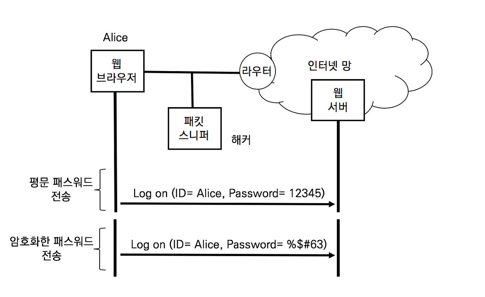
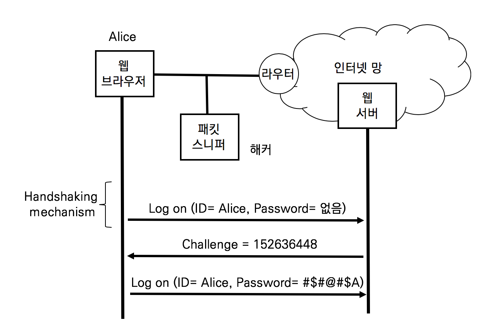
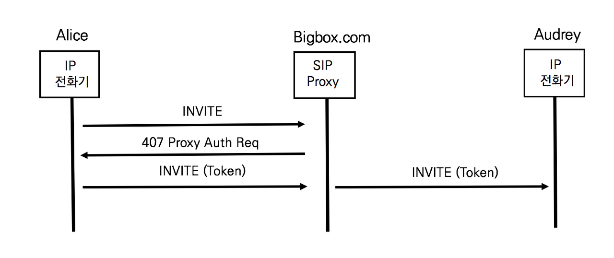
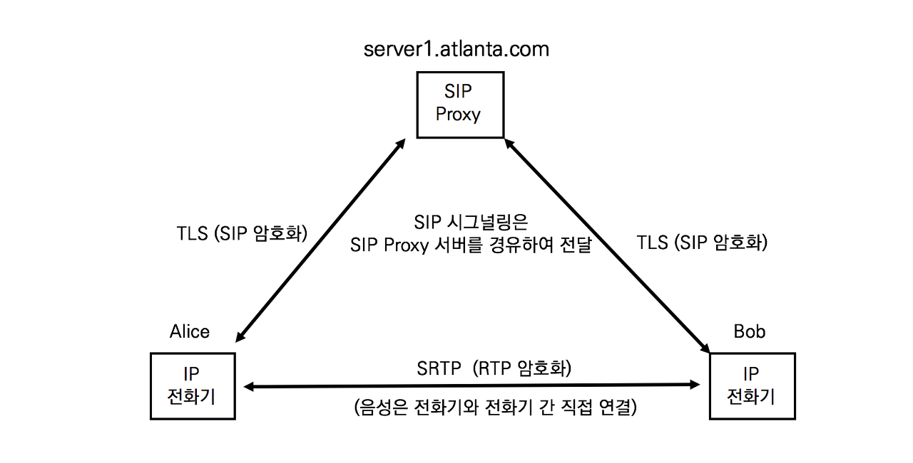
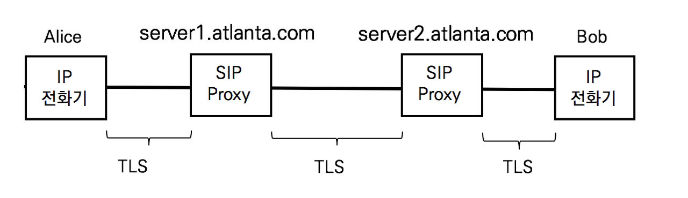
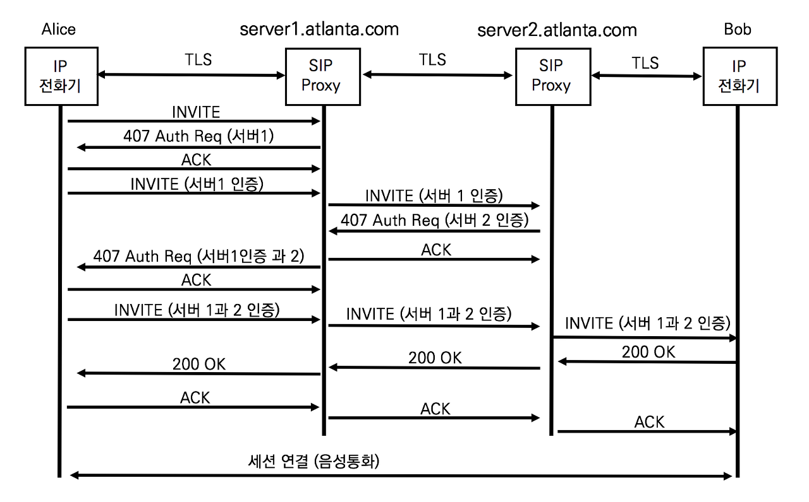

# 사용자 인증

## SIP 보안이 필요한 이유

앨리스가 밥과 통하를 할 때 필요한 장비는 두 대의 전화기와 한 대의 SIP Proxy 서버다. 엔지니어 입장에서 기업의 IP네트워크 또는 인터넷 네트워크는 더 많은 것들로 이루어져 있다. 전화 한 통화가 이루어지기 위해 거쳐야 하는 장비는 수많은 전화기, 스위치, 라우터 방화벽, SBC 그리고 IP Proxy 서버가 있다. 인터넷의 모든 장비들은 관리자가 있고 각 속한 기업이나 조직의 관리 정책에 의해 운용된다. 안전한 전화 통화를 위해 모든 장비가 안전하게 설계되고 구축되는지를 확인하지 않는다. 기본적으로 안전하게 관리된다고 가정한다.

SIP Security는 기업 내부에 있는 IP전화기와 SIP Proxy 서버 간의 안전한 통신에 관심을 가진다. 실제 통화하는 단말과 단말 간의 안전한 통신에 관심을 가진다. 그리고 전화ㅎ통화에 참여하는 앨리스와 밥이 안전하다고 느낄 수 있는 보안 정책이 필요하다. 앨리스와 법이 안전하다고 신뢰할 수 있는 방안들이 갖추어져야 편하게 대화가 가능하다.

## 기본적인 SIP Security

SIP 프로토콜은 기본적인 보안 방법들이 있다.

- Digest Authentication (사용자 인증)

  도메인 내의 SIP Proxy 서버는 발신자가 인증된 사용자인지를 확인한다. HTTP 프로토콜도 사용하는 인증방식으로 재사용 공격 방지와 인증을 제공한다

- TLS

  Hob by Hob 또는 End-to-End로 시그널리에 대한 기밀성과 무결성을 보장한다

- S/MIME (Secure / Multipurpose Internet Mail Extension)

  SIP 메시지 바디는 MIME으로 작성하여 암호화한다. 암호화는 메시지에 기밀성 및 무결성을 제공한다.

- Network Asserted Identity (NAI)

  같은 도메인 내의 발신자를 식별한다

- SIP Identitiy

  도메인과 도메인 간의 발신자를 식별한다

- SIP Privacy

  외부 도메인에 대해 메시지의 특정 부분을 보호한다.

SIP 프로토콜은 한 가지 방법을 사용하는 것이 아니라 서로 상호 보완적으로 사용한다.

## HTTP Digest Authentication (단순 인증)

SIP 단순인증은 RFC 2617 HTTP Digest Authentication에 기반을 둔 사용자 인증 방법이다.



웹서버에 로그인하기 위해 사람들은 브라우저에서 유저네임과 패스워드를 입력한다 . 패스워드를 평문 그대로 전송한다면 해커는 손쉽게 패킷을 캡처하여 순쉽게 패스워드를 얻을 수 있다. 그래서 패스워드를 해쉬하여 전송한다면 해커는 패킷을 캡처하여도 패스워드를 얻을 수 없다. 해쉬는 패스워드를 특정한 길이의 난수열로 바꾸는 기법이다. 암호는 다시 복호화하여 원문을 얻을 수 있지만 해쉬는 복호화가 불가능한 것이 특징이다. 문제는 MD5와 같은 오래된 해쉬 기법을 사용하거나 패스워드가 변경되지 않는 한 동일한 해쉬값이 전달되므로 언젠가는 해킹될 우려가 있다.

현재의 암호화 기법은 시스템이 동적으로 해쉬갑이 매번 변경되도록 하여 해커가 추측하지 못하게 한다. 매번 전송되는 패스워드의 해쉬값을 변경하기 위해 합의된 난수열을 사용한다.



앨리스가 처음 로그인 시도 시에는 유저네임만을 전송한다. 웹서버는 랜덤 난수열을 생성하여 Challenge로 응답한다. 앨리스가 패수어드를 해쉬할 대 패스워드와 Challenge값을 함께 해쉬한다. 이렇게 하면 해쉬값이 매번 변경되므로 해커가 유추할 수 없다.


## SIP Digest Authentication

SIP Digest Authentication은 HTTP Digest Authentication과 동작 방식은 동일하지만, HTTP 프로토콜이 아니라 SIP 프로토콜 위에서 동작하는 것이 다르다.



1. 앨리스의 INVITE

   앨리스는 SIP INVITE 요청을 SIP Proxy 서버로 전송한다.

   ```sip
   INVITE sip:audrey@atlanta.com SIP/2.0
   Via: SIP/2.0/TCP pc33.atlanta.com;branch=z9hG4bK74b43
   Max-Forwards: 70
   From: Alice <sip:alice@atlanta.com>;tag=9fxced76sl
   To: Audrey <sip:audrey@atlanta.com>
   Call-ID: 3848276298220188511@pc33.atlanta.com
   CSeq: 31862 INVITE
   Contact: <sip:alice@atlanta.com>
   Content-Type: application/sdp
   Content-Length: 151 
   ```

2. SIP Proxy 서버의 407 Proxy Authorization Required

   SIP Proxy 서버는 INVITE 메시지에 사용자 인증에 대한 정보가 없으므로 407 Proxy Authoriation Required 응답을 앨리스에게 전달한다.

   ```sip
   SIP/2.0 407 Proxy Authorization Required
   Via: SIP/2.0/TLS pc33.atlanta.com;branch=z9hG4bK74b43 ;received=10.1.3.33
   From: Alice <sips:alice@atlanta.com>;tag=9fxced76sl
   To: Audrey <sips:audrey@atlanta.com>;tag=3flal12sf
   Call-ID: 3848276298220188511@pc33.atlanta.com
   CSeq: 31862 INVITE
   Proxy-Authenticate: Digest realm="atlanta.com", qop="auth",         nonce="f84f1cec41e6cbe5aea9c8e88d359", opaque="", stale=FALSE, algorithm=MD5
   Content-Length: 0
   ```

   SIP Proxy 서버는 SIP INVITE 요청에 대해 사용자 인증을 요청하려고 응답한다. Proxy-Authenticate 헤더는 여러 가지 정보를 포함하고 있다.

   - realm="atlanta.com"
     도메인 네임
   - qop="auth"
     사용자 인증 정보 요청
   - nonce="f84f1cec41e6cbe5aea9c8e88d359"
     HTTP Digest Authentication의 Challenge 값과 동일한 시간을 기반으로 한 난수열

   INVITE를 받은 SIP Proxy 서버는 407 Proxy Authorization Required로, SIP REDIRECT 서버나 REGISTRA 서버는 401 Unauthrized로 응답한다

3. 앨리스의 INVITE (Token)

   앨리스는 INVITE메시지에 Authorization헤더를 이용하여 사용자 인증 정보를 전달한다

   ```sip
   INVITE sips:audrey@atlanta.com SIP/2.0
   Via: SIP/2.0/TLS pc33.atlanta.com;branch=z9hG4bK776asdhds ;received=10.1.3.33
   Max-Forwards: 70
   Route: <sips:bigbox10.atlanta.com;lr>
   To: Audrey <sips:audrey@atlanta.com>
   From: Alice <sips:alice@atlanta.com>;tag=1928301774
   Call-ID: a84b4c76e66710@pc33.atlanta.com 
   CSeq: 31863 INVITE
   Contact: <sips:alice@pc33.atlanta.com>
   Content-Type: application/sdp
   Content-Length: 151
   Authorization: Digest username=“audrey", realm="atlanta.com"  nonce="ea9c8e88df84f1cec4341ae6cbe5a359", opaque="",  uri="sips:audrey@atlanta.com",  response="dfe56131d1958046689d83306477ecc"
   ```

   407 Proxy Auth Required 응답의 Proxy-Authenticate 헤더의 nounce값을 이용하여 생성한 해쉬값과 사용자 인증 정보를 Authorization 헤더로 전달한다.

   - username=“audrey"
     사용자명
   - realm="atlanta.com" 
     도메인 네임
   - nonce="ea9c8e88df84f1cec4341ae6cbe5a359"
     HTTP Digest Authentication의 Challenge 값과 동일한 시간을 기반으로 한 난수열
   - uri="sips:audrey@atlanta.com"
     착신 측의 URI 주소
   -  response="dfe56131d1958046689d83306477ecc"
     패스워드 해쉬 정보

4. SIP Proxy 서버의 INVITE (Token)

   SIP Proxy 서버는 오드리에게 앨리스가 보낸 메시지를 그대로 전달한다. SIP Proxy 서버는 응답을 받기 위해 Via 헤더만을 추가한다

## TLS와 SRTP의 개요

공공기관과 보안을 중요시하는 기업들은 보안이 강화된 Secure IP Telephony를 구현한다. Secure IP Telephony는 매우 복잡한 체계로 구현되지만 주요 프로토콜은 TLS (Transport Layer Security)와 SRTP(Secure RTP)다. TLSsms 냐ㅖ시그널링 메시지를 암화화하고, SRTP는 음성과 영상 트래픽을 암호화한다. Secure IP  Telephony가 구현된 네트워크에서 중간에 패킷을 캡쳐하더라도 내용을 유추할 수 없다.



TLS는 넷스케이프 사에 전자 상거래 등의 보안을 위해 개발된 SSL (Secure Socket Layer Protocol) 프로토콜이  RTF 2246으로 1999년에 표준화 된 후 현재는 RFC 5346 TLS 1.2가 표준화되었다. RFC 8446 TLS 1.3도 표준화되었지만, 가장 널리 쓰이는 것능 TLS 1.2이다. TLS는 OSI 7계층 중 전송계층에서 수행되는 프로토콜이므로 응용계층의 프로토콜인 HTTP, XMPP, FTP등 사용할 수 있다. TLS는 기밀성, 무결성 및 사용자 인증까지 제공할 수 있는 프로토콜로써 확장성 및 효율성이 뛰어나 광범위하게 사용된다.

## SIP 프로토콜을 위한 TLS

TLS는 이름 그대로 전송 계층인 TCP에 신뢰성을 강화할 수 있는 프로토콜이다. TLS가 적용할 경우 SIP 픅로토콜이 전송 프로톸로로 TCP만 사용해야 한다.



앨르스와 밥 간에 직접 다대단 (End-to-End) TLS 세션이 만들어져 SIP프로토콜을 주고받는다고 가정해보자. SIP Proxy 서버는 Via헤더와 같은 SIP 메시지를 추가 변경 상제 할 수 없고, SIP 메시지를 확인할 수 없으므로 호의 상태를 전혀 추적할 수 없다. 따라서 TLS 는 Hop-by-Hop으로 세션을 생성한다.



홉 바이 홉으로 생성된 TLS 세션을 통해 SIP프로토콜의 운영 방식을 변경하지 않고도 안전하게 전달할 수 있다. 두 개의 SIP Proxy 서버가 모두 사용자 인증을 요구할 경우에는 사용자 인증을 모두 수행한다.

## TLS 협상 절차

TLS세션을 생성하기 위한 파라미터 교환은 TLS Handshake 프로토콜이 진행한다. TLS클라이언트와 서버가 통신하기 위해서는 TLS 버전, 암호화 알고리즘 및 상호 인증을 수행해야한다. 그리고 공개키 암호화 기법을 이용하여 암호화 키를 생성하고 교환한다.

