## Amazon EC2 Lunux 인스턴스 시작하기

1. EC2 선택

   > 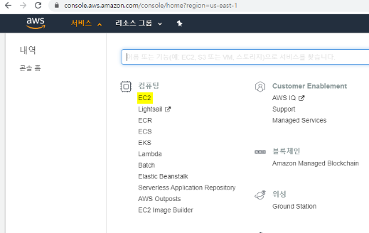

2. 인스턴스 시작 선택

   > 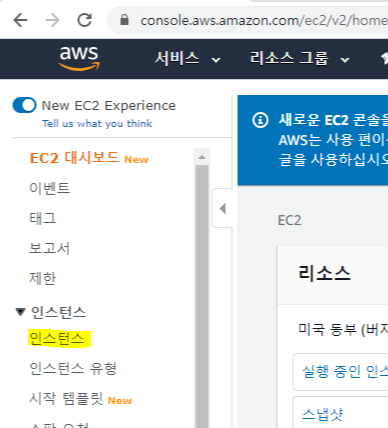
   >
   > 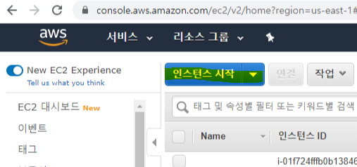

3. AMI 선택

   > 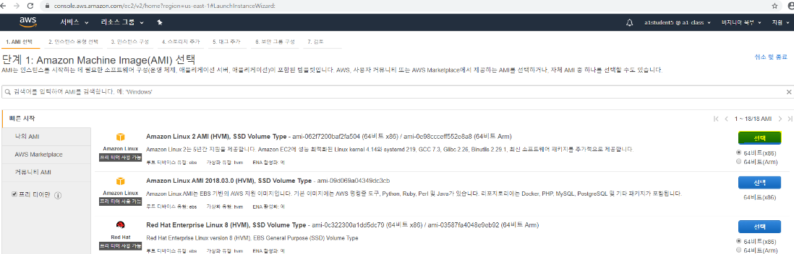

4. 인스턴스 유형 선택 -> 다음

   > 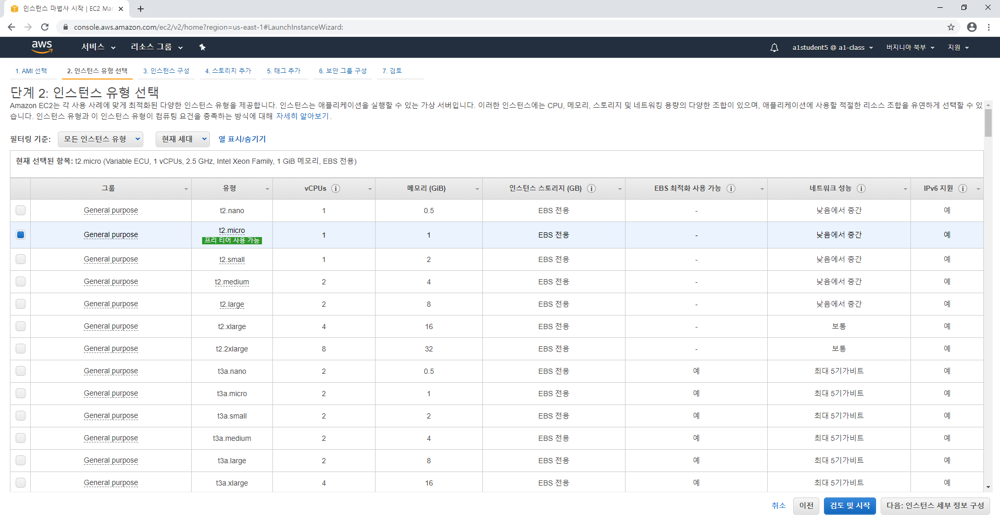

5. 세부구성 -> 기본 설정 사용

   > 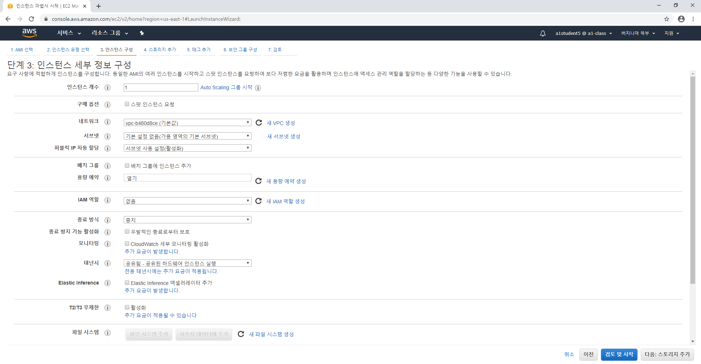

6. 스토리지 추가

   > 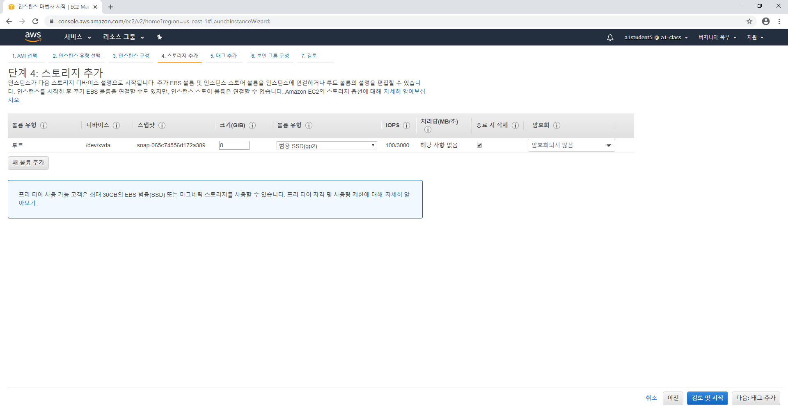

7. 보안그룹 선택 (SSH, http, https ..)

   > 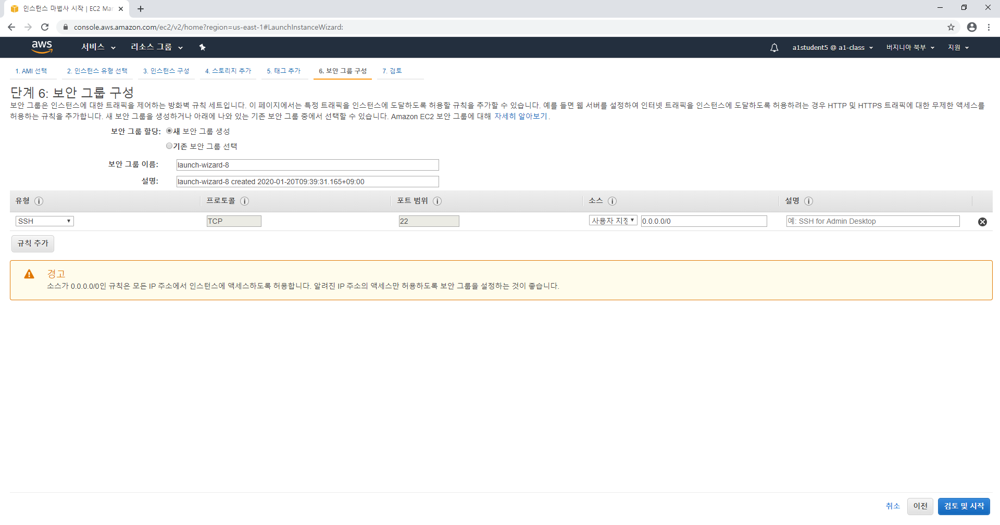

8. 키페어 선택 (새 키 페어 생성)

   > 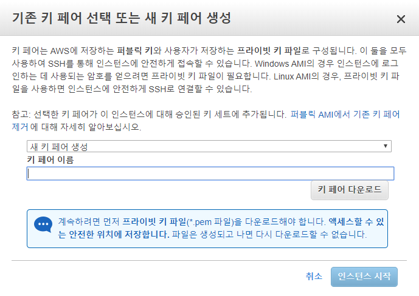

   * 키 페어 입력 후 "키 페어 다운로드" -> 인스턴스 시작

     > 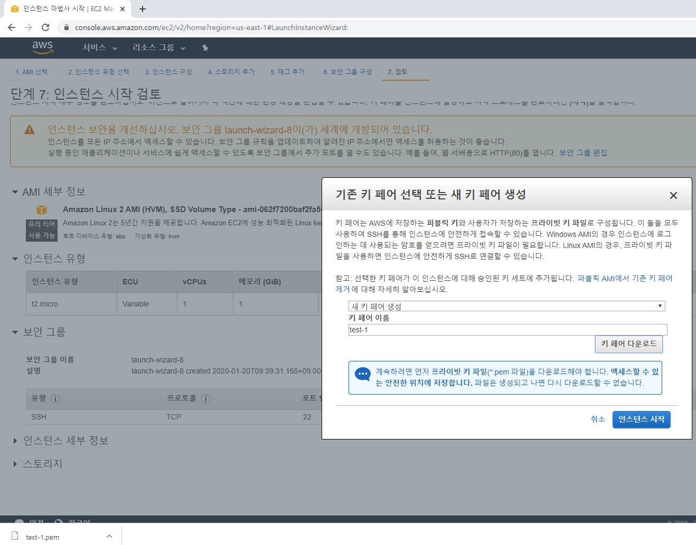

   

#### Putty 연결

1. 생성한 인스턴스 및 Public IP확인

   > 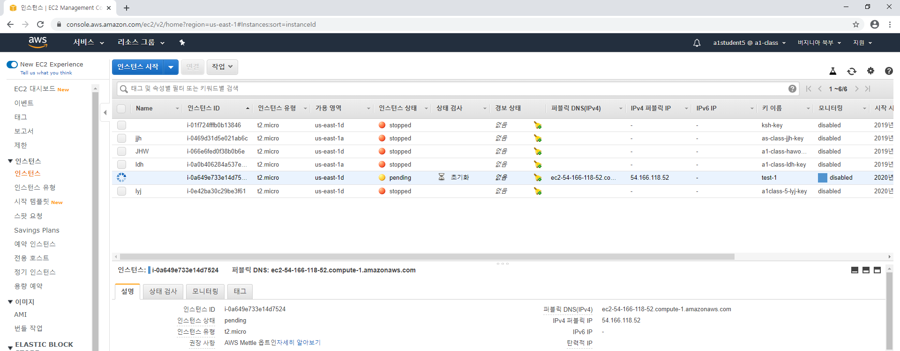

2. Putty Key Generator 실행 후 다운받은 키 Load ->save private key 선택하여 저장

   > 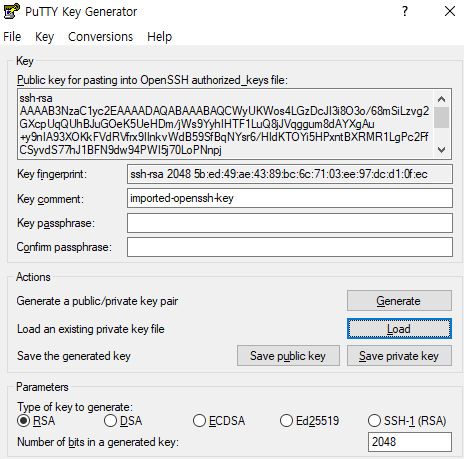

3. Putty 실행하여 Auth에서 키 선택

   > 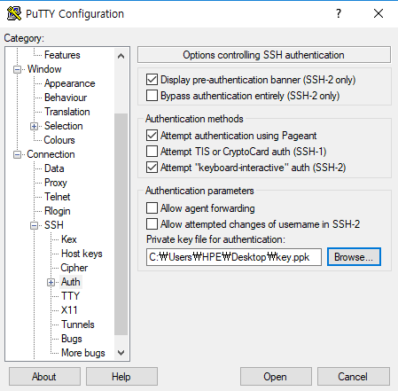

4. 할당된 퍼블릭 IP로 세션 연결

   > 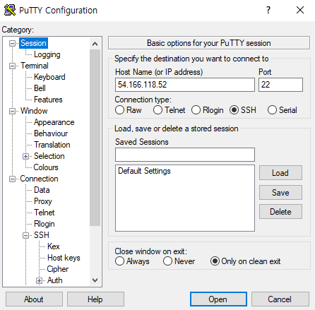

5. 접속확인

   > 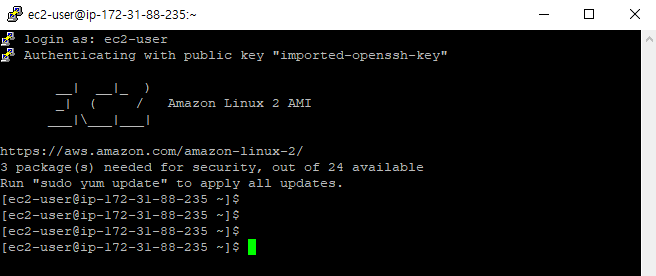