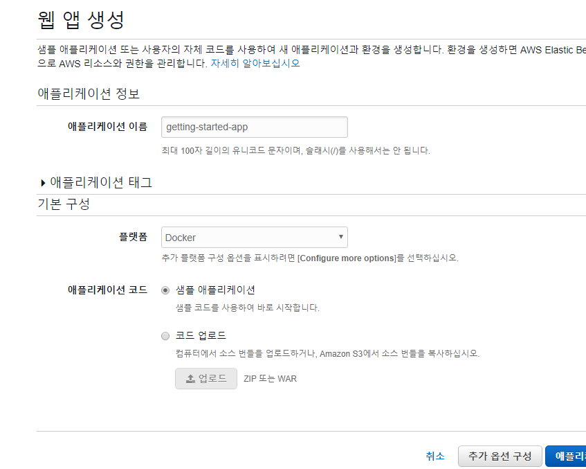
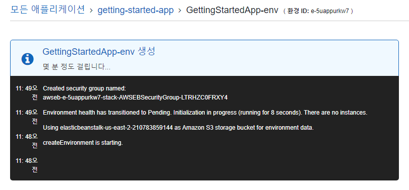
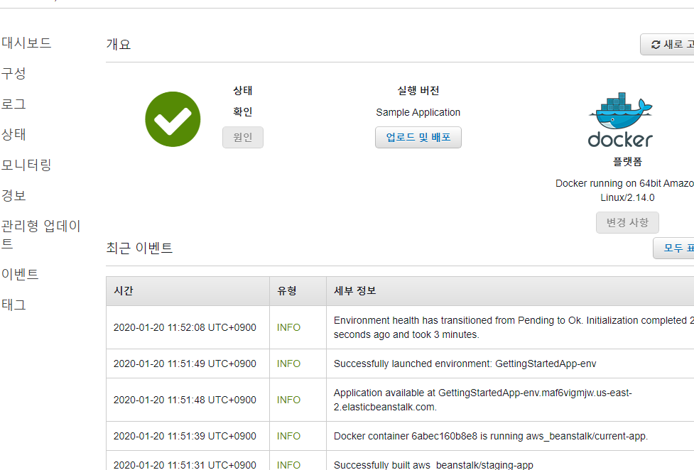
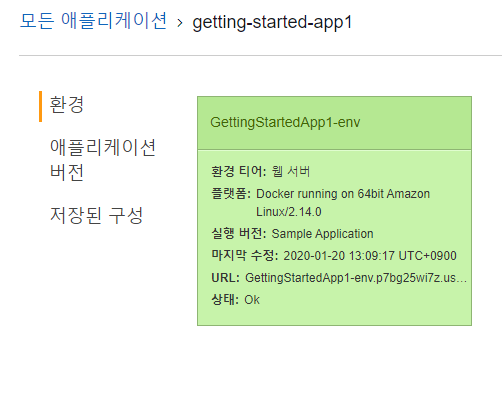
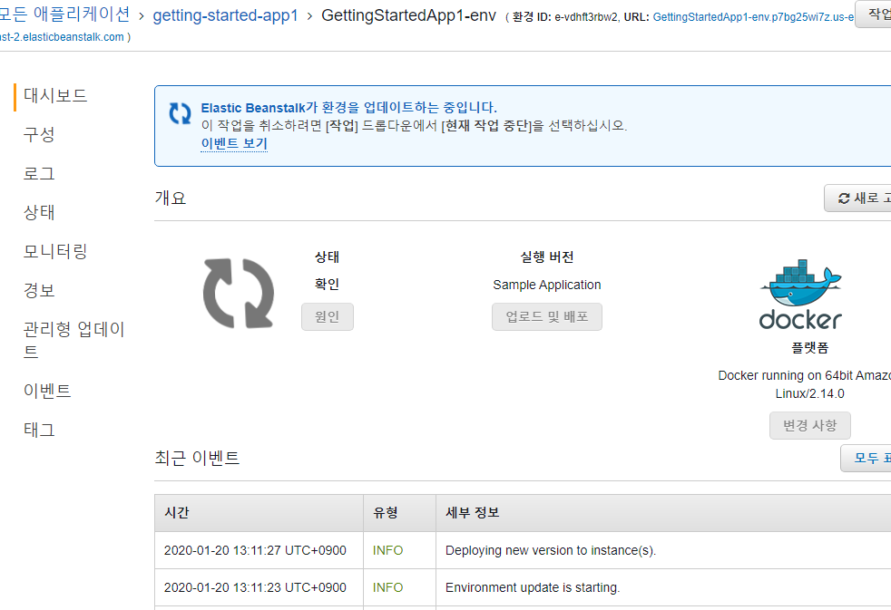
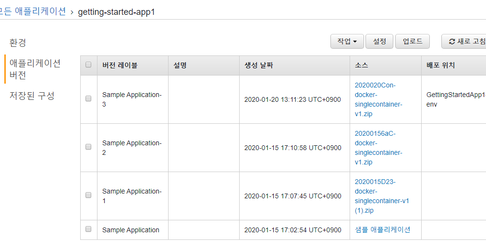
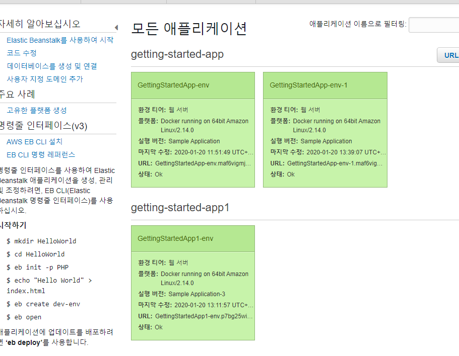
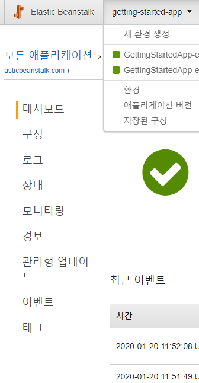

Elastic Beanstalk 사용 시작 (Platform은 도커로)

1. 어플리케이션 생성

   >

2. env 환경 확인

   * 어플리케이션 생성 중

     > 

   * 정상적인 환경 로드 장면

     >

   * 설정한 환경 값 확인

     >

   * 새 어플리케이션 배포 - 단일 도커

     >

   * 생성된 어플리케이션 버전 정보 확인

     >

3. 어플리케이션 구성 변경

   * 배포된 앱 확인

     > 

4. 관리자 페이지 이동

   * 어플리케이션에 더 적합하도록 환경을 구성할 수 있다

   * 관리자 페이지

     >

   