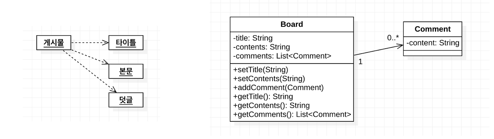

## UML

- Unified Modeling Language
- 소프트웨어를 설계하며 필요에 의해서 사용된다
  - 의사소통 또는 설계 논의를 위해
  - 전체 시스템의 구조 및 클래스의 의존성 파악을 위해
  - 유지보수를 위한 설계의 back-end 문서 제작을 위해

## 클래스 다이어그램

**목적**

- 문제 해결을 위한 도메인 구조를 나타내어 보이지 않는 도메인 안의 개념과 같은 추상적인 개념을 기술
- 소프트웨어의 설계 혹은 완성된 소프트웨어의 구현 설명

## 클래스 다이어그램의 기본 요소

**접근제어자 리스트**

- \+ : public
- \- : private
- \# : protected

**형식**

- 속성(Attribute)
  - `접근제어자 이름: 타입 = 기본값`
  - ex) -title: String = ""
- 메서드
  - `접근제어자 이름(파라미터 속성): 리턴값`
  - ex_1) +setTitle(String)
  - ex_2) +getTitle(): String

interface와 abtsract(추상화)와 같은 요소들은 `<<>>`을 이용해서 `<<interface>>` 또는 `<<abstract>>`로 나타낼 수 있다.

## 클래스 다이어그램을 이용한 관계 표현

참조 : http://www.nextree.co.kr/p6753/

### 일반화

- 상속을 의미한다.
- 실선에 비어있는 화살표로 표현

### 실체화

- 오버라이딩하여 실제로 구현하는 것을 의미
- 점선과 비어있는 화살표로 표현

