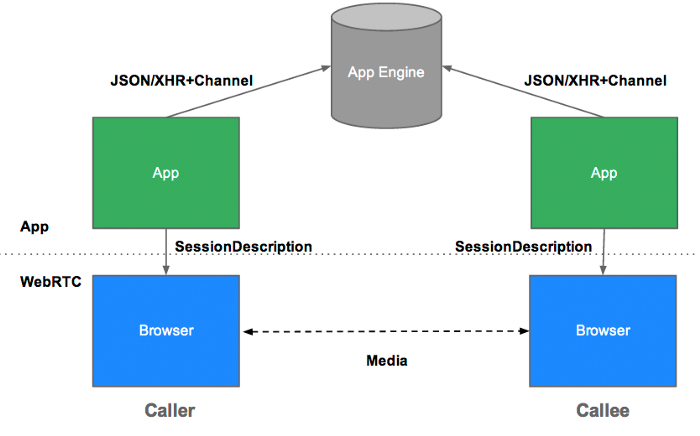

## WebRTC

- Web Real-Time Communication
- 별도의 소프트웨어 없이 음성, 영상 미디어 혹은 텍스트, 파일같은 데이터를 브라우저끼리 주고 받을 수 있게 만든 기술
- WebRTC로 구성된 프로그램들은 별도의 플러그인이나 소프트웨어 없이 p2p 화상회의 및 데이터 공유를 한다
- WebRTC는 서로 상호작용하는 API와 Protocol들로 구성되어 있다

### 활용

- 화상 통화
- 화상회의
- 데이터 전송
- 게임

### WebRTC 통신 원리

