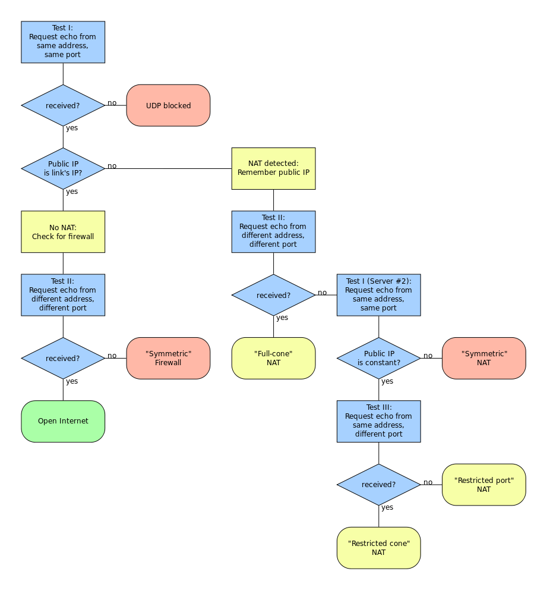

## ICE

- Interactive Connectivity Establishment
- RFC 5245 A protocol for Network Address Translator (NAT) Traversal for Off/Answer Protocols 에 정의되어 있다.
- ICE는 두 단말이 서로 통신할 수 있는 최적의 경로를 찾을 수 있도록 도와주는 프레임워크다.
- ICE는 STUN과 TURN을 활용하는 프레임워크로 SDP 제안 및 수락 모델에 적용할 수 있다.
- ICE는 두 단말 간의 제안 및 수락 모델로 생성되는 실시간 UDP 미디어 스트림을 송수신하기 위한 NAT Traversal 기술이지만 TCP 전송 프로토콜에도 적용 가능하다.
- ICE는 STUN과 TURN 프레임워크로 확보된 통신 가능한 여러 IP wnthdhk 포트 넘버를 SDP Offer와 SDP Answer를 통해 상대방에게 전달한다.
  - 두 단말은 확보된 모든 주소에 대해 P2P 연결성 테스트를 진행하고 통신 가능한 주소로 RTP 미디어 스트림을 송수신한다.

## STUN

- Session Traversal Utilities for NAT
- IETF RFC 5389에 정의된 네트워크 프로토콜/패킷 포맷
- **Public 관점에서 종단에 Access 가능한 IP:Port를 발견하는 작업**
- 대부분의 WebRTC 호출은 STUN을 이용한 연결을 성공적으로 만들어낸다

#### STUN의 역할

- 어떤 종단이 NAT/Firewall 뒤에 있는지 판단하게 해준다.
- 어떤 종단에 대한 Public IP Address를 결정하고 NAT/Firewall의 유형에 대해 알려준다.

#### STUN의 테스트 절차

#### STUN의 한계

- 두 단말이 같은 NAT 환경에 있을 경우 STUN은 동작하지 않는다.
- Symmetric NAT로 동작하는 사설망 환경에서는 애플리케이션이 다르면 NAT 매핑 테이블이 바뀌기 때문에 사용할 수 없다.
- STUN 메시지로 확인한 STUN 클라이언트의 Reflexive Transport Address가 다른 애플리케이션인 SIP 시그널링과 RTP 프로토콜을 사용할 때는 주소가 바뀐다..

## TRUN

- Traversal Using Relays around NAT
- Peer간 직접 통신이 실패할 경우 종단점들 사이에 데이터 릴레이를 수행하는 TURN 서버들을 사용
- TURN은 Peer 들과의 미디어 스트리밍을 릴레이하기 위해 사용
- TURN은 공용 주소들을 가지고 있으며 미디어를 릴레이하기 때문에 네트워크와 컴퓨팅 자원이 소모될 수 있다.

