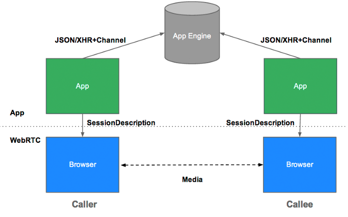

## WebRTC

- Web Real-Time Communication
- 별도의 소프트웨어 없이 음성, 영상 미디어 혹은 텍스트, 파일같은 데이터를 브라우저끼리 주고 받을 수 있게 만든 기술
- WebRTC로 구성된 프로그램들은 별도의 플러그인이나 소프트웨어 없이 p2p 화상회의 및 데이터 공유를 한다
- WebRTC는 서로 상호작용하는 API와 Protocol들로 구성되어 있다

### 활용

- 화상 통화
- 화상회의
- 데이터 전송
- 게임

#### WebRTC 통신 원리

#### 특징

- WebRTC 기술은 P2P 통신에 최적화되어 있다.
- WebRTC에 사용되는 기술은 크게 3가지의 클래스에 의해 실시간 데이터 교환이 일어난다
  - MediaStream : 카메라와 마이크 등의 데이터 스트림 접근
  - RTCPeerConnection : 암호화 및 대역폭 관리 및 오디오, 비디오의 연결
  - RTCDataChannel : 일반적인 데이터의 P2P통신

#### STUN, TURN 서버

- WebRTC는 P2P에 최적화 되어있다. 즉 Peer들 간의 공인 네트워크 주소(IP)를 알아야 하고 데이터 교환을 해야하는데, 실제 개개인의 컴퓨터는 방화벽 등 여러 보호장치들이 존재하고 있어 연결이 쉽지 않다. Stun/Turn 서버는 서로간의 연결정보를 공유하여 P2P통신을 가능하게 해준다.

