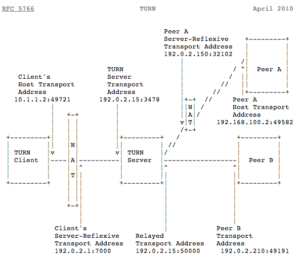

## STUN

- Session Traversal Utilities for NAT
- IETF RFC 5389에 정의된 네트워크 프로토콜/패킷 포맷
- **Public 관점에서 종단에 Access 가능한 IP:Port를 발견하는 작업**
- 대부분의 WebRTC 호출은 STUN을 이용한 연결을 성공적으로 만들어낸다

#### STUN의 역할

- 어떤 종단이 NAT/Firewall 뒤에 있는지 판단하게 해준다.
- 어떤 종단에 대한 Public IP Address를 결정하고 NAT/Firewall의 유형에 대해 알려준다.

#### STUN 동작

#### STUN의 한계

- 두 단말이 같은 NAT 환경에 있을 경우 STUN은 동작하지 않는다.
- Symmetric NAT로 동작하는 사설망 환경에서는 애플리케이션이 다르면 NAT 매핑 테이블이 바뀌기 때문에 사용할 수 없다.
- STUN 메시지로 확인한 STUN 클라이언트의 Reflexive Transport Address가 다른 애플리케이션인 SIP 시그널링과 RTP 프로토콜을 사용할 때는 주소가 바뀐다.

> **Symmetric NAT**
>
> NAT에는 Cone NAT과 Symmetric NAT가 있다. Cone NAT과 Symmetric NAT의 다른 점은 도착지 주소가 mapping에 주요한지 아닌지에 따라 달라진다. Cone NAT는 internal ip & port 만이 mapping에 주요하나, Symmetric NAT은 destination 주소가 다르면 다른 mapping table에 적힌다.
>
> - Cone NAT에서는 특정 PC의 내부의 IP:Port가 외부 IP:Port로 변환될 때 Destination에 상관 없이 외부 Port가 항상 일정하다.
>
> 
>
> - Symmetric NAT은 특정 PC의 내부의 IP:Port가 외부 IP:Port로 변환될 때 Destination에 따라 다른 외부 Port가 사용된다. 즉 peer들이 오직 이전에 연결한 적 있는 연결들만 허용한다
>
> 

## TRUN

- Traversal Using Relays around NAT
- STUN을 사용할 수 없을 때 TURN 서버를 통해 미디어 중계를 위해 사용된다
  - 모든 미디어를 중계하기 때문에 다소 비용이 들 수 있다
- TURN 서버와 연결하고 모든 정보를 그 서버에 전달하는 것으로 Symmetric NAT 제한을 우회한다.
  - 이를 위해 TURN 서버와 연결을 한 후 모든 peer들에게 저 서버에 모든 패킷을 보내고 다시 나에게 전달해달라고 해야 한다. 이것은 명백히 오버헤드가 발생하므로 이 방법은 다른 대안이 없을 경우만 사용하게 된다
- Peer간 직접 통신이 실패할 경우 종단점들 사이에 데이터 릴레이를 수행하는 TURN 서버들을 사용
- TURN은 Peer 들과의 미디어 스트리밍을 릴레이하기 위해 사용
- TURN은 공용 주소들을 가지고 있으며 미디어를 릴레이하기 때문에 네트워크와 컴퓨팅 자원이 소모될 수 있다.
- STUN을 사용할지 TURN을 사용할지는 ICE 프로토콜에 의해 결정된다

#### TURN 동작

### STUN/TURN 비교

- STUN
  - 구현하기 쉬운 백엔드 리소스
  - 항상 동작하지는 않는다
- TURN
  - 거의 항상 동작한다
  - 많은 리소스를 필요로 한다

||STUN|TURN|
|---|---|---|
|목적|외부 IP 주소를 확인하기 위해|미디어 릴레이를 위해|
|사용빈도|거의 항상 사용|종종 사용|
|운영비용|낮음|높음|
|품질 영향|없음|있을 수 있음|
