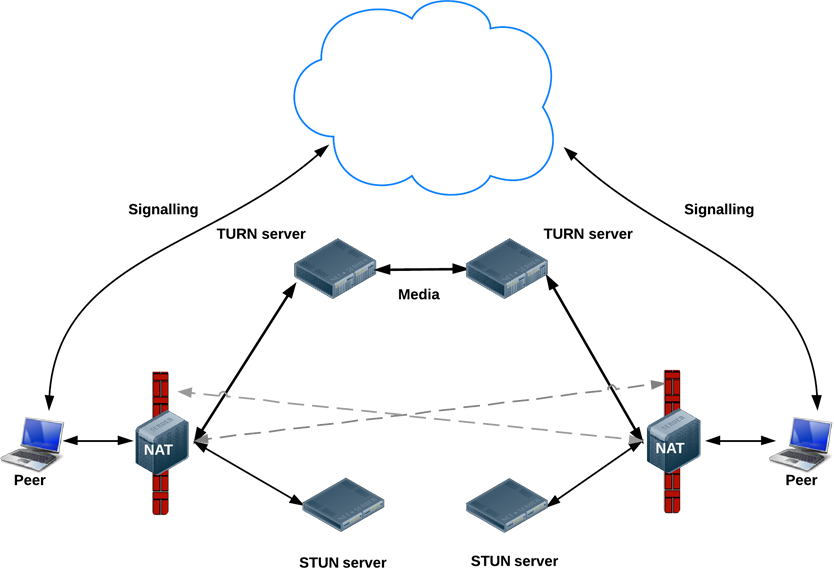

## TRUN

- Traversal Using Relays around NAT
- TURN 서버와 연결하고 모든 정보를 그 서버에 전달하는 것으로 Symmetric NAT 제한을 우회한다.
  - 이를 위해 TURN 서버와 연결을 한 후 모든 peer들에게 저 서버에 모든 패킷을 보내고 다시 나에게 전달해달라고 해야 한다. 이것은 명백히 오버헤드가 발생하므로 이 방법은 다른 대안이 없을 경우만 사용하게 된다
- Peer간 직접 통신이 실패할 경우 종단점들 사이에 데이터 릴레이를 수행하는 TURN 서버들을 사용
- TURN은 Peer 들과의 미디어 스트리밍을 릴레이하기 위해 사용
- TURN은 공용 주소들을 가지고 있으며 미디어를 릴레이하기 때문에 네트워크와 컴퓨팅 자원이 소모될 수 있다.

#### TURN 동작

