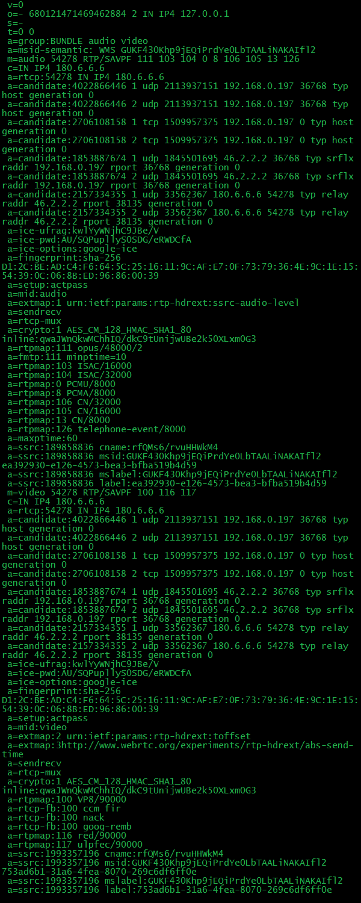

## SDP

- Session Description Protocol
- 해상도, 코덱, 암호화 등의 멀티미디어 컨텐츠의 연결을 설명하기 위한 표준
- 기술적으로 보자면 SDP는 프로토콜이 아니지만, 데이터 포맷은 디바이스 간의 미디어를 공유하기 위한 연결을 설명하기 위해 사용된다.


## WebRTC SDP

- WebRTC에서는 SDP

### WebRTC SDP의 구조



```sdp
v=0
o=- 6137031273746274589 2 IN IP4 127.0.0.1
s=-
t=0 0
a=group:BUNDLE audio video data
a=msid-semantic: WMS vrogvdX9SLeto3IhVm6C1cFS2fRIFqRMlPzd
m=audio 9 UDP/TLS/RTP/SAVPF 111 103 104 9 0 8 126
c=IN IP4 0.0.0.0
a=rtcp:9 IN IP4 0.0.0.0
a=ice-ufrag:eWXl
a=ice-pwd:57FcQfoChjtjaMlHOlp6TPGE
a=fingerprint:sha-256 EB:E1:55:0E:41:99:0C:C0:CC:C8:43:9B:99:11:F9:A1:4D:77:5C:A1:BF:70:78:B0:19:30:04:D8:D3:11:DC:0D
a=setup:actpass
a=mid:audio
b=AS:32
a=extmap:1 urn:ietf:params:rtp-hdrext:ssrc-audio-level
a=extmap:3 http://www.webrtc.org/experiments/rtp-hdrext/abs-send-time
a=sendrecv
a=rtcp-mux
a=rtpmap:111 opus/48000/2
a=rtcp-fb:111 transport-cc
a=fmtp:111 minptime=10;useinbandfec=1
a=rtpmap:103 ISAC/16000
a=rtpmap:104 ISAC/32000
a=rtpmap:9 G722/8000
a=rtpmap:0 PCMU/8000
a=rtpmap:8 PCMA/8000
a=rtpmap:126 telephone-event/8000
a=ssrc:4294317716 cname:rMz9sLiEHfqP6GNx
a=ssrc:4294317716 msid:vrogvdX9SLeto3IhVm6C1cFS2fRIFqRMlPzd dbf5d9a8-8135-4e0d-87f0-d2b6b7d326b3
a=ssrc:4294317716 mslabel:vrogvdX9SLeto3IhVm6C1cFS2fRIFqRMlPzd
a=ssrc:4294317716 label:dbf5d9a8-8135-4e0d-87f0-d2b6b7d326b3
m=video 9 UDP/TLS/RTP/SAVPF 100 101 107 116 117 96 97 99 98
c=IN IP4 0.0.0.0
a=rtcp:9 IN IP4 0.0.0.0
a=ice-ufrag:eWXl
a=ice-pwd:57FcQfoChjtjaMlHOlp6TPGE
a=fingerprint:sha-256 EB:E1:55:0E:41:99:0C:C0:CC:C8:43:9B:99:11:F9:A1:4D:77:5C:A1:BF:70:78:B0:19:30:04:D8:D3:11:DC:0D
a=setup:actpass
a=mid:video
b=AS:1500
a=extmap:2 urn:ietf:params:rtp-hdrext:toffset
a=extmap:3 http://www.webrtc.org/experiments/rtp-hdrext/abs-send-time
a=extmap:4 urn:3gpp:video-orientation
a=extmap:5 http://www.ietf.org/id/draft-holmer-rmcat-transport-wide-cc-extensions-01
a=extmap:6 http://www.webrtc.org/experiments/rtp-hdrext/playout-delay
a=recvonly
a=rtcp-mux
a=rtcp-rsize
a=rtpmap:100 VP8/90000
a=fmtp:100 x-google-start-bitrate=600; x-google-min-bitrate=600; x-google-max-bitrate=1500; x-google-max-quantization=56
a=rtcp-fb:100 ccm fir
a=rtcp-fb:100 nack
a=rtcp-fb:100 nack pli
a=rtcp-fb:100 goog-remb
a=rtcp-fb:100 transport-cc
a=rtpmap:101 VP9/90000
a=rtcp-fb:101 ccm fir
a=rtcp-fb:101 nack
a=rtcp-fb:101 nack pli
a=rtcp-fb:101 goog-remb
a=rtcp-fb:101 transport-cc
a=rtpmap:107 H264/90000
a=rtcp-fb:107 ccm fir
a=rtcp-fb:107 nack
a=rtcp-fb:107 nack pli
a=rtcp-fb:107 goog-remb
a=rtcp-fb:107 transport-cc
a=fmtp:107 level-asymmetry-allowed=1;packetization-mode=1;profile-level-id=42e01f
a=rtpmap:116 red/90000
a=rtpmap:117 ulpfec/90000
a=rtpmap:96 rtx/90000
a=fmtp:96 apt=100
a=rtpmap:97 rtx/90000
a=fmtp:97 apt=101
a=rtpmap:99 rtx/90000
a=fmtp:99 apt=107
a=rtpmap:98 rtx/90000
a=fmtp:98 apt=116
m=application 9 DTLS/SCTP 5000
c=IN IP4 0.0.0.0
a=ice-ufrag:eWXl
a=ice-pwd:57FcQfoChjtjaMlHOlp6TPGE
a=fingerprint:sha-256 EB:E1:55:0E:41:99:0C:C0:CC:C8:43:9B:99:11:F9:A1:4D:77:5C:A1:BF:70:78:B0:19:30:04:D8:D3:11:DC:0D
a=setup:actpass
a=mid:data
b=AS:1638400
a=sctpmap:5000 webrtc-datachannel 1024
```

### SDP 상세설명

#### Global Lines

```sdp
v=0
```

- SDP의 현재 버전을 일컫는다. 곧 SDP 프로토콜 버전이다

```sdp
o=- 6137031273746274589 2 IN IP4 127.0.0.1
```

- SDP를 생성한 Peer의 식별자. 순서는 아래와 같다.
- user name(생략됨), session id, session version, network type, address type, unicast address 순이다.
- user name 이 - 으로 생략되었지만 문자열 파싱을 통해 어플리케이션에서 user name 을 추가할 수 있다. 이를 추가하면 아래와 같다

```sdp
o=Jack 6137031273746274589 2 IN IP4 127.0.0.1
```

```sdp
s=-
```

- 세션 네임이지만 별도의 세션 네임은 생략되었다.
- 세션 네임이 생략되었지만 어플리케이션에서 이를 추가할 수 있다.

```sdp
t=0 0
```

- 세션이 활성화 되었을 시간을 의미한다. 각각 start time 과 end time 이다. 0 0 은 고정 세션을 의미한다. 이는 세션 만료 없이 영구적임을 의미한다.

```sdp
a=group:BUNDLE audio video data
```

- 번들 그룹핑은 SDP 내에 있는 미디어 라인들간에 관계를 형성 한다. 예를 들어 audio video 라고 기술되어 있다면, 이는 datachannel없이 audio와 video 에 관한 라인들만 있음을 의미한다. 즉 audio, video만 사용됨을 의미한다.

#### Audio Lines

```sdp
m=audio 9 UDP/TLS/RTP/SAVPF 111 103 104 9 0 8 126
```

- m 은 미디어라인을 의미한다. 이는 오디오 스트림에 관한 속성들에 대한 정보들을 가지고 있다. 순서는 아래와 같다
- 미디어 타입 (audio)
- 포트 번호 (9)
- 형식을 일컫는다 곧 사용되어지는 프로토콜이다 (UDP/TLS/RTP/SAVPF)
- 브라우저에서 미디어를 보내고 받을 수 있는 미디어 형식(코덱)을 가르키는데 이는 프로파일 번호이다. 프로파일 번호에 해당하는 코덱에 관한 상세 설명은 아래에 있다
- Peer 간의 협상과정에서 앞에 있는 프로파일 번호를 순서대로 적용한다. 예를 들어 111번에 해당하는 코덱이 상호간에 가능한지 확인하고 가능하지 않다면 103번으로 넘어간다.

```sdp
c=IN IP4 0.0.0.0
```

- c 는 실시간 트래픽을 보내고 받을 IP를 제공합니다. 그러나 ICE 에서 이미 IP 가 제공 되고 있으므로 c 라인의 IP 는 사용되지 않는다.

```
a=rtcp:9 IN IP4 0.0.0.0
```

- 이 행은 RTCP에 사용될 IP 및 포트를 지정합니다. RTCP multiplex가 지원되므로 SRTP와 동일한 포트입니다.

```
a=ice-ufrag:eWXl
a=ice-pwd:57FcQfoChjtjaMlHOlp6TPGE
```

- ICE Parameter 이다.
- ICE candidate 가 교환되면, 서로를 확인하는 프로세스가 시작된다.
- ice-ufgra 과 ice-pwd는 해당 프로세스에 사용되어 세션과 관련되지 않는 잠재적인 공격을 받지 않도록 한다.

```
a=fingerprint:sha-256 EB:E1:55:0E:41:99:0C:C0:CC:C8:43:9B:99:11:F9:A1:4D:77:5C:A1:BF:70:78:B0:19:30:04:D8:D3:11:DC:0D
```

- DTLS Parameters 이다.
- DTLS-SRTP 협상에 사용되는 인증서의 해시 함수 (이 경우 sha-256 사용)의 결과이다.

```
a=setup:actpass
```

- DTLS Parameters 이다.
- 이 매개 변수는 Peer가 DTLS 협상을 시작하는 서버 또는 클라이언트가 될 수 있음을 의미합니다. RFC4145에 의해 정의 되었으며 RFC4572에 의해 업데이트되었습니다.