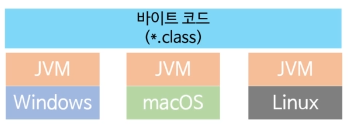
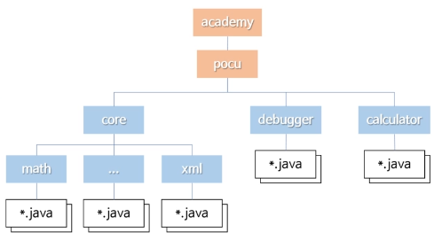

### Java 클래스

- 하나의 .java 파일에는 최고 레벨 public 클래스가 하나만 있어야 한다
  - 둘 이상일 경우 컴파일되지 않는다.

### 메인 함수

- 프로그램의 시작점
- 반드시 시그내쳐대로 메인 함수를 만들어야 한다. 안 그러면 실행 시 오류 발생

```java
public static void main(String[] args){
  // ...
}
```


### 내포 클래스

- 클래스 안의 클래스를 넣을 수 있다
  - 안에 있는 클래스를 내포(nested)클래스라고 부른다
  - 중첩클래스, 내부 클래스라고도 부른다
- 이때 내포 클래스는 public 이어도 상관없다.
- 

```java
public class Hello {
  class Teacher {
    // 코드 생략
  }
  public class Student {
    // 코드 생략
  }
}
```


## Java의 실행 모델

### 전통적인 컴파일 및 실행

- 컴파일을 하면 실행 파일이 나옴
- 실행 파일은 기계어이며 운영체제가 직접 실행하는 파일
- 각 운영체제/디바이스마다 실행파일을 따로 만들어야 함
  - 컴파일러가 소스코드를 각 운영체제/디바이스에 맞는 기계어로 바꿔줌
  - 소스코드는 안 바꿔도 됨
  - C는 이런 관점에서 크로스 플랫폼
    - 소스코드는 크로스 플랫폼. 실행파일은 크로스 플랫폼이 아니다.


### Java 컴파일 모델

- 코드를 컴파일 한 결과는 바이트 코드
  - 실행 파일이 아님
- 바이트코드란
  - 어떤 운영체제/디바이스가 이해하는 기계어가 아님
  - JVM이라는 특수한 프로그램이 이행하는 명령어
  - JVM이 실행 중에 최종 플랫폼에 맞는 명령어로 바꿔서 실행해줌
  - JVM에 맞게 최적화 됐지만 당연히 기계어보다는 느림


### 자바 가상 머신 (Java Virtual Machine, JVM)

- 운영체제에 설치하는 별도의 프로그램
  - 각 운영체제/디바이스마다 다른 버전을 설치
- Java의 바이트 코드를 실행함
- 따라서 운영체제나 다비이스의 영향을 받지 않음
  - 크로스 플랫폼




### Java의 플랫폼은 JVM

- JVM이 설치되지 않았다면
  - Java 프로그램 실행 불가
  - 따라서 Java의 플랫폼은 JVM이라고도 할 수 있음
  - 이런 관점에서는 크로스 플랫폼이라고 하기엔 어폐가 있음
- JVM이 바이트 코드를 실제 디바이스에서 실행하는 방식은 다양하다
  - 과거 JVM은 인터프리터 방식으로 동작한다
  - 최신 JVM은 JIT(just-in-time) 컴파일을 추가
  - 여러 가지 컴파일 방식이 공존하는 형태


## 모듈

### 패키지



#### 기존 패키지 시스템의 한계

- 어플리케이션이 사용하는 클래스 목록을 찾는 공식적인 방법이 없음
  - 누락된 클래스가 있다면 실행 중에 그것을 사용하려 할 때 오류 발생
  - 따라서 사용중인 패키지에 있는 모든 클래스를 같이 배포하는게 일반적
  - 문제점
    - Java버전이 증가함에 따라 Java 자체 제공 라이브러리의 크기가 커짐
    - 안 사용하는 클래스까지 같이 배포할 경우 쓸데없이 용량이 커짐

- 패키지 안에 있는 모든 public 클래스를 아무나 사용할 수 있음
- 때로는 그 중 일부만 외부에 노출하고 싶은데 그럴 수 없음


### 모듈

- Java 9부터 지원
- 패키지보다 상위 개념
  - 패키지를 내포함
- 장점
  - 정말 필요한 패키지만 포함할 수 있음 (경량화)
  - 프로그램 시작 시 누락된 모듈을 확인 가능
  - 어떤 모듈이 사용하는 다른 모듈 목록을 찾기 쉬움
  - 모듈 사용자에게 공개할 클래스를 특정할 수 있음

- 모듈의 이름
  - 패키지와 마찬가지로 중복을 피해야 함
  - 여러 단어로 이루어진 경우 점(.)을 찍음
    - 단어 별로 폴더를 만들지 않음!

