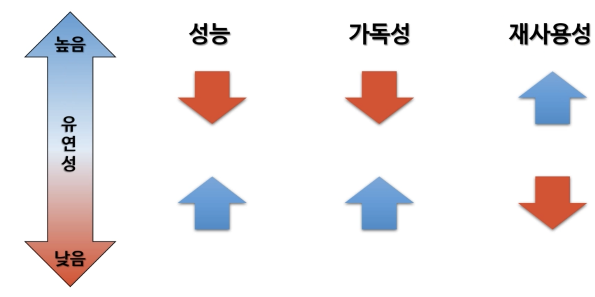

## 클래스 다이어그램

- 어떤 시스템에 있는 클래스들을 보여주는 다이어그램
  - 클래스 안에 들어있는 상태, 동작 접근 제어자
  - 클래스 간의 관계
- 시스템의 정적인 구조를 보여주기에 적합
- 먼 훗날 데이터베이스 설계할 때도 비슷한 다이어그램을 볼 수 있음
- UML (Unified Modeling Language)의 일부

## UML이란

- 시스템의 디자인을 시각화하기 위해 만든 표준
- UML의 종류는 크게 두개로 나뉜다
  - 구조를 보여주는 클래스 다이어그램
  - 동작을 보여주는 시퀀스 다이어그램

#### 클래스 다이어그램의 범위

- 클래스 다이어그램은 다음의 것들을 표현한다
  - 클래스가 가지고 있는 상태
  - 클래스에 실행할 수 있는 동작의 목록
  - 클래스 간의 관계

## 유연성의 함정

**유연성이 높고 재사용성이 좋다고 항상 좋은건 아니다**

필요에 따라 유연셩을 유연하게 조정할 것

#### 재사용의 장점

- 자주 사용하는 수식들을 함수로 만듦

#### 재사용의 단점

- 머무 많이 쪼개져서 읽기 힘들 수 있다

#### 