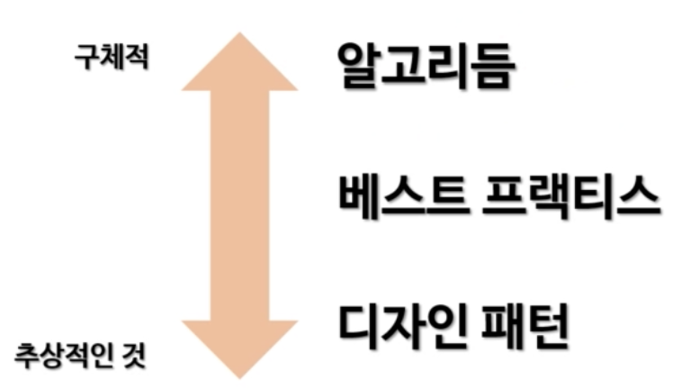

## static

- static은 멤버(함수/변수)가 인스턴스 소속이 아니라 클래스 소속으로 만들어준다.
- static 멤버 변수 및 멤버 함수는 클래스에 속하기 때문에 딱 하나만 존재한다
- static이 아닌 것은 개체에 속한다
- 비정적 -> 정적 : 접근 가능
- 정적 -> 비정적 : 접근 불가능

### 정적 멤버 함수

- 모든 것이 개체 속이 있을 때의 불편함을 해소해준다.
  - 단순한 계산도 개체를 만들어야 하는 불편함
  - 개체 단위가 아니라 클래스 단위에서 뭔가를 하고 싶을 때의 불편함
- 멤버 함수 시그내처에 `static`만 붙여주면 된다
- 이 멤버 함수의 소유주는 인스턴스가 아니라 클래스이다
- 정적 멤버 함수를 호출할 때는?
  - `<클래스명>.<함수명>()`
    - 물론 클래스가 아니라 개체에서 사용 가능하지만 클래스에서 사용하는게 올바르다
- UML에서는 보통 밑줄 그리는거로 표현한다
- 클래스에 속한 메서드가 개체에 속한 멤버 (함수/변수)에 접근은 불가능하다.

### static에 대한 비판

- '모든 것은 개체여야 한다' 라고 주장하는 소수설 지지자
  - 일단 static은 개체 소속이 아니라 프로그램 실행 동안 존재하는 전역 변수 같은 개념
- Java는 하드웨어에 대한 성능을 무시하는 언어이기 때문에 static은 어울리지 않다
  - Java가 절차적 프로그래밍을 무시하던 도발의 여파..
- 결국 static은 OO의 개념과 먼 것은 사실이다
  - 그러나 OO의 개념과 멀다고 그게 잘못된 방법은 아니다

## 디자인 패턴과 싱글턴

### 디자인 패턴

- 소프트웨어 설계에서 흔히 겪는 문제에 대한 해결책
- 범용적, 반복적
- 완성된 설계가 아님
  - 곧바로 코드로 바뀌지 않음
  - 어떤 문제를 다양한 환경에서 해결하는 법을 설명한 가이드일 뿐
- 흔히 GoF (Gang of Four)라고 불리는 저자들의 1994년 책에서 등장

#### 디자인 패턴의 장점

1. 이미 테스트를 마친 검증된 개발 방법을 통해 개발 속도를 향상
2. 공통 용어 정립을 통한 개발자들 간의 빠른 의사소통 촉진

#### 디자인 패턴의 단점

1. 고치려는 대상이 잘못됨
   - C++ 언어의 미지원 기능에 대한 미봉책이다
2. 곧바로 적용할 수 없고 참고 가이드를 '패턴'이라고 부를 수 없음
3. 잘못 적용하는 경우가 빈번함

