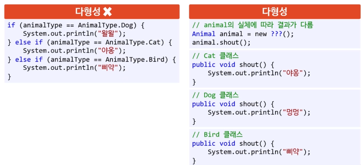

## 다형성

- 많은 사람이 OOP의 핵심이라 여기는 특징
- 같은 지시를 내렸는데 다른 종류의 개체가 동작을 달리 하는 것
- 어떤 개체가 다양한 형태로 변할 수 있는 능력
- 어떤 함수가 구현이 실행될지는 실행 중에 결정됨
  - 늦은 바인딩
- 일반적인 함수 호출은 이른 바인딩
  - 컴파일 중에 결정됨
- 다형성의 혜택을 받으려면 상속 관계가 필요함
  - 부모 개체에서 함수 시그내처를 선언
  - 자식 개체에서 그 함수를 다르게 구현 (오버라이딩)

### 다형성의 장점

- 각 자료형의 코드가 클래스 안에 들어가서 캡슐화
- 유지 보수성 높아짐
- 새로운 클래스를 추가할 때 클래스 코드만 추가하면 됨
- 클라이언트가 작성할 코드가 줄어듦

> 다형성을 통해 조건문의 사용 없이 코드 구현이 가능하다. 그렇기 때문에 조건문을 사용하면 OO가 아니라고 주장하는 사람이 있다. (조건문 대신 모든 것을 다형성으로 바꿔야 한다고 한다)
>
> 하지만 다형성이 조건문을 모두 대체하기는 어렵고, 설사 가능하더라고 그렇게 해야할 이유가 없다.

### 늦은 바인딩 vs 이른바인딩

**늦은 바인딩**

- 동적 바인딩이라고도 한다.
- 호출되는 메서드 구현이 프로그램 실행 중에 결정된다
- 다형성은 늦은 바인딩이다.

**이른 바인딩**

- 정적 바인딩이라도 한다
- C에서 배웠던 함수의 호출 방식이다
- 어떤 함수 구현을 호출해야 할지가 빌드 중에 결정된다.
  - 따라서 함수 호출문을 바로 jmp 명령어로 교체 가능하다
  - jmp하는 주소는 그 함수의 어셈블리어 코드가 시장되는 메모리 주소
- C에서 이게 가능한 이유는 다형성을 지원하지 않기 때문이다.

> 사실 C에 없는 기능은 하드웨어에 없다. 그렇기 때문에 사실 C에도 늦은 바인딩이 있다. 바로 **함수 포인터**다. 함수 포인터를 직접 전달하는 방식으로 늦은 바인딩을 구현할 수 있다.
>
> Java는 이 함수포인터 같은 기능을 편하게 사용할 수 있도록 해준것이다. Java에만 있는 기능은 C의 기능들을 조합해서 만든 것이기 때문에 C에서 이 기능이 아주 없다고 단정짓지 않아야 한다. (마찬가지로 Java도 final을 사용하여 이른바인딩이 가능하다.)
>
> 

### Object의 다형적 메서드

- Java의 클래스는 모두 Object로부터 상속을 받는다
- 따라서 Object에 있는 메서드들은 어떤 클래스에서도 오버라이딩이 가능하다. 대표적으로 toString()이 있다.

**`toString()`**

- 사람이 읽기 편하게 해당 개체를 문자열로 표현
- Object클래스 안의 기본 구현
  - `getClass().getName() + "@" + Integer.toHexString(hashCode())`
- Java 공식 문서는 모든 클래스에서 이 메서드를 오버라이딩 하라고 권장한다 (하지만 잘 하지 않는 편이다)

**`equals()`**

- 동치 비교를 위한 메서드
- 아무런 구현이 없다면 단순한 주소를 비교한다
  - 일일이 데이터를 비교하지 않는다
  - 클래스마다 같다는 의미가 다를 수 있기 때문이다.
- 클래스 속 데이터를 비교해야한다면 오버라이딩이 필욯다
  - 이때 hashCode()도 반드시 같이 오버라이딩 해야 한다

**`hashCode()`**

- 어떤 개체를 비교하는 해시값을 32 비트 정수로 반환한다
  - 동치인 두 개체는 해시값이 같다
  - 동치가 아닌 두 개체도 해시값이 같을 수 있다 (해시 충돌)
- Java의 Object클래스 안의 기본 구현은 개체의 주소를 반환하도록 되어있다.
- 주 목적은 Java가 자체 제공하는 HashMap클래스에서 사용하기 위함이다
  - 키(key) 로 사용하는 개체의 해시값이 필요하기 때문
  - 덕분에 빠른 비교용으로 사용 가능하다
    - 단 두 개체가 같지 않으만 빠르게 판단 가능하다