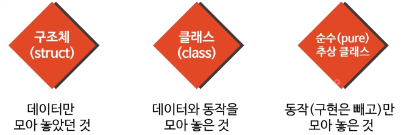
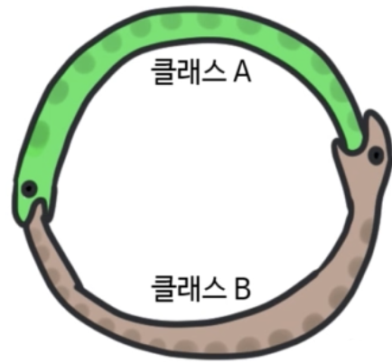

## 인터페이스

- 컴퓨터 분야에서 인터페이스란 매우 다양한 것을 의미
- 함수의 구현이 아닌 함수의 선언을 의미
- 함수 시그내처를 인터페이스라고 부르기도 한다
  - 함수 선언 == 함수 시그내처 == 인터페이스

**OO에서는 순수 추상 클래스를 인터페이스라고 한다**

- Java, C#등은 이 특별한 클래스를 위해 interface란 키워드를 지원한다
- C++은 별도의 키워드가 없어 추상 클래스를 사용해야 한다

#### 인터페이스는 특수한 형태의 클래스다

- 어떤 상태도 없음
- 동작의 구현도 없음
- 동작의 시그내처만 있음
- 이런 특징 때문에 클래스와는 약간 다른 규칙을 따른다

### Java에서의 인터페이스의 특징

- 상속받은 인터페이스의 추상 메서드를 구현하지 않으면 컴파일 오류 발생
  - 추상 클래스 상속과 전혀 다르지 않다
- 미구현으로 인한 컴파일 오류는 실수를 방지
  - 메서드 이름 오타 or 부모클래스의 메서드 이름만 바꾸고 자식 클래스는 손대지 않는 경우
-  Java에서는 `@Override`라는 어노테이션을 제공한다
  - 이 어노테이션을 메서드 위에 사용하면 상속받은 메서드를 구현하겠다는 의미
  - 만약 부모 클래스에 같은 이름의 메서드가 없으면 오류 발생
- 인터페이스는 public 메서드만 가능
  - 누구라도 보고 명령할 수 있는 동작
- 인터페이스는 다중 상속이 가능 (클래스 다중상속은 불가능)
  - 메서드가 중복되더라도 오버라이딩되지 않기 때문에 실체가 겹칠 위험이 없음
    - 아무리 복잡하게 상속 구조를 해도 구현은 하나 뿐
  - 인터페이스는 두 실체가 중복되어도 상속받은 클래스가 구현만 제공하면 됨
  - 단 반환형만 다르면 컴파일 오류가 난다
    - 두 함수를 다 구현할 방법이 없기 때문에
    - 반환형만 다른 경우는 올바른 함수 오버로딩이 아님
  - **인터페이스는 다중 상속의 해결법**
- **함수 포인터처럼 사용하는 인터페이스**

> 어노테이션
>
> - 프로그램에 대한 메타 데이터를 제공
>   - 프로그램의 일부가 아니어서 코드 실행에는 아무 영향을 미치지 않음
> - 어노테이션의 용도
>   - 컴파일러에게 정보를 제공 (`@Deprecated`, `@Override`)
>     - `@Deprecated` : 더 이상 지원을 안 할 함수. 만약 이 함수를 사용시 컴파일러가 경고함
>   - 컴파일 또는 배포 중에 어노테이션을 기반으로 어떤 처리를 할 수 있음
>     - 문서 제작 등..
>   - 실행 중에서도 어노테이션을 기반으로 어떤 처리를 할 수 있음

### 구체클래스 vs 인터페이스

| 구체 클래스                      | 인터페이스                        |
| -------------------------------- | --------------------------------- |
| 상태와 동작을 모두 포함          | 동작에 대한 설명만 포함           |
| 동작에 다양한 접근권한 부여 가능 | 모든 동작은 public                |
| 구체클래스로부터 개체 생성 가능  | 인터페이스로부터 개체 생성 불가능 |
| 다중 상속의 부모가 될 수 없음    | 다중 상속의 부모가 될 수 있음     |

### Object.clone()

**Java의 특징**

- Java에서 클래스형은 다 참조형 (C의 포인터)
- 단순 대입으로는 복사가 일어나지 않는다
- 여전히 같은 주소를 가리키는 포인터 개념

#### Object.clone()메서드

- 복사를 원할 경우 clone() 메서드를 구현하면 됨
- 이때 `Clonalbe` 인터페이스를 상속 후 구현
- Cloneable 인터페이스를 상속받지 않고 오버라이딩하면 `CloneNotSupportedException` 예외 발생

#### 복제를 하는 올바른 방법

- Cloneable 메서드를 상속받고, `clone()`메서드에서`super.clone()`을 호출하는 것
- 각 클래스마다 clone()의 의미는 다를 수 있음
  - Object는 실제 자식 개체의 개체를 만들고 모든 멤버를 대입해서 반환 (얕은복사)
- `clone()` 사용 시 `Object`를 반환하기 때문에 실제 사용시에는 캐스팅이 필요하다

 

## 의존선과 결합도

### 의존성

- 소프트웨어 모듈 A가 제대로 작동하려면 다른 모듈 B가 필요한경우
  - OO에서는 모듈 == 클래스라고 생각
- 클래스 A가 클래스 B에 의존한다는 의미
  - B가 없으면 A는 작동하지 못함
  - A가 없어도 B는 작동

### 의존성이 있어야 좋은 설계

- 각 클래스의 목적이 뚜렷하다는 의미
- 캡슐화가 잘 되어있다는 의미
- 클래스를 재사용할 수 있다는 의미
  - 함수 재사용성과 마찬가지
  - 의존성을 완전히 없애려면 프로그램 전체를 함수 하나에 작성하면 됨...

**그럼에도 의존성이 나쁘다고 생각하는 의미는?**

1. 결합도란 용어와 혼용해서 사용해서
2. 결합도라는 용어도 너무 생략해서 잘못 사용해서

### 결합도

- 종종 커플링이(coupling)라고 음차해서 사용
- 원래 의미는 두 소프트웨어 모듈 간에 상호 의존성 정도
  - 클래스 A가 클래스 B에 의존
  - 클래스 B가 클래스 A에 의존
  - A와 B중 하나도 독자 생존이 불가능
- 여러 가지 종류의 결합도가 존재

### OO에서 흔이 논하는 결합도

**A가 B에 의존하는 상황에서 B를 변경할 때 프로그램이 잘 작동하는가?**

- A의 내부를 변경하지 않아도 제대로 동작
  - A가 B에 의존하나 그 정도가 높지 않음
  - 즉, 결합도가 낮음

- A의 내부를 변경해야만 제대로 동작한다
  - A가 B에 의존하는 정도가 높음
  - 즉, 결합도가 높음

