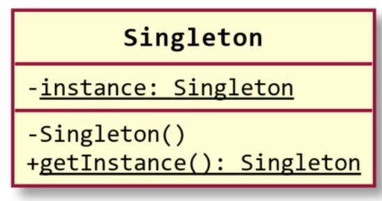
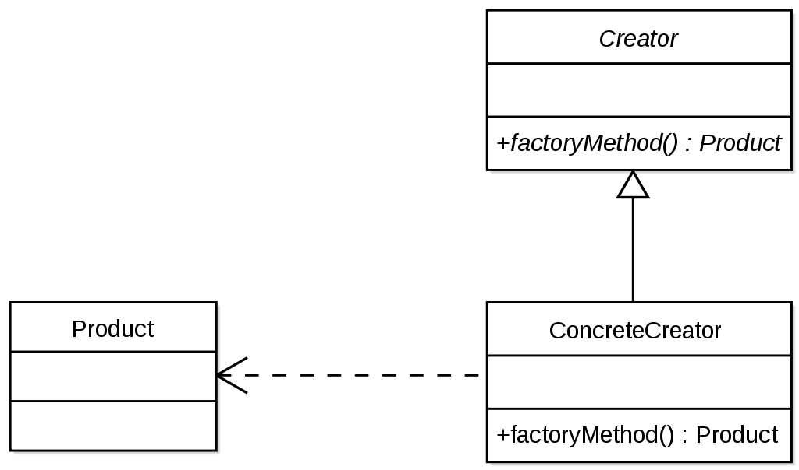

## 디자인 패턴

- 소프트웨어 설계에서 흔히 겪는 문제에 대한 해결책
- 범용적, 반복적
- 완성된 설계가 아님
  - 곧바로 코드로 바뀌지 않음
  - 어떤 문제를 다양한 환경에서 해결하는 법을 설명한 가이드일 뿐
- 흔히 GoF (Gang of Four)라고 불리는 저자들의 1994년 책에서 등장

#### 디자인 패턴의 장점

1. 이미 테스트를 마친 검증된 개발 방법을 통해 개발 속도를 향상
2. 공통 용어 정립을 통한 개발자들 간의 빠른 의사소통 촉진

#### 디자인 패턴의 단점

1. 고치려는 대상이 잘못됨
   - C++ 언어의 미지원 기능에 대한 미봉책이다
2. 곧바로 적용할 수 없고 참고 가이드를 '패턴'이라고 부를 수 없음
3. 잘못 적용하는 경우가 빈번함
4. 비효율적인 해법이 되는 경우가 많음
   - 디자인 패턴은 범용적, 추상적
   - 코드 중복이 많아지고 성능이 떨어질 수 있음
5. 다른 추상화 기법과 크게 다르지 않음

#### 디자인 패턴은 만능이 아니다

- 프로그래밍을 못하는 사람이 디자인 패턴을 익힌다고 더 잘하지 않음
  - 충분한 문제를 접하지 않음
  - 문제 해결하는 압버도 충분히 손에 안익음
  - 어디에 어떤 패턴을 사용할지 잘못 판단함

- 디자인 패턴은 모르는걸 가르쳐 주는게 아니라 정리 개념이다
  - 디자인 패턴을 미리 공부하면 문제를 보기 전에 해법부터 외우는 꼴
    - 개발 능력 향상에 도움이 되지 않음


## 싱글턴 패턴

- 어떤 클래스에서 만들 수 있는 인스턴스 수를 하나로 제한하는 패턴
- 다음과 같은 조건을 충족하는 개체에 적합
  - 프로그램 실행 중에 최대 하나만 있어야 함
    - 예) 프로그램 설정, 파일 시스템 등
  - 이 개체에 전역적으로 접근이 가능해야 함
- 딱 하나만 존재해야 하니 이름도 싱글턴

#### 싱글턴 패턴의 클래스 다이어그램

- private 생성자
- static 메서드를 통해서만 개채를 얻어올 수 있음
- 아직 개채가 없는 경우
  - 개채를 생성 후 static 변수에 저장
  - static 변수에 저장된 개채를 반환
- 이미 개채가 있는 경우
  - static 변수에 저장되어 있는 개채를 반환




## 팩토리 메서드

- 객체 생성 클래스를 서브 클래스로 분리해서 처리하도록 캡슐화하는 패턴
  - 객체 생성 코드를 별도의 클래스/메서드로 분리함으로써 객체 생성의 변화에 대비하는데 유용하다
  - 특정 기능의 구현은 개별 클래스를 통해 제공되는 것이 바람직한 설계다
- 사용할 클래스를 정확히 몰라도 객체 생성을 가능하게 해주는 패턴
- 실제 사용하려는 클래스의 객체를 만들어서 반환해주는 메서드를 사용한다



#### 팩토리 메서드의 장점

- 클라이언트는 봉닝에게 익숙한 인자를 통해서 객체 생성 가능
- 생성자에서 오류 상황 감지 시 null 반환 가능
- 다형적으로 객체 생성 가능
  - 따라서 이 패턴을 가상 생성자 패턴이라고도 함


## 빌더 패턴

- 객체의 생성과정을 그 개체의 클래스로부터 분리하는 방법
- 개체의 부분부분을 만들어 나가다 준비되면 그제서야 객체를 생성
- 다형성이 없는 빌더는 이미 `StringBuilder`에서 확인 가능하다
- 일반적으로 

```java
// 일반적인 객체 생성
Customer customer = new Customer("홍길동", 30);  // 인자가 무엇을 의미하는지 정확히 알기 어렵다


// 일반적인 빌더 
Member builder = new Builder();
builder.withName("홍길동");
builder.withAge(30);

Customer customer = builder.build();

// 플루언트 인터페이스가 적용된 빌더 패턴
Customer customer = new Builder()
    .withName("홍길동")
    .withAge(30)
    .build();
```

- 사실 위의 예시만으로는 `객체는 생성부터 유요한 상태여야 한다` 라는 원칙에서 어긋나기 때문에 올바른 디자인 패턴 사용법은 아니다
  - 빌더에서 객체를 반환하기 전에 예외처리를 추가해주는 등의 작업이 필요하다 (여전히 완벽하지는 않음)
  - `StringBuilder`는 유효한 개체만 반환했다. (올바른 빌더 패턴 구현)
  - 다른 언어에서는 위의 실수를 방지하기 위해서 `명명된 인자` 라는 기능을 추가해서 위의 모든 문제점을 고쳤기 때문에 이 경우 위의 예시와 같은 빌더 패턴을 사용할 이유가 없다. (C#, Go ...)
    - 다만, 언어적으로 지원해야 사용가능

> 플루언트 인터페이스
>
> - 자기 스스로를 반환
> - 메소드 체이닝에 상당 부분 기반한 객체 지향 API 설계 메소드이며, 소스 코드의 가독성을 산문과 유사하게 만드는 것이 목적


## 래퍼

- 클래스에 대한 인터페이스를 호환되는 다른 인터페이스로 변환하는 패턴
- GoF책에서는 어댑터 패턴이라는 이름을 사용한다
- 어떤 클래스의 메서드 시그내처를 맘에 들지 않을 때 다른 걸로 바꾸는 방법
- 단, 그 클래스의 메서드 시그내처를 직접 변경하지 않음
  - 그 클래스의 소스코드가 없을 수도 있음
  - 그 클래스에 의존하는 다른 클래스가 있을 수도 있음
- 그 대신 새로운 클래스를 만들어서 기존 클래스를 감싼다


#### 메서드 시그내처를 바꾸려는 이유는 다양

- 추후 외부 라이브러리를 바꿀 때 클라이언트 코드를 변경하지 않기 위해
- 그냥 사용 중이 메서드가 코딩 표준에 맞지 않아서
- 기존 클래스에 없는 기능을 추가하기 위해
- 확장된 용도 : 내부 개체를 클라이언트에게 노출시키지 않기 위해
  - DTO (data transfer object) 만들기


## 프록시 패턴

#### 프록시란?

- 웹 브라우저 등에서 '프록시 서버'라는 이름으로 자주 사용됨.
- 프록시 서버란 실제 웹사이트와 사용자 사이에 위치하는 중간 서버
- 인터넷상의 캐시 메모리처럼 작동한다
  - 사용자는 프록시 서버를 통해 원하는 문서를 읽으려 함
  - 프록시 서버에 이미 그 문서가 저장되어 있다며 그걸 반환
  - 없다면 실제 웹서버에서 문서를 읽어와 프록시 서버에 저장

### 프록시 패턴

- 프록시 서버와 이루려는 목적이 비슷하다
- 클래스 안에서 어떤 상태를 유지하는게 여의치 않은 경우가 있을 때 사용
  - 데이터가 너무 커서 미리 읽어 두면 메모리 부족한 경우
  - 개체 생성 시 데이터를 로딩하면 시간이 꽤 걸리는 경우
  - 개체는 만들었으나 그 속의 데이터를 사용하지 않을 수도 있을 경우
  - 위의 경우 다음과 같은 방법을 통해 불필요한 데이터 로딩 방지
    - 개체 생성 시에는 데이터 로딩에 필요한 정보만 (예: 파일 위치) 기억해둠
    - 클라이언트가 실제로 데이터를 요청할 때 메모리에 로딩함 [지연로딩 (Lazy loading)]


#### 여러 로딩 방식의 장단점

|                 | 즉시 로딩 | 지연로딩 + 캐시사용 x | 지연로딩 + 캐시사용 (프록시 패턴) |
| --------------- | --------- | --------------------- | --------------------------------- |
| 최신 데이터     | 안됨      | 됨                    | 비교적 최신                       |
| 메모리 사용량   | 최고      | 최소                  | 중간                              |
| 실행속도 병목점 | 생성 시   | 이미지 사용 시        | 알기 힘듦                         |

- 지연 로딩은 예전에는 정말 유용했던 방법
  - 지연로딩이 무조건 나쁜게 아니라 필요한 곳에 잘 선택해서 적절한 수단을 잘 선택하는게 중요하다
- 요즘 세상에는 무조건 한 가지 방법을 사용하기가 애매하다


### 요즘의 프록시 패턴

- 요즘 컴퓨터는 메모리를 많이 장착
  - 미리 다 로딩해놔도 큰 문제가 아닌 경우가 많음
- 한 번에 그리느 이미지 수가 많지 ㅇ낳다면
  - 필요할 때마다 디스크에서 읽을 수 있음 (충분히 빠름. SSD면 더욱 빠름)
- 하지만 인터넷에서 그 이미지들을 로딩한다면
  - 예정네 디스크에서 읽을 때보다 시간이 더 오래 걸리며, 그동안 프로그램이 느려질 수 있음

- 요즘은 적절한 메시지나, UI로 프록시를 대체하는 경향이 강하다
  - 요즘은 클래스가 남몰래 프록시 패턴을 사용하는것보다 클라이언트에게 조작 권하는 주는게 좋을 수 있음
  - 사용자는 프로그램이 동작하고 있다는 걸 인지하고, 프로그램은 그 동안 작업
  - 예) "Loading : 이미지 파일 30개 중 17개를 로딩하고 있습니다." 라고 메시지나 UI를 띄우는 방식


## 책임 연쇄 패턴

- 클라이언트로부터의 요청을 처리할 수 있는 처리객체를 집합 (Chain)으로 만들어 부여함으로써 결합을 느슨하게 하기 위해 만들어진 디자인 패턴


#### 책임 연쇄 패턴이 적용되는 경우

- 요청의 발신자와 수신자를 분리하는 경우
- 요청을 처리할수 있는 객체가 여러개일 때 그 중 하나에 요청을 보내려는 경우
- 코드에서 처리객체 (handler)를 명시적으로 지정하고 싶지 않은 경우

**지연로딩이 무조건 나쁜게 아니라 필요한 곳에 잘 선택해서 적절한 수단을 잘 선택하는게 중요하다**

