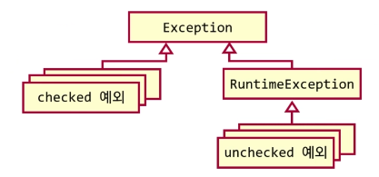

## 예외

- 예외는 error의 일종이며 프로그램이 수행 시 또는 컴파일시에 프로그램을 불능상태를 만들어버린다
  - 예외처리는 이러한 예외가 발생할 것을 미리 예측해서 이를 소스상에서 제어하고 처리하는 작업니다.


#### Java의 예외 

```Java
try {
    // 시도할 코드들
} catch (<예외 클래스 1> 변수명) {
    // 예외가 발생할 경우 해당 예외를 처리할 코드
} catch (<예외 클래스 2> 변수명) {
    // 예외가 발생할 경우 해당 예외를 처리할 코드
    // catch는 하나 이상 올 수 있다
} catch (Exception e) { 
    // Exception : 모든 예외의 최상위 부모. 특정하기 어렵거나 모든 예외를 잡고 싶을 때 사용
    // 예외가 발생할 경우 해당 예외를 처리할 코드
} finally {
    // 예외 발생 여부와 상관없이 항상 실행되는 코드
    // finally는 생략 가능하다
}
```

- 단 부모 예외 클래스가 자식 예외 클래스보다 먼저 나오면 안된다


### 예외가 발생했을 때 진행 순서

1. try 블록의 실행이 중단됨
2. catch 블록 중에 발생한 예외를 처리할 수 있는지 찾음
   - 위에서부터 하나씩 평가
3. 예외를 처리할 수 있는 catch 블록이 있다면. 해당 catch 블록안의 코드들이 실행 후 finally 블록 실행. try블록 이후의 코드들이 실행됨
4.  예외를 처할 수 있는 catch 블록이 없다면
   - finally블록을 실행 후 한 단계 높은 try 블록으로 전달


### custom 예외 만들기

- Exception을 상속받는 클래스를 상속받는다 (Exception을 상속받아도 된다)
- 자식 클래스들의 생성자에서 반드시 `super()`를 호출해야 한다
- 호출하지 않을 경우 message, cause가 저장되지 않는다
- message는 getMessage()로 확인 가능하다
- cause는 getCause()로 확인 가능하다

```java
public final class UserNotFoundException extends RuntimeException {
    public UserNotFoundException() {
        super();
    }
    
    public UserNotFoundException(String message) {
        super(message);
    }
    
    public UserNOtFolundException(String message, Throwable cause) {
        super(message, cause);
    }
}
```


### Java의 큰 두가지 예외

**Checked Exception**

- 컴파일러가 예외처리를 제대로 하는지 확인해줌
- 어느 메서드가 어떤 예외를 던지는지 명확히 알 수 있음
- 예외가 발생하는 코드에서 이 둘 중 하나를 안하면 컴파일 오류
  - 발생한 예외를 그 메서드 안에서 처리 (catch 블록)
  - 처리를 안 할 경우 그 사실을 메서드 시그내처 옆에 표기.
    - 메서드 호출자가 다시 이 둘 중 하나를 해야 함

**Unchecked Exception**

- 컴파일러가 따로 검사를 해주지 않음
- 어디서 어떤 예외가 나오는지 한눈에 보이지 않음
- RuntimeException을 상속





#### checked 예외의 목적

- 목적 : API 제적자가 이건 클라이언트가 반드시 처리해야할 예외라고 알려주는 용도
- 예외 발생 시 정상상태 회복을 위해서 사용
  - 그렇지만 프로그램을 '회복'하는것이 쉽지 않으며, 모든 경우 안전하게 예외처리를 하는게 거의 불가능
  - 따라서 모든 곳에서 예외를 처리하는 것이 아니라 필요한 곳에서만 예외처리를 하는 것이 필요하고 중요해졌다


### 요즘에 선호하는 예외 처리 방향

- 모든 예외는 **한번에 처리**하자
  - `Exception` 으로 한번에 잡자
- 주로 main()함수에서 한번만
- 따라서 다시 예외를 던지는 일도 훨씬 적어짐 (rethrow)
- 여전히 던질 때는 세세한 예외 형을 던짐 (커스텀 예외 포함)
  - `catch` 를 `Exception` 으로 한번에 할 뿐
- 만약 사람의 감시가 없이 예외가 발생할 수 있는 상황이라면 프로그램 재실행을 시켜주는 다른 프로그램을 이용하자.
  - 근래의 OS는 하드웨어 재부팅이 필요없으니 프로그램 크래시를 크게 두려워하지 않아도 됨
  - 프로그램을 감시하고, 종료될 시 재시작 시켜주는 다른 프로그램 사용
  - 재시작하므로 메모리가 깔끔한 상태로 시작


## 예외는 절대로 제어흐름 용으로 사용하지 말아야 한다

 **예외를 제어흐름용으로 사용할 수는 있지만, 그렇게 해서는 안된다.**

- 예외를 제어흐름 용으로 사용할 시 `goto` 와 개념이 같아진다
  - `goto` 보다 더 안좋은 사용이 된다.
- 프로그램이 복잡해지고, 조금만 건드려도 터지는 경우가 많다.
  - 실무에서 사용되는 복잡한 프로그램의 경우 프로그램 유지보수가 굉장히 어려워짐
- 디버깅이 굉장히 어려워진다.
  - 예외는 오류상황이라는 전제하에 모든 툴이 개발되어 있다.
    - 이 룰을 벗어나고 제어흐름용으로 사용 시 이 툴들의 혜택을 못받을 수 있다.
    - 대표적으로, 예외 중단점 사용이 굉장히 어려워짐
- 비슷한 예로 컴파일 경고를 안 고치는 것이 있다
  - 컴파일할 때 의미없는 경고 수십개를 그냥 둘 경우, 정말 고쳐야 하는 경고가 나왔을 때 알아채기 어려워진다.


## 올바른 예외처리 방법

**오류처리보다 처음부터 문제가 없는 코드가 최고다.** 가급적 오류상황이 발생하지 않도록 코드를 작성하라.

### 기본적인 오류상황 처리 방법

- 예측가능한 오류상황인 경우 처리하는 코드를 사용
- 예측하지 못한 오류상황(버그)가 발생할 경우, 버그를 처리하는 코드를 추가해서 다시 빌드

### 오류상황을 처리하는 4가지 방법

1. 무시 : 무시하고 넘어간다
2. 종료 : 문제를 일으킬 수 있는 상황이 있는지 검사하고, 그렇다면 프로그램을 종료
3. 수정 : 문제를 일으킬 수 있는 상황이 있는지 검사하고, 문제를 고친 뒤 계속 프로그램을 수행되게 한다
4. 예외 : 문제가 발생하면 예외를 던진다.


**가장 훌륭한 마음가짐**

- 내 시스템 안에 들어온 데이터는 언제나 유효하다는 가정
  - 예외 상황을 고려할 필요가 없음
  - 예외 상황이 발생하면 그건 버그
  - 깊은 함수 호출이 있어도 복잡하지 않음
- 내 시스템이 아닌 외부에서 받은 데이터는 언제든 유효하지 않을 수 있다는 가정
  - **외부에서 데이터를 받을 때 반드시 검증작업 수행하고 잘못된 데이터는 곧바로 거부**
  - 그리고 남에게 문제가 있다고 알려줌
    - boolean이나 null반환
    - 오류 코드 (int or enum)반환
    - 예외 반환


#### 1. 무시

- 오류상황 발생 시 다음 중 하나가 발생
  1. 곧바로 크래시
  2. 일단 작동하지만 언젠가 크래시
  3. 안정적이지 못한 상태로 작동함 **(매우 위험한 상황)**

**3번이 아닌 1, 2번의 경우 무시하는 방법을 선택하기도 한다.**

- 이유 : 잘못된 예외를 사용할 경우 프로그램이 불안정한 상태로 계속 실행될 수 있기 때문. (3번 상태)
- **크래시의 가장 큰 문제점인 세이브 문제를 자동 세이브로 어느정도 해결 가능** 
  - 최근 5분, 혹은 실시간 저장(Google 문서)로 사용자들이 크래시에 크게 신경을 안쓰는 추세

- 요새 OS와 하드웨어는 안정성 착면에서 큰 차이가 없기 때문
  - 크래시 발생 시 OS에 영향을 미치지 않음. 단지 프로그램만 종료
  - 디버깅을 잘하는 프로그래머들은 오히려 크래시를 선호
    - 문제를 일찍 발견
    - 메모리 덤프 등을 통해 크래시가 발생한 이유를 곧바로 조사 가능
    - 메모리 덤프 : 크래시가 난 상황의 메모리 상태를 파일로 저장
      - 개발자가 크래시가 발생한 원인파악하기 쉬움

#### 2. 종료

- 미리 검사 후 프로그램 종료
- 어떤 문제가 있었는지 사용자에게 보여주고 정상종료
  - 주로 팝업창이나 로그 파일
- 사용자는 문제를 인식하고 다시 프로그램 실행
- 크래시에 비해 나은 점
  - 제대로 시스템 상태를 정리하고 프로그램 종료할 가능성이 높음
  - 따라서 프로그램 종료 후 시스템이 좀 더 안정적일 가능성이 높음
  - **작업하던 내용을 날리지 않고 저장해줄 수 있음**

#### 3. 수정

- 미리 검사 후 문제를 고친다
- 예 : 분모가 0일 경우
  - 사용자에게 올바른 값을 입력하라고 다시요청 (입력값 검증)
- 단점
  - 문제가 처음 발생한 곳을 파악하기 어려움
  - 문제가 발생했다는 사실조차 모를 수 있음
    - 예 : 파일 읽는 함수에서 파일을 못찾았는데 빈 문자열을 반환했을 경우

#### 4. 예외

- 대부분의 OO언어는 예외를 지원하므로, 문제가 발생했다는 사실을 알려주기 위해서 예외를 던짐


### 예외 외에는 해결책이 없는 경우 : 생성자

- **언어의 제약 때문**
- 생성자에서 문제가 발생 시 '문제를 수정'하는 방법은 불가능
  - 이미 객체가 생성됨
  - 생성자에서 null을 반환할 수도 없음
- 문제가 발생했다는 사실을 알려주려면 예외가 유일한 방법

#### 주류 프로그래밍 언어의 생성자 호출 구조

1. 메모리 할당
2. 그 메모리를 개체에 배정
3. 생성자를 통해 상태 초기화

생성자에서 문제가 발생할 경우 3번에서 발생하는데, 이 경우 이미 1, 2번 과정이 진행되어있기 때문에 이걸 되돌릴 방법이 없다


 