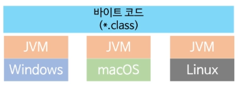

## 전통적인 컴파일 및 실행

- 컴파일을 하면 실행 파일이 나옴
- 실행 파일은 기계어이며 운영체제가 직접 실행하는 파일
- 각 운영체제/디바이스마다 실행파일을 따로 만들어야 함
  - 컴파일러가 소스코드를 각 운영체제/디바이스에 맞는 기계어로 바꿔줌
  - 소스코드는 안 바꿔도 됨
  - C는 이런 관점에서 크로스 플랫폼
    - 소스코드는 크로스 플랫폼. 실행파일은 크로스 플랫폼이 아니다.

## Java 컴파일 모델

- 코드를 컴파일 한 결과는 바이트 코드
  - 실행 파일이 아님
- 바이트코드란
  - 어떤 운영체제/디바이스가 이해하는 기계어가 아님
  - JVM이라는 특수한 프로그램이 이행하는 명령어
  - JVM이 실행 중에 최종 플랫폼에 맞는 명령어로 바꿔서 실행해줌
  - JVM에 맞게 최적화 됐지만 당연히 기계어보다는 느림

## 자바 가상 머신 (Java Virtual Machine, JVM)

- 운영체제에 설치하는 별도의 프로그램
  - 각 운영체제/디바이스마다 다른 버전을 설치
- Java의 바이트 코드를 실행함

