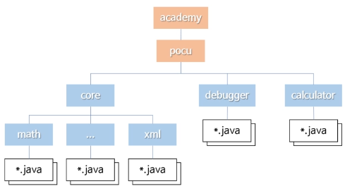

## 패키지

#### 기존 패키지 시스템의 한계

- 어플리케이션이 사용하는 클래스 목록을 찾는 공식적인 방법이 없음
  - 누락된 클래스가 있다면 실행 중에 그것을 사용하려 할 때 오류 발생
  - 따라서 사용중인 패키지에 있는 모든 클래스를 같이 배포하는게 일반적
  - 문제점
    - Java버전이 증가함에 따라 Java 자체 제공 라이브러리의 크기가 커짐
    - 안 사용하는 클래스까지 같이 배포할 경우 쓸데없이 용량이 커짐

- 패키지 안에 있는 모든 public 클래스를 아무나 사용할 수 있음
- 때로는 그 중 일부만 외부에 노출하고 싶은데 그럴 수 없음

## 모듈

- Java 9부터 지원
- 패키지보다 상위 개념
  - 패키지를 내포함
- 장점
  - 정말 필요한 패키지만 포함할 수 있음 (경량화)
  - 프로그램 시작 시 누락된 모듈을 확인 가능
  - 어떤 모듈이 사용하는 다른 모듈 목록을 찾기 쉬움
  - 모듈 사용자에게 공개할 클래스를 특정할 수 있음

- 모듈의 이름
  - 패키지와 마찬가지로 중복을 피해야 함
  - 여러 단어로 이루어진 경우 점(.)을 찍음
    - 단어 별로 폴더를 만들지 않음!

