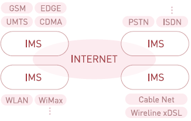
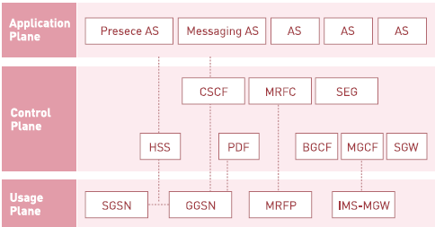

## IMS망

IMS(IP Multimedia Subsystem)은 유선망과 무선망간의 새로운 통신 비즈니스 모델을 제시함으로써 ALL IP 기반의 풍부한 컨텐츠와 새로운 서비스 능력을 수용할 수 있도록 지원한다. 서비스 측면에서 IMS의 개념은 과거의 폐쇠적인 통신 서비스의 개발 및 제공방법과는 차별화하여 서비스 제공자 도메인과 망사업자 도메인간의 분리를 시도했다.

IMS 망 개념도

IMS망내의 시스템 계층구조

IMS망에서는 호처리를 하는 CSCF (Call Session Contron Function)가 존재한다. 이는 SIP기반의 멀티미디어 세션 제어를 위한 기본 기능을 수행하는 인프라 시스템으로써 역할에 따라 Proxy-CSCF, Interogating-CSCF, Serving-CSCF로 나뉜다

이 시스템에서는 가입자 등록, 인증, 과금, 서시브셥 ㄹ트리거링 및 해당 어플리케이션 서버로의 라우팅, 착신자 위치 조회, SIP 메시지 압축 및 해제를 처리한다. 가입자의 프로파일 정보, 인증 및 위치 관련 데이터가 저장되어 있는 HSS(Home Subscriber Service)와 실제 서비스 로직을 보유하여 해당 서비스를 제공하는 어플리케이션 서버가 존재한다