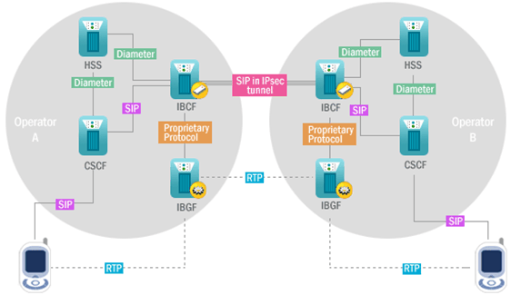

## IBCF

- Interconnection Border Control Function)
- IMS망과 연동 시 망과 망 사이의 Border Controller 역할을 수행하고 다양한 네트워크와 연동 시 보안 및 연동 관련 이슈를 처리하는 시스템. 즉, IBGF는 사업자 내부 망의 단말간 Media Relay 기능 수행하는 시스템이다

IBCF의 기능

- 보안 기능
- NAT 자원 및 미디어 제어 가능
- 자원 할당 기능
- 세션 Filtering 기능
- Topology and Infrastructure Hiding 기능
- 과금 기능
- Media Relay 기능
- 타망의 IBCF 연동 기능
- Transcoding 기능