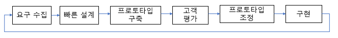
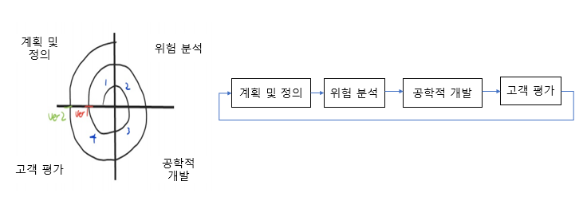
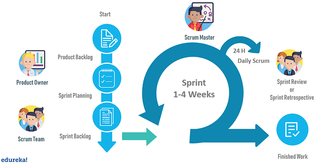
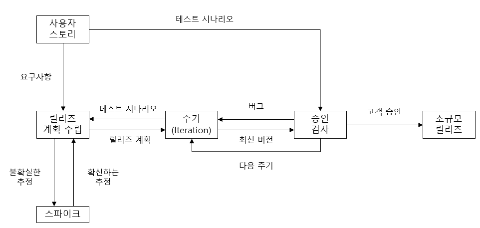

## 소프트웨어 생명주기

### 소프트웨어 생명주기 (Life Cycle)

- 소프트웨어 개발 방법론의 바탕이 되어 소프트웨어를 개발하기 위해 정의하고 운용 유지보수 등의 과정을 각 단계별로 나눈 것
- 소프트웨어 개발 단계외 각 단계별 주요 활동 및 활동의 결과를 산출물로 표현
- 소프트웨어 생명 주기를 표현하는 형태를 소프트웨어 생명주기 모형, 소프트웨어 프로세스 모형, 소프트웨어 공학 패러다임이라고 함
- 특정 모형을 선택하여 사용하거나 개별적인 모형을 사용할 수 있음

### 폭포수 모형

- 폭포수가 거슬러 올라갈 수 없듯이 이전 단계를 확실히 마무리하고 다늠 단계로 진행하는 개발 방법론
- 소프트웨어 공학에서 가장 오래되고 폭넓게 사용된 생명주기 모형
- 한 단계가 끝나야 다음 단계로 넘어갈 수 있는 선형 순차형 모형
- 메뉴얼을 작성해야 한다
- 단계를 끝내고 다음 단계로 가기 위해서는 결과물이 명확히 나와야 한다.

### 프로토타입 모형

- 요구사항을 정확히 파악하기 위해 실제 개발된 소프트웨어에 대한 시제품을 만들어 최종 결과물을 예측하는 모형
- 폭포수 모델의 단점을 보완하기 위해 만들어진 모형
- 사용자와 시스템 사이 인터페이스에 중점을 두어 개발

### 나선형 모형

- 폭포수 모형과 프로토타입 모형의 정점에 위험 분석 기능을 추가한 모형
- 나선을 따라 돌듯이 여러 번의 개발 과정을 거쳐 점진적으로 완벽한 최종 소프트웨어를 개발
- 소프트웨어를 개발하면서 발생할 수 있는 위험을 관리하고 최소화하는 것이 목적
- 누락되거나 추가된 요구사항을 첨가할 수 있음
- 정밀하고 유지보수 과정이 필요 없음

### 애자일 모형

- 고객의 요구사항 변화에 유연하게 대응할 수 있도록 일정한 주기를 반복하며 진행하는 모형
- 좋은 것을 빠르고 낭비 없게 만들기 위해 고객과의 소통에 초점을 맞춤 모든 방법론을 통칭
- 스프린트 또는 이터레이션이라고 불리는 짧은 개발주기를 반복
- 반복되는 주기마다 결과물에 해당 평가와 요구 수용
- 요구사항에 우선순위를 부여하여 개발 진행
- 애자일 모형을 기반으로 하는 모형에는 스크럼, xp, 칸반, Lean, 크리스탈, ASD, FDD, DSDM등이 있다.

## 스크럽 기법

### 스크럽의 개요

- 팀이 중심이 되어 개발의 효율성을 높임
- 팀원 스스로가 팀을 구성하고 개발 작업에 대한 모든 것을 스스로 해결할 수 있어야 함

### 스크럽의 구성요소

- 제품 책임자
  - 개발된 제품에 대한 이해도가 높고 요구사항을 책임지고 의사 결정할 사람
  - 개발 의뢰자나 사용자가 담당
  - 이해관계들의 의견을 종합하여 제품에 대한 요구사항을 작성
  - 백로그를 작성
  - 팀원들은 백로그에 스토리는 추가할 수 있지만 우선순위를 지정하는 것은 제춤 책임자임
  - 테스트를 수행하면서 주기적으로 요구사항의 우선순위 갱신
- 스크럽 마스터
  - 팀이 잘 수행할 수 있도록 객관적인 시각에서 조언을 해주는 가이드 역할
  - 일일 스크럼 회의를 주관하여 진행 사항을 점검하고 개발과정에서 발생된 장애 요소를 공론화하여 처리
- 개발팀
  - 개발자 외에도 디자인, 테스터 등 제품 개발을 위해 참여하는 모든 사람
  - 보통 인원은 7~8명이 적당

### 스크럼 개발 프로세스

(출처 : https://www.edureka.co/blog/agile-scrum-tutorial/)

- 제품 백로그 (Product Backlog)
  - 개발에 필요한 요구사항을 우선순위에 따라 나열한 목록
  - 새롭게 도출되는 요구사항으로 인해 지속적 업데이트
  - 작성된 사용자 스토리를 기반으로 릴리즈 계획을 수립
- 스프린트 계획 회의 (Sprint Planning Meeting)
  - 이번 스프린트에서 수행할 작업을 대상으로 단기 일정 수립
  - 처리할 요구사항을 개발자들이 나눠서 작업할 수 이ㄷㅆ도록 태스크라는 작업 단위로 나눠 개발자 별로 수행할 작업 목록인 스프린트 백로그 (Sprint Backlog) 작성
- 스프린트 (Sprint)
  - 실제 개발 작업을 진행하는 과정
  - 스프린트 백로그에 작성된 태스크를 대상으로 작업 시간이나 양을 추정한 후 개발 담당자에게 할당
  - 태스크를 할당할 때는 개발자가 원하는 태스크를 직접 선별하여 담당할 수 있도록 하는 것이 좋음
  - 할당된 태스크는 할 일, 진행 중, 완료의 상태를 가짐
- 일일 스크럼 회의 (Daily Scrum Meeting)
  - 모든 인원이 매일 약속된 시간에 짧은 시간동안 진행 상황을 점검
  - 스크럼 마스터는 발견된 장애 요소를 해결할 수 있도록 도와줌
  - 남은 작업 시간은 소멸 차트에 표시
- 스프린트 검토 회의 (Sprinting Review)
  - 부분 또는 완성 제품이 요구사항에 잘 부합되는지 사용자가 포함된 참석자 앞에서 테스트 수행
- 스프린트 회고 (Sprint Retrospective)
  - 스프린트가 끝나고 정해놓은 규칙을 잘 준수했는지, 개선할 점은 없는지 등을 점검하고 수행

## XP (eXtreme Programming) 기법

### XP의 개요

- 수시로 발생하는 고객의 요구사항에 유연하게 대응하기 위해 고객의 참여와 개발 과정의 반복을 극대화하여 개발 생산성을 향상시키는 기법
- 짧고 반복적인 개발주기, 단순한 설계, 고객의 적극적인 참여를 통해 빠르게 개발하는 것이 목적
- 릴리즈의 기간을 짧게 반복하면서 요구사항 반영에 대한 가시성을 높임
- XP의 5가지 핵심 가치 : 의사소통, 단순성, 용기, 존중, 피드백

### XP 개발 프로세스

- 사용자 스토리
  - 고객의 요구사항을 간단한 시나리오로 표현
- 릴리즈 계획 수립
  - 몇 개의 스토리가 적용되어 부분적으로 기능이 완료된 제뭎을 제공하는 것에 대한 계획 수립
- 스파이크
  - 요구사항의 신뢰성을 높이고 기술 문제에 대한 위험을 감소시키기 위해 별도로 만드는 프로그램
- 이터레이션
  - 하나의 릴리즈를 더 세부화하여 한 단위
- 승인 검사
  - 하나의 이터레이션 안에서 계획된 릴리즈 단위의 부분 완료 제품이 구현되면 수행하는 테스트
  - 사용자 스토리 작성 시 함께 기재한 테스트 사항에 대해 고객이 직접 수행
- 소규모 릴리즈
  - 고객의 반응을 기능별로 확인하고 고객의 요구사항에 유연하게 대응
  - 진행된 이터레이션이 모두 완료되면 고객에 의한 최종 테스트 수행 후 최종 결과물을 고객에게 전달

### XP의 주혀 실천 방법

- Pair Programming : 다른 사람과 함게 프로그래밍 수행
- Test-Driven Development : 실제 코드 작성 전 테스트 케이스를 먼저 작성하여 무엇을 해야할지 파악
- Whole Team : 개발에 참여하는 모든 구성원은 각기 역할이 있어 책임을 다해야 함
- Continuous Intergration : 모듈 단위로 나눠 개발한 코드는 하나의 작업이 마무리되면 지속적으로 통합
- Design Improvement / Refactoring : 프로그램 기능의 변경 없이 시스템을 재구성
- Small Release : 릴리즈 기간을 짧게 하여 고객의 요구 변화에 신속하게 대응