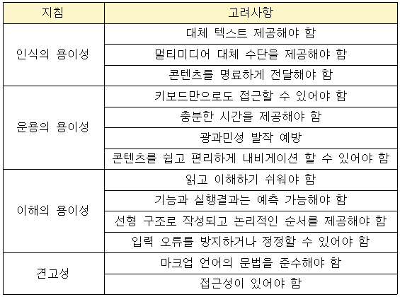
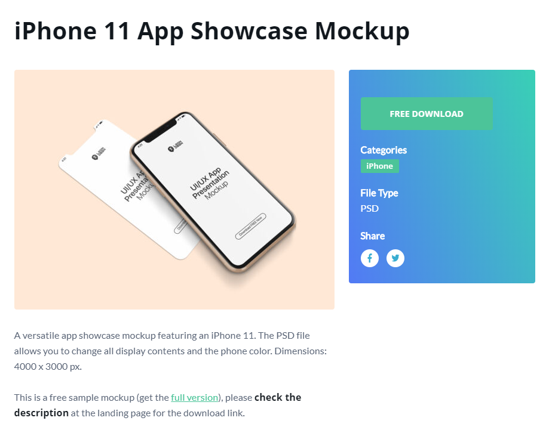
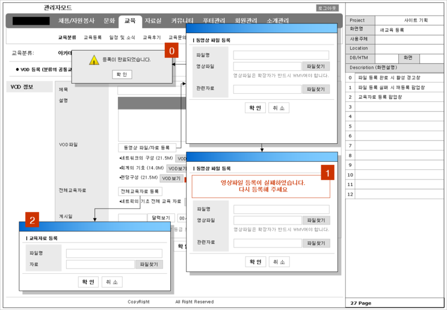
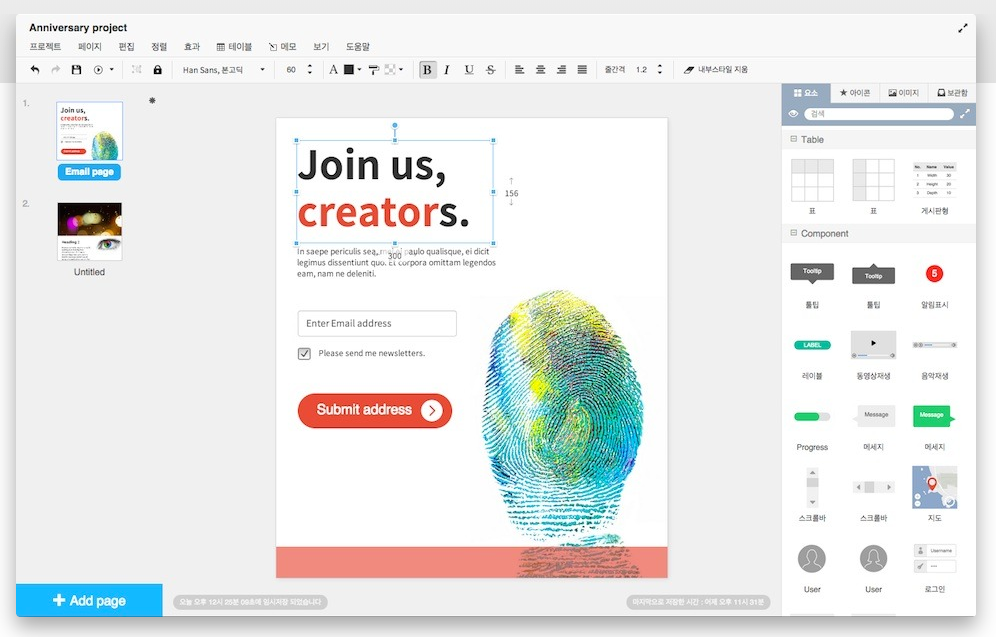
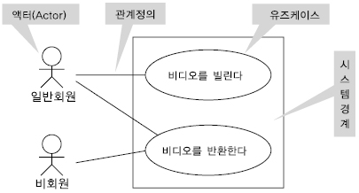
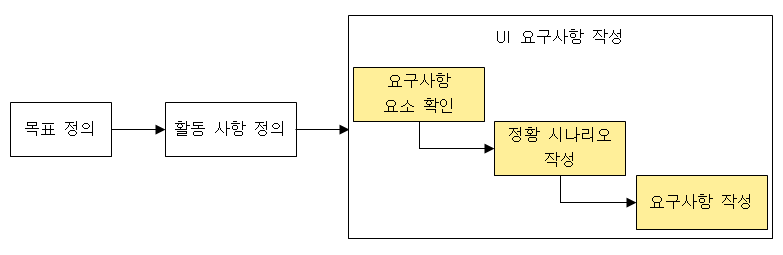
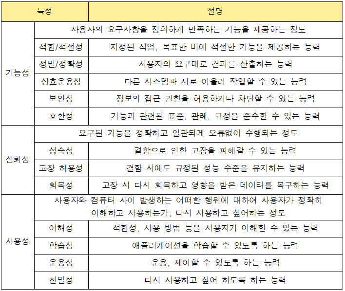
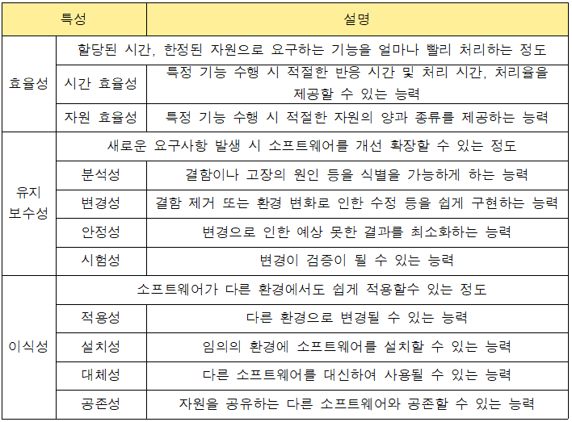
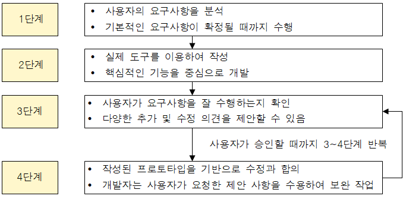
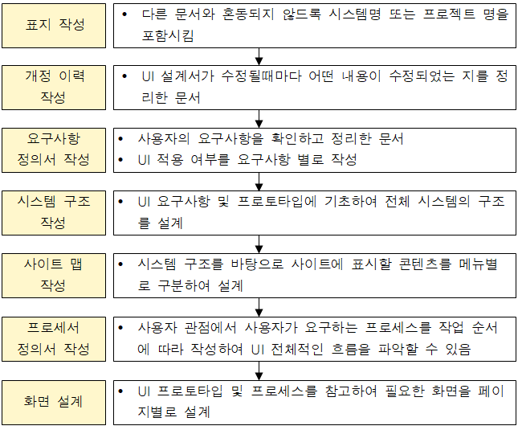

## 사용자 인터페이스

### 사용자 인터페이스의 개요

- 사용자와 시스템 간의 상호작용을 원활하게 도와주는 장치나 소프트웨어
- 사용자 인터페이스의 3가지 분야
  - 정보 제공과 전달을 위한 물리적 제어에 대한 분야
  - 콘텐츠의 상세적인 표현과 전체적인 구성에 관한 분야
  - 모든 사용자가 편리하고 간편하게 사용하도록 하는 기능에 관한 분야

### 사용자 인터페이스의 구분ㄴ

- CLI (Command Line Interface) : 명령과 출력이 텍스트 형태로 이루어지는 인터페이스
- GUI (Graphic User Interface) : 아이콘과 메뉴를 마우스로 선택하여 작업을 수행하는 인터페이스
- NUI (Natural User Interface) : 말이나 행동으로 조작하는 인터페이스

### 사용자 인터페이스의 기본 원칙

- 직관성, 유효성, 학습성, 유연셩

### 사용자 인터페이스의 설계 지침

- 사용자 중심, 일관성, 단순성, 결과 예측 가능, 가시성, 표준화, 접근성, 명확성, 오류 발생 해결

## UI 표준 및 지침

### UI 표준 및 지침의 개요

- UI 표준과 지침을 토대로 기술의 중립성(표준), 보편젹 표햔 보장성(접근성), 기능의 호환성이고려되었는지 확인

### 한국형 웹 콘텐츠 접근성 지침 (KWCAG)

- 장애인과 비장애인이 동등하게 접근할 수 있는 웹 콘텐츠 제작의 장법 제시

- 웹 콘텐츠 접근성 지침 준수를 위한 고려사항

  

- 네비게이션 : 사용자가 사이트에서 원하는 정보를 빠르게 찾도록 도와주는 장치

### 전자정보 웹 표준 준수 지침

- 정부기관의 홈페이지 구축시 반영해야 할 최소한의 규약
- 전자정부 웹 표준 준수 지침 사항
  - 내용의 문법 준수
  - 내용과 표현의 분리
  - 동작의 기술 중립성 보장
  - 플러그인의 호환성
  - 콘텐츠의 보편적 표현
  - 운영체제에 돌깁적인 콘텐츠 제공
  - 부가 기능의 호환성 확보
  - 다양한 프로그램 제공ㅇ

## UI 설계 도구

### UI 설계 도구

- 사용자의 요구사항에 맞게 UI를 설계할 때 사용하는 도구

### 와이어프레임

- 기획 초기 단계에서 제작하는 것으로 페이지에 대한 대략적인 레이아웃이나 UI요소 등에 대한 뼈대를 설계
- 와이어프레임 툴 : 손그림, 파워포인트, 키노트, 스케치, 일러스트, 포토샵 등

### 목업

- 와이어프레임보다 좀 더 실제 화면과 유사하게 만드는 정적인 형태의 모형
- 목업 툴 : 파워 목업, 발사믹 목업 등

출처 : https://www.mockupworld.co/free/category/iphone/

### 스토리보드

- 와이어프레임에 대한 콘텐츠에 대한 설명이나 페이지 간 이동 흐름 등을 추가한 문서
- 디자이너와 개발자가 최종적으로 참고해야 하는 문서
- 서비스 구축을 위한 모든 정보가 담겨 있어야 함ㅁ
- 스토리보드 툴 : 파워포인트, 키노트, 스케치, Axure 등

출처 : https://m.blog.naver.com/durandot/100205321229

### 프로토타입

- 와이어프레임이나 스토리보드 등에 인터랙션을 적용해 실제 구현된 것처럼 텍스트가 가능한 동적인 형태의 모현
- 작성 방법에 따라 페이퍼/디지털 프로토타입으로 나눔
- 프로토타입 툴 : HTML/CSS, Axure, Flinto, 네이버 포로토나우, 카카오 오븐 등ㅇ

출처 : https://ovenapp.io/

### 유스케이스

- 사용자 측면에서의 유구사항으로 사용자가 원하는 목표를 달성하기 위해 수행할 내용 기술

출처 : http://www.hanbit.co.kr/media/channel/view.html?cms_code=CMS8900361225&cate_cd=

## UI 요구사항 확인

### UI 요구사항 확인의 개요

- 새로 개발할 시스템에 적용할 UI 관련 요구사항을 조사해서 작성하는 단계

### 목표 정의

- 사용자들을 대상으로 인터뷰를 하고 사용자들의 의견이 수렴된 비즈니스 요구사항을 정의
- 인터뷰 진행 시 유의사항
  - 사업적, 기술적 요구사항을 명확히 이해
  - 가능한 개별적인 진행
  - 한 시간을 넘기지 않는게 좋음
  - 사용자 리서치 시작 전 해야함

### 활동 사항 정의

- 조사한 요구사항을 토대로 앞으로 해야 할 활동 사항을 정의
- 기술의 발전 가능성을 파악하고 UI 디자인의 방향 제시

### UI 요구사항 작성

- 여러 경로로 수집된 사용자의 요구사항을 검토하고 분석하여 UI 개발 목적에 맞게 작성해야 함

### 요구사항 요소 확인

- 파악된 요구사항 요소의 종류와 각각의 표현 방식 등을 검토
- 요구사항 요소 : 데이터 요구, 기능 요구, 제품/서비스의 품질, 제약 사항

### 정황 시나리오 작성

- 사용자의 요구사항을 도출하기 위해 작성
- 사용자가 목표를 달성하기 위해 수행하는 방법을 순차적으로 묘사
- 개발하는 서비스의 모습을 상상하는 첫번째 단계로 사용자 관점에서 시나리오를 작성해야 함

### 요구사항 작성

- 정황 시나리오를 토대로 작성

## 품질 요구사항

### 품질 요구사항

- 소프트웨어의 기능, 성능, 만족도 등 소프트웨어에 대한 요구사항이 얼마나 충족하는가를 나타내는 것
- ISO/IEC 9126 : 국제 표준으로 소프트웨어 품질 특성과 평가를 위한 지침

## UI 프로토타입 제작 및 검토

### UI 프로토타입의 개요

- 사용자 요구사항을 기반으로 실제 동작하는 것처럼 만든 동적인 형태의 모형
- 테스트 가능
- 최대한 간단하게 만들어야 함
- 일부 핵심적인 기능을 제공하지만 최종 제품의 작동사항을 이해시켜줄 기능은 반드시 포함되어야 함
- 실제 사용자를 대상으로 테스트해야 함

### UI 프로토타입의 장단점

- 장점
  - 사용자를 설득, 이해시키기 쉬움
  - 요구사항을 점검하며 혼선은 예방함으로써 개발 시간을 줄일 수 있음
  - 사전 오류 검출 가능
- 단점
  - 프로토타입 제작으로 인해 작업 시간을 증가시킬 수 있음
  - 필요 이상의 자원 소모 가능
  - 부분적으로 작업 시 중요한 작업이 생략될 수 있음

### 프로토타입의 종류

- 페이퍼 프로토타입
  - 아날로그 방법(스케치, 글, 그림) 등을 이용하여 직접 작성
  - 제작기간이 짧고, 제작 비용이 적을 경우, 업무 회의가 빠를 경우, 급하게 만들어야하는 경우 사용
- 디지털 프로토타입
  - 프로그램을 사용하여 작성
  - 재사용이 필요하거나, 완선 제품과 비슷하게 만들어야 하거나, 숙련된 전문가가 있을 대 사용

### UI 프로토타입 계획 및 작성 시 고려사항

- 계획 시 고려사항
  - 일정은 아키텍처가 확정 ~ 프로젝트 실제 분석 작업 완료 사이에 진행해야 함
  - 프로토타입을 통해서 발생되는 이슈를 모두 취합하여 해결 방법을 제시
  - 진행하면서 가장 많은 시간이 소요된 구간을 찾아 그 원인을 분석하여 해결 방법을 제시
- 작성 시 고려사항
  - 프로젝트의 상황을 감안해서 프로토타입의 범위를 정해야 함
  - 완성된 프로토타입이 실제 개발에 참도될 수 있는지 확인

### UI 프로토타입 제작단계

## UI 설계서 작성

### UI 설계서의 개요

- 사용자의 요구사항을 바탕으로 UI 설계를 구체화하여 작성하는 문서

### UI 설계서 작성 순서

## UI 상세 설계

### UI 시나리오 문서의 개요

- UI 설계서를 바탕으로 실제 설계 및 구현을 위해 모든 화면에 대한 자세한 설계를 진행
- 시나리오를 작성해야 함
- 사용자 인터페이스의 기능 구조, 대표 화면, 화면간 상호작용의 흐름, 다양한 상황에서의 예외처리 등을 문서로 정리

### 시나리오 문서 작성 원칙

- 개발자가 전체 UI 기능과 작동방식을 이해할 수 있도록 구체적으로 작성
- UI 요소와 인터랙션을 일반 규칙으로 정의
- 인터랙션의 흐름을 정의하고 인터랙션의 순서, 분기, 조건, 반복 등을 명시
- 예외 상황에 대비한 다양항 케이스를 정의

### UI 시나리오 문서 작성을 위한 일반 규칙

- 주요 키의 위치와 기능
  - 모든 화면에 공통적으로 배치되는 주요 키의 위치와 기능을 설명
  - 여러 화면 간 일관성 보장
- 공통 UI 요소
  - UI 요소를 언제 어떤 형태로 사용할 지 정의
  - 사용자의 조작에 대한 반응하는지에 대한 흐름을 설명
- 기본 스크린 레이아웃
  - 모든 화면에 공통적으로 나타나는 요소들에 대한 위치와 속성을 정의
- 기본 인터랙션 규칙
  - 터치 제스쳐 등에 공통적으로 사용하는 조작 방법과 화면 전환 효과 등을 기술
- 케이스 문서
  - 다양한 상황에서 공통적으로 적용되는 시스템의 동작을 정의한 문서

### UI 시나리오 문서의 요건

- 완전성 : 누락되지 않도록 상세히 기술
- 일관성 : 서비스의 목표, 요구사항, UI 스타일이 모두 일관성을 유지해야 함
- 이해성 : 누구나 쉽게 이해할 수 있도록 설명
- 가독성 : 표준화된 템플릿을 활용하여 읽기 쉽도록 해야 함
- 수정 용이성 : 사나리오의 수정, 개선이 쉬워야 함
- 추적 용이성 : 변경 사항이 언제 어떻게 왜 발생했는지 쉽게 추적할 수 있어야 함

## HCI/UX/감성공학

### HCI (Human Computer Interaction or Interface)

- 사람이 시스템을 보다 편리하고 안전하게 사용할 수 있도록 개발, 연구하는 학문
- 최종 목표는 시스템을 사용하는데 있어 최적의 사용자 경험을 만드는 것

